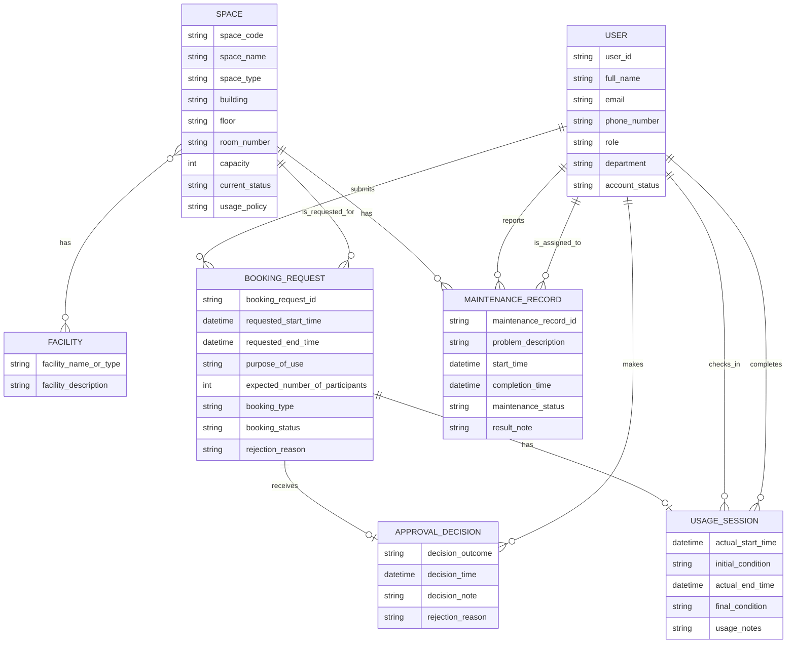

# Conceptual Database Design - G03

## 1. Source Document

- Input: `outputs/01-business-req-analysis-G03.md`
- Target system: Campus Space Management System
- Design level: Conceptual database design

This document translates the business requirement analysis into a conceptual Entity-Relationship Diagram. It intentionally does not define relational tables, foreign keys, SQL, or junction tables. Many-to-many relationships are preserved at this stage as required.

## 2. Conceptual ERD

## 3. Entity Explanations

### 3.1 User

Represents any university account holder who interacts with the system. This includes students, lecturers, teaching assistants, staff, facility staff, department administrators, and facility managers.

Key attributes:

- `user_id`: Identifies the user account.
- `full_name`: User's full name.
- `email`: User's university email or account contact email.
- `phone_number`: Contact number.
- `role`: Operational role, such as student, lecturer, teaching assistant, facility staff, department administrator, facility manager, or staff.
- `department`: Department associated with the user.
- `account_status`: Current account state.

Traceability:

- Supports user management requirements.
- Supports requester, approver, check-in staff, completion staff, reporter, and assigned maintenance staff roles.

### 3.2 Space

Represents a shared physical campus space that can be requested for use.

Key attributes:

- `space_code`: Unique code identifying the space.
- `space_name`: Human-readable name of the space.
- `space_type`: Type of space, such as auditorium, classroom, computer laboratory, project laboratory, meeting room, or student workspace.
- `building`, `floor`, `room_number`: Physical location details.
- `capacity`: Maximum or intended occupancy capacity.
- `current_status`: Availability state, such as available, in use, under maintenance, temporarily closed, or retired.
- `usage_policy`: Business guidance controlling how the space may be used.

Traceability:

- Supports space management, booking availability control, maintenance tracking, and utilization history requirements.

### 3.3 Facility

Represents equipment or facility features available in one or more spaces.

Key attributes:

- `facility_name_or_type`: Name or category of the facility, such as projector, whiteboard, microphone, computer, livestreaming equipment, or air conditioner.
- `facility_description`: Optional additional description.

Traceability:

- Supports the requirement to store the list of facilities available in each space.

### 3.4 Booking Request

Represents a user's request to reserve and use a selected space for a requested time period.

Key attributes:

- `booking_request_id`: Identifies the booking request.
- `requested_start_time`: Requested start date and time.
- `requested_end_time`: Requested end date and time.
- `purpose_of_use`: Reason for using the space.
- `expected_number_of_participants`: Expected attendance count.
- `booking_type`: Activity type, such as lecture, examination, seminar, workshop, meeting, student activity, or administrative event.
- `booking_status`: Current booking lifecycle status, such as pending, approved, rejected, cancelled, checked in, completed, or no-show.
- `rejection_reason`: Reason stored when the request is rejected.

Traceability:

- Supports booking submission, conflict prevention, approval management, no-show tracking, and historical booking requirements.

### 3.5 Approval Decision

Represents the decision made for a booking request when approval or rejection is recorded.

Key attributes:

- `decision_outcome`: Approval or rejection outcome.
- `decision_time`: Time when the decision was made.
- `decision_note`: Staff or manager note attached to the decision.
- `rejection_reason`: Reason for rejection when applicable.

Traceability:

- Supports the requirement to record who approved or rejected a booking, when the decision happened, the decision note, and rejection reason.

### 3.6 Usage Session

Represents the actual use of a space after a booking is checked in and later completed.

Key attributes:

- `actual_start_time`: Actual check-in or session start time.
- `initial_condition`: Condition of the space at check-in.
- `actual_end_time`: Actual completion or session end time.
- `final_condition`: Condition of the space at completion.
- `usage_notes`: Notes recorded after use.

Traceability:

- Supports check-in, completion, condition recording, and usage history requirements.

### 3.7 Maintenance Record

Represents a reported or managed maintenance issue for a space.

Key attributes:

- `maintenance_record_id`: Identifies the maintenance record.
- `problem_description`: Description of the issue, such as broken projector, air-conditioning failure, damaged furniture, cleaning issue, or network problem.
- `start_time`: Time maintenance issue or activity starts.
- `completion_time`: Time maintenance is completed.
- `maintenance_status`: Current maintenance state.
- `result_note`: Resolution or result note.

Traceability:

- Supports maintenance management, unavailable-space control, spaces-under-maintenance reporting, and maintenance history requirements.

## 4. Relationship Constraints

| Relationship | Cardinality | Participation | Explanation |
|---|---:|---|---|
| User submits Booking Request | 1:N | Booking Request mandatory; User optional | Each booking request must be submitted by one user. A user may submit zero or many booking requests. |
| Space is requested for Booking Request | 1:N | Booking Request mandatory; Space optional | Each booking request selects one space. A space may have zero or many booking requests over time. |
| Space has Facility | M:N | Optional on both sides | A space may have zero or many facilities. A facility type may appear in zero or many spaces. This many-to-many relationship is preserved conceptually. |
| Booking Request receives Approval Decision | 1:0..1 | Approval Decision optional for Booking Request | A booking request may require approval and then receive one decision. Some bookings may not yet have a decision, and some may not require one. |
| User makes Approval Decision | 1:N | Approval Decision mandatory; User optional | Each approval decision is made by one authorized facility staff member or manager. A user may make zero or many decisions. |
| Booking Request has Usage Session | 1:0..1 | Usage Session optional for Booking Request | A checked-in booking has usage information. Pending, rejected, cancelled, or no-show bookings may not have a usage session. |
| User checks in Usage Session | 1:N | Usage Session mandatory at check-in; User optional | Each checked-in session records the facility staff member who performed check-in. A user may check in zero or many sessions. |
| User completes Usage Session | 1:N | Usage Session mandatory at completion; User optional | Each completed session records completion details handled by facility staff. A user may complete zero or many sessions. |
| Space has Maintenance Record | 1:N | Maintenance Record mandatory; Space optional | Each maintenance record belongs to one space. A space may have zero or many maintenance records over time. |
| User reports Maintenance Record | 1:N | Maintenance Record mandatory; User optional | Each maintenance record stores one reporter. A user may report zero or many maintenance records. |
| User is assigned to Maintenance Record | 1:N | Maintenance Record optional on assigned staff | Each maintenance record may have one assigned staff member. A staff user may be assigned zero or many records. |

## 5. Business Rule Coverage

| Business Rule Area | Conceptual Design Support |
|---|---|
| University account requirement | Captured by `USER` entity and user account attributes. |
| Unique space code | Captured as key conceptual attribute `space_code` on `SPACE`. |
| Space status control | Captured by `current_status` on `SPACE`. |
| Facility list per space | Captured by M:N relationship between `SPACE` and `FACILITY`. |
| Booking request submission | Captured by `USER` to `BOOKING_REQUEST` and `SPACE` to `BOOKING_REQUEST` relationships. |
| No overlapping approved bookings | Captured as a business rule associated with `BOOKING_REQUEST` and `SPACE`; enforcement is deferred to logical/implementation design. |
| Unavailable spaces cannot be booked | Captured through `SPACE.current_status`, `MAINTENANCE_RECORD`, and the relationship between `SPACE` and `BOOKING_REQUEST`. |
| Approval tracking | Captured by `APPROVAL_DECISION` and its relationships to `BOOKING_REQUEST` and `USER`. |
| Check-in and completion tracking | Captured by `USAGE_SESSION` and its relationships to `BOOKING_REQUEST` and `USER`. |
| Maintenance tracking | Captured by `MAINTENANCE_RECORD` and its relationships to `SPACE` and `USER`. |
| Historical records | Captured by retaining `BOOKING_REQUEST`, `USAGE_SESSION`, `APPROVAL_DECISION`, and `MAINTENANCE_RECORD` as historical business events. |

## 6. Design Reasoning

- `User` is modeled once because all actors are university account holders and differ mainly by role.
- `Approval Decision` is separate from `Booking Request` because approval records have their own decision time, decision note, decision maker, and rejection reason.
- `Usage Session` is separate from `Booking Request` because requested times and actual usage times are different business facts.
- `Maintenance Record` is separate from `Space` because a space can have many maintenance events over time and the system must preserve maintenance history.
- `Space` and `Facility` remain many-to-many because this is a conceptual design and the requirement explicitly says each space may have several facilities, while facility types can reasonably appear in multiple spaces.
- The user who submits a booking, the user who makes an approval decision, the user who checks in a session, the user who completes a session, the user who reports maintenance, and the user assigned to maintenance are represented as separate relationships because they describe different business responsibilities.

## 7. Assumptions Carried Forward

- Facility staff and facility managers are represented as roles of `User`.
- A usage session exists only after a booking is checked in.
- Maintenance assignment can be optional when a maintenance record is first reported.
- Facility details beyond name or type remain unspecified at the conceptual level.
- The open questions from `outputs/01-business-req-analysis-G03.md` remain unresolved and should be clarified before final logical design where necessary.
