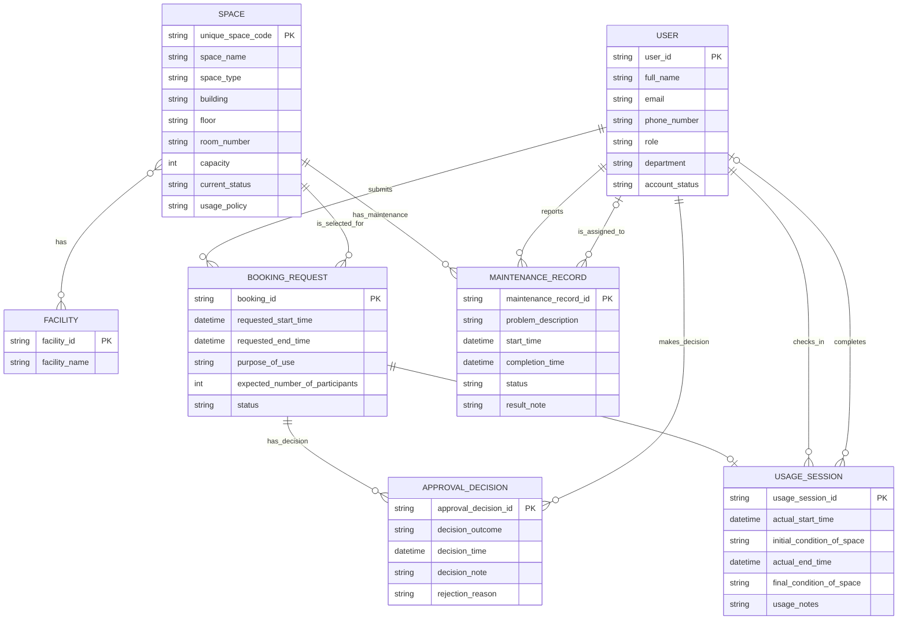

# Conceptual Database Design - Group 03

## 1. Introduction

This document outlines the conceptual database design for the Campus Space Management System project. The design is based on the business requirements analysis produced in `outputs/01-business-req-analysis-G03.md`.

## 2. Conceptual ERD

> Note: Every distinct relationship is shown as its own Mermaid relationship line. Multi-role pairs such as `USER`–`USAGE_SESSION` and `USER`–`MAINTENANCE_RECORD` are not merged; see §4 Relationship Constraints for the full detail of each relationship.

## 3. Entity Definitions

### 3.1 User

A person with a university account who can interact with the system according to the role stored for that user.

Attributes:
- user_id *(identifier)* — source: upstream User attribute “User ID” in §4.1 and BR-1.
- full_name — source: upstream User attribute “Full name” in §4.1 and BR-1.
- email — source: upstream User attribute “Email” in §4.1 and BR-1.
- phone_number — source: upstream User attribute “Phone number” in §4.1 and BR-1.
- role — source: upstream User attribute “Role” in §4.1 and BR-2; possible values are Student, Lecturer, Teaching Assistant, Facility Staff, Department Administrator, and Facility Manager.
- department — source: upstream User attribute “Department” in §4.1 and BR-1.
- account_status — source: upstream User attribute “Account status” in §4.1 and BR-1.

> Relationships involving this entity are listed in §4 Relationship Constraints.

### 3.2 Space

A bookable shared campus space managed by the School.

Attributes:
- unique_space_code *(identifier)* — source: upstream Space attribute “Unique space code” in §4.2 and BR-3.
- space_name — source: upstream Space attribute “Space name” in §4.2 and BR-3.
- space_type — source: upstream Space attribute “Space type” in §4.2 and BR-3.
- building — source: upstream Space attribute “Building” in §4.2 and BR-3.
- floor — source: upstream Space attribute “Floor” in §4.2 and BR-3.
- room_number — source: upstream Space attribute “Room number” in §4.2 and BR-3.
- capacity — source: upstream Space attribute “Capacity” in §4.2 and BR-3.
- current_status — source: upstream Space attribute “Current status” in §4.2 and BR-4; possible values are Available, In use, Under maintenance, Temporarily closed, and Retired.
- usage_policy — source: upstream Space attribute “Usage policy” in §4.2 and BR-3.

> Relationships involving this entity are listed in §4 Relationship Constraints.

### 3.3 Facility

An available item or equipment that may be listed for one or more spaces.

Attributes:
- facility_id *(identifier)* — source: upstream Facility attribute “Facility ID [proposed identifier — not stated in source]” in §4.3 and upstream Assumptions §12.
- facility_name — source: upstream Facility attribute “Facility name” in §4.3; examples include Projector, Whiteboard, Microphone, Computer, Livestreaming equipment, and Air conditioner.

> Relationships involving this entity are listed in §4 Relationship Constraints.

### 3.4 Booking Request

A request submitted by a user to use a selected space for a requested time and purpose.

Attributes:
- booking_id *(identifier)* — source: upstream Booking Request attribute “Booking ID [proposed identifier — not stated in source]” in §4.4 and upstream Assumptions §12.
- requested_start_time — source: upstream Booking Request attribute “Requested start time” in §4.4 and BR-6.
- requested_end_time — source: upstream Booking Request attribute “Requested end time” in §4.4 and BR-6.
- purpose_of_use — source: upstream Booking Request attribute “Purpose of use” in §4.4 and BR-6/BR-7; possible values are Lecture, Examination, Seminar, Workshop, Meeting, Student activity, and Administrative event.
- expected_number_of_participants — source: upstream Booking Request attribute “Expected number of participants” in §4.4 and BR-6.
- status — source: upstream Booking Request attribute “Status” in §4.4 and BR-8; possible values are Pending, Approved, Rejected, Cancelled, Checked in, Completed, and No-show.

> Relationships involving this entity are listed in §4 Relationship Constraints.

### 3.5 Approval Decision

A record of a facility staff member or manager approving or rejecting a booking request.

Attributes:
- approval_decision_id *(identifier)* — source: upstream Approval Decision attribute “Approval Decision ID [proposed identifier — not stated in source]” in §4.5 and upstream Assumptions §12.
- decision_outcome — source: upstream Approval Decision attribute “Decision outcome [proposed — derived from the source's ‘approved or rejected’ conditional, not stated as a stored fact]” in §4.5 and upstream Assumptions §12; possible values are Approved and Rejected.
- decision_time — source: upstream Approval Decision attribute “Decision time” in §4.5 and BR-12.
- decision_note — source: upstream Approval Decision attribute “Decision note” in §4.5 and BR-12.
- rejection_reason — source: upstream Approval Decision attribute “Rejection reason” in §4.5 and BR-13.

> Relationships involving this entity are listed in §4 Relationship Constraints.

### 3.6 Usage Session

A record of the actual checked-in and completed use of a booking.

Attributes:
- usage_session_id *(identifier)* — source: upstream Usage Session attribute “Usage Session ID [proposed identifier — not stated in source]” in §4.6 and upstream Assumptions §12.
- actual_start_time — source: upstream Usage Session attribute “Actual start time” in §4.6 and BR-15.
- initial_condition_of_space — source: upstream Usage Session attribute “Initial condition of the space” in §4.6 and BR-15.
- actual_end_time — source: upstream Usage Session attribute “Actual end time” in §4.6 and BR-16.
- final_condition_of_space — source: upstream Usage Session attribute “Final condition of the space” in §4.6 and BR-16.
- usage_notes — source: upstream Usage Session attribute “Usage notes” in §4.6 and BR-16.

> Relationships involving this entity are listed in §4 Relationship Constraints.

### 3.7 Maintenance Record

A record of maintenance activity or a problem for a space.

Attributes:
- maintenance_record_id *(identifier)* — source: upstream Maintenance Record attribute “Maintenance Record ID [proposed identifier — not stated in source]” in §4.7 and upstream Assumptions §12.
- problem_description — source: upstream Maintenance Record attribute “Problem description” in §4.7 and BR-17/BR-18.
- start_time — source: upstream Maintenance Record attribute “Start time” in §4.7 and BR-18.
- completion_time — source: upstream Maintenance Record attribute “Completion time” in §4.7 and BR-18.
- status — source: upstream Maintenance Record attribute “Status” in §4.7 and BR-18.
- result_note — source: upstream Maintenance Record attribute “Result note” in §4.7 and BR-18.

> Relationships involving this entity are listed in §4 Relationship Constraints.

## 4. Relationship Constraints

This table is the authoritative relationship model. The Mermaid diagram in §2 is a visual aid only.

> The `Cardinality` value is written in the same order as the columns: Entity-A side first, then Entity-B side. For example, `1..1 to 0..*` means each Entity-B occurrence is linked to exactly one Entity-A occurrence, and each Entity-A occurrence may be linked to zero or many Entity-B occurrences.

| Relationship Name | Entity A | Entity B | Cardinality | Participation | Explanation |
|---|---|---|---|---|---|
| SUBMITS | User | Booking Request | `1..1 to 0..*` | A→B: Each User may submit zero or many Booking Requests. B→A: Each Booking Request must be submitted by exactly one User. | Source: upstream §5 “User submits Booking Request” and BR-6. The requester exists at booking request creation. |
| SELECTS_SPACE | Booking Request | Space | `0..* to 1..1` | A→B: Each Booking Request must select exactly one Space. B→A: Each Space may be selected by zero or many Booking Requests. | Source: upstream §5 “Booking Request selects Space” and BR-6. A booking cannot be created without selecting a space. |
| HAS_FACILITY | Space | Facility | `0..* to 0..*` | A→B: Each Space may have zero or many Facilities. B→A: Each Facility may be available in zero or many Spaces. | Source: upstream §5 “Space has Facility” and BR-5; upstream notes the source does not state that a facility item is unique to one space. |
| HAS_APPROVAL_DECISION | Booking Request | Approval Decision | `1..1 to 0..*` | A→B: Each Booking Request may have zero or many Approval Decisions. B→A: Each Approval Decision must belong to exactly one Booking Request. | Source: upstream §5 “Booking Request has Approval Decision” and BR-11 through BR-13. The upstream analysis deliberately avoids an unsupported one-decision maximum. |
| MADE_BY | User | Approval Decision | `1..1 to 0..*` | A→B: Each User may make zero or many Approval Decisions. B→A: Each Approval Decision must be made by exactly one User. | Source: upstream §5 “User makes Approval Decision” and BR-12. The decision maker is recorded when the decision record is created. |
| HAS_USAGE_SESSION | Booking Request | Usage Session | `1..1 to 0..1` | A→B: Each Booking Request may have zero or one Usage Session. B→A: Each Usage Session must belong to exactly one Booking Request. | Source: upstream §5 “Booking Request has Usage Session,” BR-14 through BR-16, and upstream Assumption that one session records one start-to-end use of one booking. |
| CHECKED_IN_BY | User | Usage Session | `1..1 to 0..*` | A→B: Each User may check in zero or many Usage Sessions. B→A: Each Usage Session must be checked in by exactly one User. | Source: upstream §5 “User checks in Usage Session” and BR-15. The usage session exists because the check-in occurred, so the check-in user is mandatory. |
| COMPLETED_BY | User | Usage Session | `0..1 to 0..*` | A→B: Each User may complete zero or many Usage Sessions. B→A: Each Usage Session may be completed by zero or one User. | Source: upstream §5 “User completes Usage Session” and BR-16. Completion occurs after check-in and may be absent until the session is completed. |
| HAS_MAINTENANCE_RECORD | Space | Maintenance Record | `1..1 to 0..*` | A→B: Each Space may have zero or many Maintenance Records. B→A: Each Maintenance Record must relate to exactly one Space. | Source: upstream §5 “Space has Maintenance Record” and BR-17/BR-18. The related space is stored with each maintenance record. |
| REPORTED_BY | User | Maintenance Record | `1..1 to 0..*` | A→B: Each User may report zero or many Maintenance Records. B→A: Each Maintenance Record must be reported by exactly one User. | Source: upstream §5 “User reports Maintenance Record” and BR-18. The reporter is stored with each maintenance record at creation. |
| ASSIGNED_TO | User | Maintenance Record | `0..1 to 0..*` | A→B: Each User may be assigned to zero or many Maintenance Records. B→A: Each Maintenance Record may be assigned to zero or one User. | Source: upstream §5 “User is assigned to Maintenance Record,” BR-18, and upstream Open Question on assignment timing. Assignment is optional because the source does not state it exists at reporting time. |

## 5. Business Rule Coverage

For every business rule in the upstream analysis (Section 6), explain how the conceptual design supports it, or explicitly state that enforcement is deferred.

| Upstream Rule | How the Design Supports It |
|---|---|
| BR-1: Each user must have a university account, and the system stores user ID, full name, email, phone number, role, department, and account status. | Supported by the User entity and its listed attributes. |
| BR-2: A user may be a student, lecturer, teaching assistant, facility staff, department administrator, or facility manager. | Supported by User.role with the upstream possible role values documented in §3.1. |
| BR-3: For each space, the system stores unique space code, space name, space type, building, floor, room number, capacity, current status, and usage policy. | Supported by the Space entity and its listed attributes. |
| BR-4: A space may be available, in use, under maintenance, temporarily closed, or retired. | Supported by Space.current_status with the upstream possible status values documented in §3.2. |
| BR-5: Each space may have several facilities, and the system stores the list of facilities available in each space. | Supported by the Space, Facility, and HAS_FACILITY many-to-many relationship. |
| BR-6: Users can submit booking requests by selecting a space, requested start time, requested end time, purpose of use, and expected number of participants. | Supported by Booking Request attributes plus SUBMITS and SELECTS_SPACE relationships. |
| BR-7: A booking may be for a lecture, examination, seminar, workshop, meeting, student activity, or administrative event. | Supported by Booking Request.purpose_of_use with the upstream possible values documented in §3.4. |
| BR-8: Each booking request has a status such as pending, approved, rejected, cancelled, checked in, completed, or no-show. | Supported by Booking Request.status with the upstream possible values documented in §3.4; transition triggers for Cancelled and No-show remain open. |
| BR-9: The system must prevent conflicting bookings: the same space cannot have two approved bookings with overlapping time periods. | BR-9 — enforcement deferred to logical/physical design. The conceptual design captures the required facts through Booking Request.status, requested time attributes, and SELECTS_SPACE, but overlap prevention is not expressible as a simple conceptual relationship. |
| BR-10: A space that is under maintenance, closed, or retired cannot be booked. | BR-10 — enforcement deferred to logical/physical design. The conceptual design captures Space.current_status and SELECTS_SPACE, but status-based booking prevention is a rule to enforce after conceptual design. |
| BR-11: A booking request may require approval from a facility staff member or manager. | Supported by HAS_APPROVAL_DECISION and MADE_BY relationships, plus User.role. |
| BR-12: When a booking is approved or rejected, the system records the staff member who made the decision, the decision time, and a decision note. | Supported by Approval Decision.decision_time, Approval Decision.decision_note, decision_outcome, and MADE_BY. |
| BR-13: If the booking is rejected, the rejection reason should be stored. | BR-13 — enforcement deferred to logical/physical design for conditional mandatory behavior. The conceptual design stores Approval Decision.rejection_reason. |
| BR-14: When the requester arrives, facility staff can check in the booking. | Supported by HAS_USAGE_SESSION and CHECKED_IN_BY relationships. |
| BR-15: At check-in, the system records the actual start time, the person who checked in the booking, and the initial condition of the space. | Supported by Usage Session.actual_start_time, Usage Session.initial_condition_of_space, and CHECKED_IN_BY. |
| BR-16: When the session ends, facility staff can complete the booking by recording actual end time, final condition of the space, and any usage notes. | Supported by Usage Session.actual_end_time, Usage Session.final_condition_of_space, Usage Session.usage_notes, and COMPLETED_BY. |
| BR-17: A space may have maintenance records for problems such as broken projectors, air-conditioning failure, damaged furniture, cleaning issues, or network problems. | Supported by Space, Maintenance Record.problem_description, and HAS_MAINTENANCE_RECORD. |
| BR-18: Each maintenance record stores the related space, reporter, assigned staff member, problem description, start time, completion time, status, and result note. | Supported by Maintenance Record attributes plus HAS_MAINTENANCE_RECORD, REPORTED_BY, and ASSIGNED_TO relationships. |
| BR-19: A space under maintenance cannot be booked. | BR-19 — enforcement deferred to logical/physical design. The conceptual design captures Space.current_status and SELECTS_SPACE, but the prohibition is a rule to enforce after conceptual design. |
| BR-20: The system should keep historical records of bookings and maintenance activities. | Supported by separate Booking Request, Usage Session, Approval Decision, and Maintenance Record event/record entities. |
| BR-21: Staff should be able to view booking history, upcoming bookings, spaces under maintenance, and no-show bookings. | The conceptual model stores the required facts through Booking Request, Space, Usage Session, Approval Decision, and Maintenance Record; view/query and authorization enforcement are deferred. |

## 6. Design Reasoning

- The conceptual model preserves the seven entities from upstream §4: User, Space, Facility, Booking Request, Approval Decision, Usage Session, and Maintenance Record. No additional business entity was introduced.
- Relationship-reference facts from the upstream analysis are modeled as relationships rather than attributes. For example, selected space, requester, decision maker, check-in user, completion user, reporter, assigned staff member, and related space appear in §4 Relationship Constraints rather than in entity attribute lists.
- Multiple relationships between the same entity pair are kept as distinct relationships because they represent different business roles at different times. `USER`–`USAGE_SESSION` has both CHECKED_IN_BY and COMPLETED_BY; `USER`–`MAINTENANCE_RECORD` has both REPORTED_BY and ASSIGNED_TO. These are shown as separate Mermaid lines and separate §4 rows so the actor participation differences are visible.
- Single-actor event relationships use at most one actor per event occurrence. CHECKED_IN_BY and REPORTED_BY are mandatory on the event side because those records are created with the actor reference. COMPLETED_BY and ASSIGNED_TO are optional on the event side because completion or assignment can happen after the record exists or the upstream analysis does not state creation-time assignment.
- The Booking Request to Usage Session relationship keeps the upstream singleton-by-nature assumption: one usage session records one start-to-end use of one booking, so a booking has zero or one usage session.
- The conceptual ERD uses coarse conceptual data types only: `string`, `int`, and `datetime`. Counts such as capacity and expected participants are `int`; time attributes are `datetime`; status/category/note/code fields are `string`.

## 7. Assumptions

Every assumption must carry a source tag:
- `[upstream]` — carried forward from the upstream analysis without change.
- `[upstream-corrected]` — item from upstream that was modified here (e.g. duplicate attribute removed, identifier added). Must state what changed and why.
- `[design-level]` — new assumption introduced at this stage, not present in upstream analysis.

- [upstream] Facility ID is a proposed identifier for Facility because the source does not state a facility identifier.
- [upstream] Booking ID is a proposed identifier for Booking Request because the source does not state a booking identifier.
- [upstream] Approval Decision ID is a proposed identifier for Approval Decision because the source does not state a decision identifier.
- [upstream] Usage Session ID is a proposed identifier for Usage Session because the source does not state a usage session identifier.
- [upstream] Maintenance Record ID is a proposed identifier for Maintenance Record because the source does not state a maintenance record identifier.
- [upstream] Decision outcome is included on Approval Decision as a derived attribute because the source names two decision outcomes, “approved or rejected,” but does not list outcome as a stored fact.
- [upstream] The Booking Request to Usage Session child maximum is resolved as `0..1` because a usage session records one indivisible start-to-end use of one booking; this is inferred from the workflow and not explicitly stated as a multiplicity in the source.
- [upstream] “Closed” in the booking restriction is treated as the same unavailable space condition as the Space status “temporarily closed,” because Layer B lists “temporarily closed” as the status value but later says a space that is “closed” cannot be booked.
- [upstream] Generic “staff” viewing permissions are not split into separate user roles because Layer B does not identify which listed staff-related roles are included beyond the word “Staff.”
- [upstream] No separate booking type or booking category attribute was created; the source-named fact is “purpose of use,” and the listed booking purposes are treated as possible purpose of use values.
- [upstream] Student, lecturer, teaching assistant, and department administrator are grouped as Requester User Roles in the actor table because Layer B gives them the same stated booking-request interaction and does not give them distinct additional responsibilities.
- [design-level] The Mermaid diagram draws every distinct relationship as a separate line, including repeated entity pairs, so the diagram line count matches the authoritative §4 relationship count.

## 8. Open Questions

List every ambiguity or unresolved issue from the upstream analysis that has a direct impact on this model. Do not summarise upstream open questions as a single bullet — each must have its own entry.

- Question: How is Space usage policy enforced, if at all, when evaluating a booking request? — Scope: Business Workflow. Design impact: usage_policy is stored on Space, but no conceptual constraint is modeled for enforcement.
- Question: How should the “same space cannot have two approved bookings with overlapping time periods” rule be enforced after conceptual design? — Scope: Database. Design impact: the conceptual model stores status, time period, and selected space, but the overlap prohibition is deferred to logical/physical design.
- Question: How should the rule that under-maintenance, closed, or retired spaces cannot be booked be enforced after conceptual design? — Scope: Database. Design impact: the conceptual model stores Space.current_status and Booking Request selection of Space, but the booking prohibition is deferred to logical/physical design.
- Question: Should rejection_reason be mandatory only when decision_outcome is Rejected, and optional otherwise? — Scope: Database. Design impact: the conceptual model includes rejection_reason on Approval Decision, but conditional mandatory enforcement is deferred to logical/physical design.
- Question: From which prior status can a Booking Request become Cancelled, who can set it, and under what condition? — Scope: Business Workflow. Design impact: Cancelled remains a Booking Request.status value, but no transition constraint is modeled.
- Question: From which prior status can a Booking Request become No-show, who can set it, and under what condition? — Scope: Business Workflow. Design impact: No-show remains a Booking Request.status value, but no transition constraint is modeled.
- Question: Which listed user roles are included in the generic “Staff” who can view booking history, upcoming bookings, spaces under maintenance, and no-show bookings? — Scope: Authorization. Design impact: User.role stores roles, but view permissions are not modeled as conceptual relationships.
- Question: Which roles may report maintenance issues? — Scope: Authorization. Design impact: REPORTED_BY links Maintenance Record to User, but role eligibility is not constrained in the conceptual model.
- Question: Which roles may assign the assigned staff member on a maintenance record? — Scope: Authorization. Design impact: ASSIGNED_TO links Maintenance Record to User, but assigning authority is not modeled.
- Question: What are the allowed status values and transitions for Maintenance Record status? — Scope: Business Workflow. Design impact: Maintenance Record.status is stored as an attribute, but no maintenance status lifecycle is modeled.
- Question: Does recording an Approval Decision automatically update Booking Request status, or is the status update handled separately? — Scope: Business Workflow. Design impact: Approval Decision and Booking Request.status are both modeled, but no automatic synchronization constraint is asserted.
- Question: Does a Maintenance Record status automatically update Space current status to under maintenance, or is Space current status maintained independently? — Scope: Mixed. Design impact: Space.current_status and Maintenance Record.status are both modeled, but no automatic dependency is asserted.
- Question: Are department administrators intended to have responsibilities beyond submitting booking requests as users? — Scope: Authorization. Design impact: Department Administrator remains a User.role value, but no additional relationship or permission is modeled.
