# Conceptual Database Design - Group 03

## 1. Introduction

This document outlines the conceptual database design for the Campus Space Management System project. The design is based on the business requirement analysis in `outputs/01-business-req-analysis-G03.md` and represents the required entities, attributes, relationships, cardinalities, participation constraints, assumptions, and open questions at the conceptual level.

## 2. Conceptual ERD

### ERD-Overview: Entity-Relationship Overview

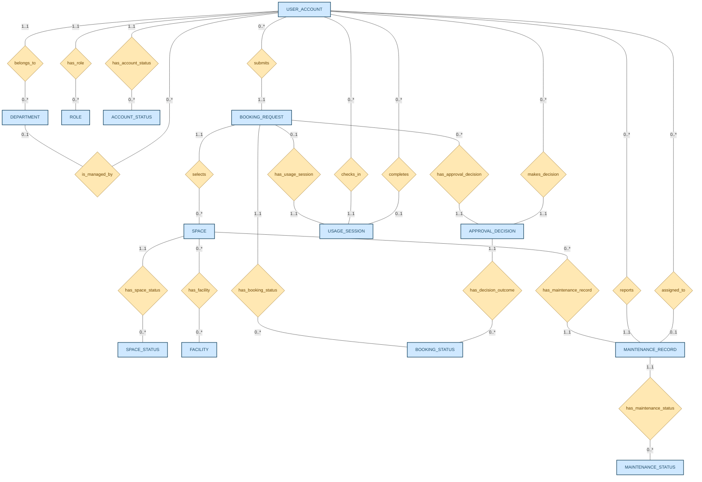

### ERD-Entities: Per-Entity Attribute Diagrams

#### USER_ACCOUNT

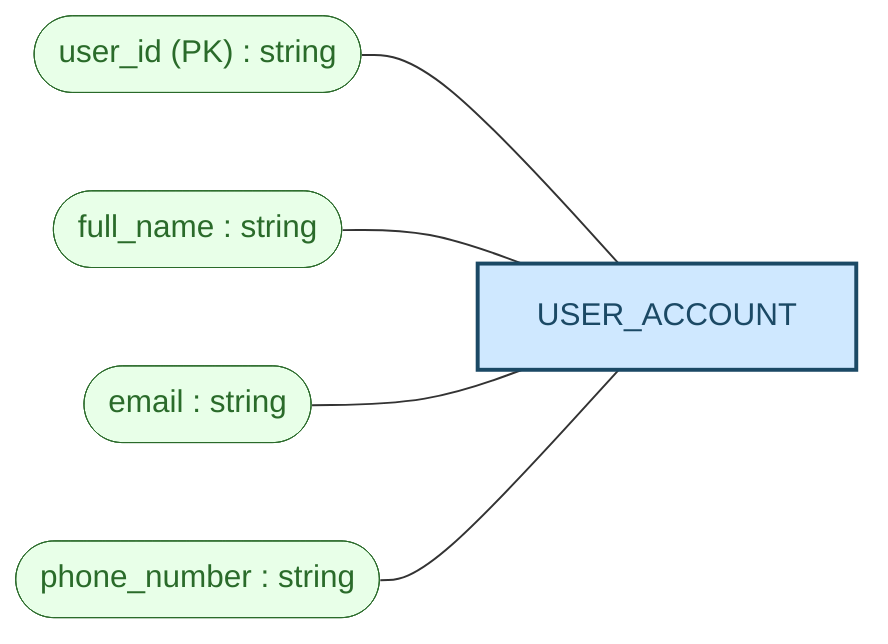

#### DEPARTMENT

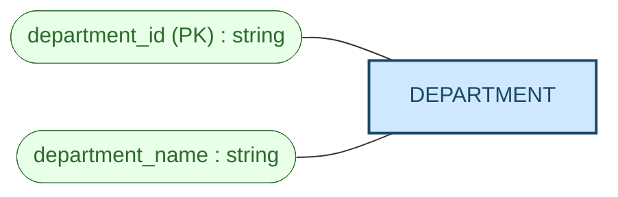

#### ROLE

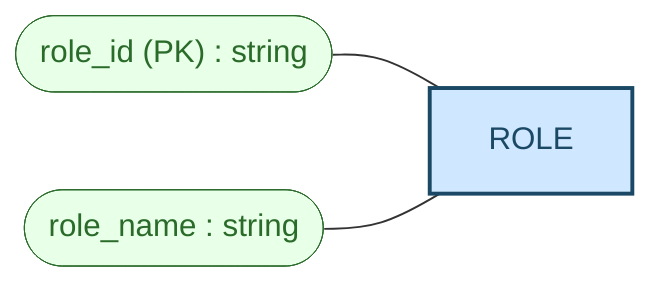

#### ACCOUNT_STATUS

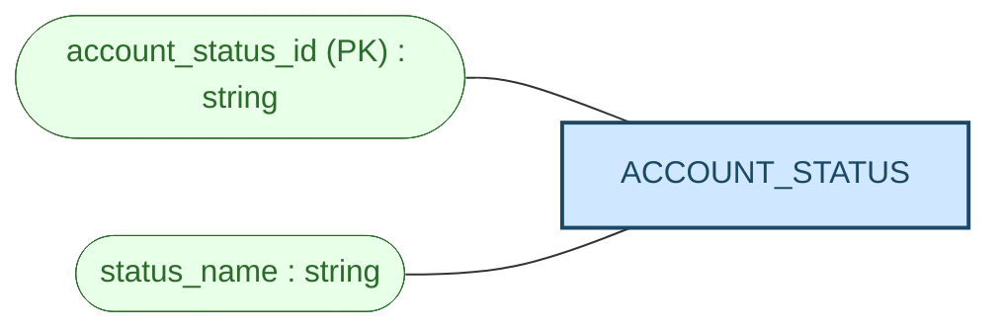

#### SPACE

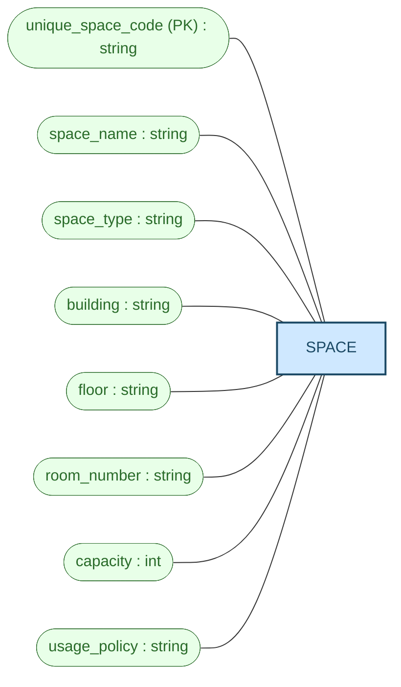

#### SPACE_STATUS

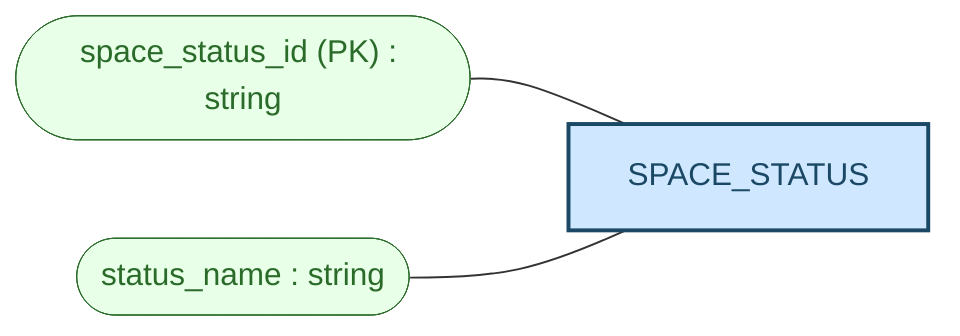

#### FACILITY

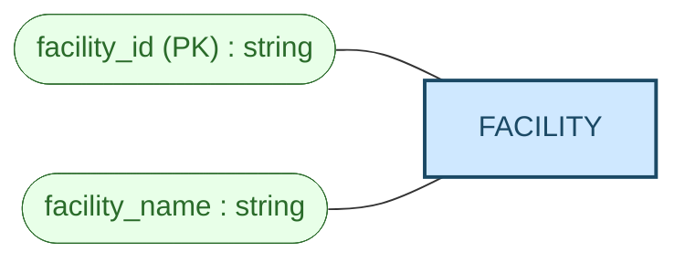

#### BOOKING_REQUEST

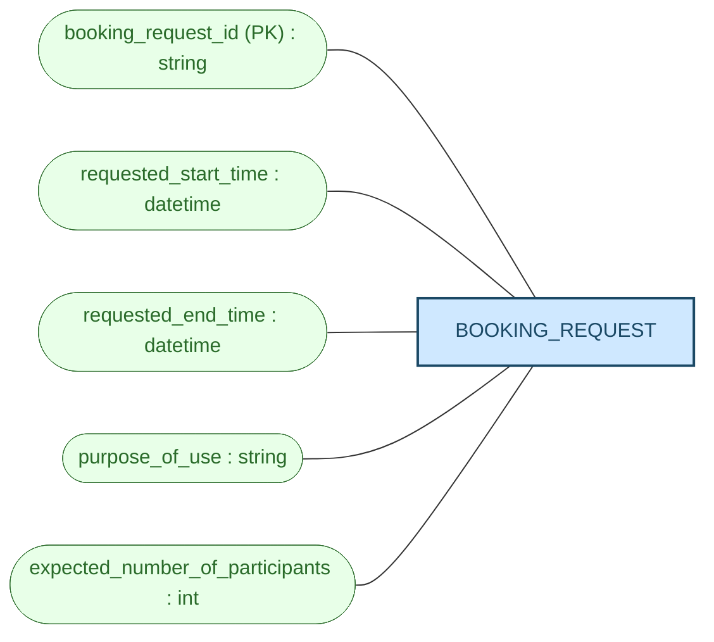

#### BOOKING_STATUS

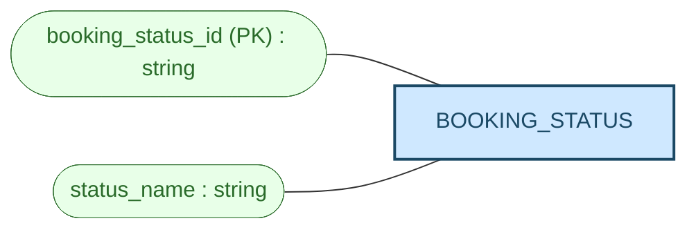

#### APPROVAL_DECISION

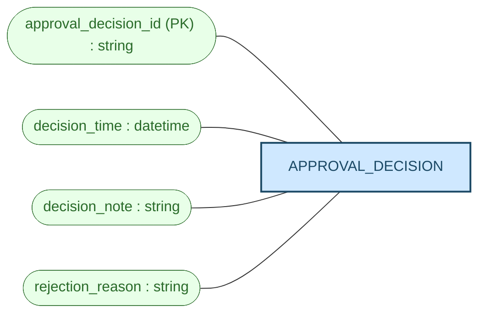

#### USAGE_SESSION

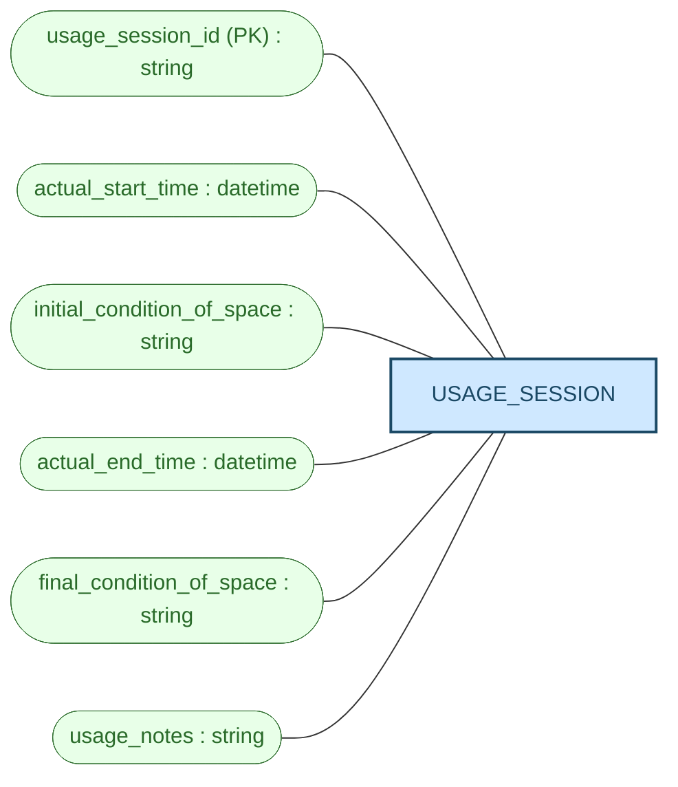

#### MAINTENANCE_RECORD

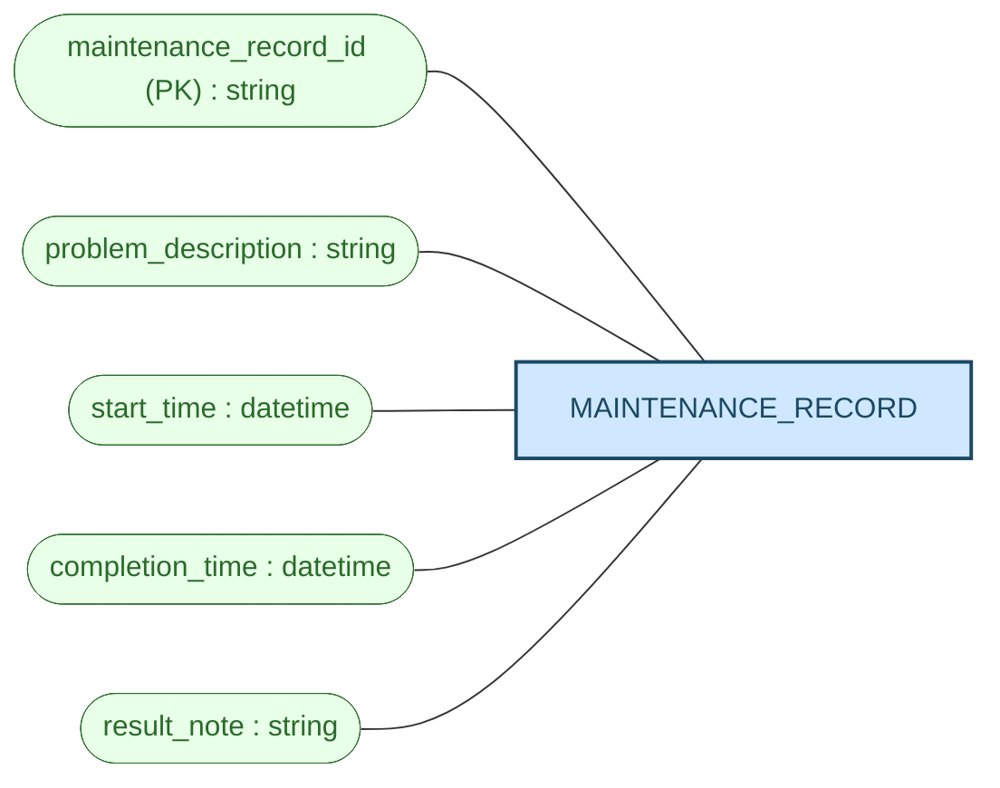

#### MAINTENANCE_STATUS

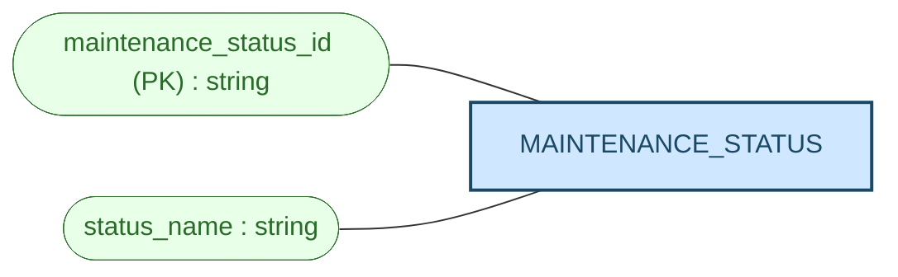

## 3. Entity Definitions

### 3.1 USER_ACCOUNT

Represents a university account user whose basic information is stored by the system.

Attributes:
- user_id *(identifier)* — source: upstream USER_ACCOUNT `user ID`; label normalized to snake_case.
- full_name — source: upstream USER_ACCOUNT `full name`.
- email — source: upstream USER_ACCOUNT `email`.
- phone_number — source: upstream USER_ACCOUNT `phone number`; label normalized to snake_case.

> Relationships involving this entity are listed in §4 Relationship Constraints.

### 3.2 DEPARTMENT

Represents the user department normalized from the source's user department attribute under the upstream design directive.

Attributes:
- department_id *(identifier)* — source: upstream DEPARTMENT `department identifier [proposed identifier — not stated in source; design directive]`; label normalized to the entity-specific identifier pattern.
- department_name — source: upstream DEPARTMENT `department_name`.

> Relationships involving this entity are listed in §4 Relationship Constraints.

### 3.3 ROLE

Represents the controlled list of user role values under the upstream design directive.

Attributes:
- role_id *(identifier)* — source: upstream ROLE `role identifier [proposed identifier — not stated in source; design directive]`; label normalized to the entity-specific identifier pattern.
- role_name — source: upstream ROLE `role_name`; possible values are student, lecturer, teaching assistant, facility staff, department administrator, and facility manager.

> Relationships involving this entity are listed in §4 Relationship Constraints.

### 3.4 ACCOUNT_STATUS

Represents user account status values under the upstream design directive.

Attributes:
- account_status_id *(identifier)* — source: upstream ACCOUNT_STATUS `status identifier [proposed identifier — not stated in source; design directive]`; label normalized to avoid ambiguity with other status entities.
- status_name — source: upstream ACCOUNT_STATUS `status_name`.

> Relationships involving this entity are listed in §4 Relationship Constraints.

### 3.5 SPACE

Represents a bookable shared campus space managed by the School.

Attributes:
- unique_space_code *(identifier)* — source: upstream SPACE `unique space code`; label normalized to snake_case.
- space_name — source: upstream SPACE `space name`.
- space_type — source: upstream SPACE `space type`.
- building — source: upstream SPACE `building`.
- floor — source: upstream SPACE `floor`.
- room_number — source: upstream SPACE `room number`; label normalized to snake_case.
- capacity — source: upstream SPACE `capacity`.
- usage_policy — source: upstream SPACE `usage policy`; label normalized to snake_case.

> Relationships involving this entity are listed in §4 Relationship Constraints.

### 3.6 SPACE_STATUS

Represents controlled space status values under the upstream design directive.

Attributes:
- space_status_id *(identifier)* — source: upstream SPACE_STATUS `status identifier [proposed identifier — not stated in source; design directive]`; label normalized to avoid ambiguity with other status entities.
- status_name — source: upstream SPACE_STATUS `status_name`; possible values are available, in use, under maintenance, temporarily closed, and retired.

> Relationships involving this entity are listed in §4 Relationship Constraints.

### 3.7 FACILITY

Represents a facility item that may be available in a space.

Attributes:
- facility_id *(identifier)* — source: upstream FACILITY `facility identifier [proposed identifier — not stated in source]`; label normalized to the entity-specific identifier pattern.
- facility_name — source: upstream FACILITY `facility_name`; source examples include projector, whiteboard, microphone, computer, livestreaming equipment, and air conditioner.

> Relationships involving this entity are listed in §4 Relationship Constraints.

### 3.8 BOOKING_REQUEST

Represents a user's request to use a selected space for a requested period and stated purpose.

Attributes:
- booking_request_id *(identifier)* — source: upstream BOOKING_REQUEST `booking request identifier [proposed identifier — not stated in source]`; label normalized to the entity-specific identifier pattern.
- requested_start_time — source: upstream BOOKING_REQUEST `requested start time`; label normalized to snake_case.
- requested_end_time — source: upstream BOOKING_REQUEST `requested end time`; label normalized to snake_case.
- purpose_of_use — source: upstream BOOKING_REQUEST `purpose of use`; possible values are lecture, examination, seminar, workshop, meeting, student activity, and administrative event.
- expected_number_of_participants — source: upstream BOOKING_REQUEST `expected number of participants`; label normalized to snake_case.

> Relationships involving this entity are listed in §4 Relationship Constraints.

### 3.9 BOOKING_STATUS

Represents controlled booking request status values under the upstream design directive.

Attributes:
- booking_status_id *(identifier)* — source: upstream BOOKING_STATUS `status identifier [proposed identifier — not stated in source; design directive]`; label normalized to avoid ambiguity with other status entities.
- status_name — source: upstream BOOKING_STATUS `status_name`; possible values are pending, approved, rejected, cancelled, checked in, completed, and no-show.

> Relationships involving this entity are listed in §4 Relationship Constraints.

### 3.10 APPROVAL_DECISION

Represents the recorded decision event when a booking is approved or rejected.

Attributes:
- approval_decision_id *(identifier)* — source: upstream APPROVAL_DECISION `approval decision identifier [proposed identifier — not stated in source]`; label normalized to the entity-specific identifier pattern.
- decision_time — source: upstream APPROVAL_DECISION `decision time`; label normalized to snake_case.
- decision_note — source: upstream APPROVAL_DECISION `decision note`; label normalized to snake_case.
- rejection_reason — source: upstream APPROVAL_DECISION `rejection reason`; label normalized to snake_case.

`decision_outcome` from the upstream APPROVAL_DECISION entity is represented by the `HAS_DECISION_OUTCOME` relationship to BOOKING_STATUS, per the upstream design directive that it references the same BOOKING_STATUS lookup instead of remaining a plain attribute.

> Relationships involving this entity are listed in §4 Relationship Constraints.

### 3.11 USAGE_SESSION

Represents the recorded use of a booking when facility staff check in and later complete the booking.

Attributes:
- usage_session_id *(identifier)* — source: upstream USAGE_SESSION `usage session identifier [proposed identifier — not stated in source]`; label normalized to the entity-specific identifier pattern.
- actual_start_time — source: upstream USAGE_SESSION `actual start time`; label normalized to snake_case.
- initial_condition_of_space — source: upstream USAGE_SESSION `initial condition of the space`; label normalized to snake_case.
- actual_end_time — source: upstream USAGE_SESSION `actual end time`; label normalized to snake_case.
- final_condition_of_space — source: upstream USAGE_SESSION `final condition of the space`; label normalized to snake_case.
- usage_notes — source: upstream USAGE_SESSION `usage notes`; label normalized to snake_case.

> Relationships involving this entity are listed in §4 Relationship Constraints.

### 3.12 MAINTENANCE_RECORD

Represents a maintenance record for a space problem.

Attributes:
- maintenance_record_id *(identifier)* — source: upstream MAINTENANCE_RECORD `maintenance record identifier [proposed identifier — not stated in source]`; label normalized to the entity-specific identifier pattern.
- problem_description — source: upstream MAINTENANCE_RECORD `problem description`; label normalized to snake_case.
- start_time — source: upstream MAINTENANCE_RECORD `start time`; label normalized to snake_case.
- completion_time — source: upstream MAINTENANCE_RECORD `completion time`; label normalized to snake_case.
- result_note — source: upstream MAINTENANCE_RECORD `result note`; label normalized to snake_case.

> Relationships involving this entity are listed in §4 Relationship Constraints.

### 3.13 MAINTENANCE_STATUS

Represents maintenance record status values under the upstream design directive.

Attributes:
- maintenance_status_id *(identifier)* — source: upstream MAINTENANCE_STATUS `status identifier [proposed identifier — not stated in source; design directive]`; label normalized to avoid ambiguity with other status entities.
- status_name — source: upstream MAINTENANCE_STATUS `status_name`.

> Relationships involving this entity are listed in §4 Relationship Constraints.

## 4. Relationship Constraints

This table is the authoritative relationship model. The Mermaid diagram in §2 is a visual aid only.

> The `Cardinality` value is written in the same order as the columns: Entity-A side first, then Entity-B side.

| Relationship Name | Entity A | Entity B | Cardinality | Participation | Explanation |
|---|---|---|---|---|---|
| BELONGS_TO | USER_ACCOUNT | DEPARTMENT | `1..1 to 0..*` | A→B: Each USER_ACCOUNT must belong to exactly one DEPARTMENT. B→A: Each DEPARTMENT may be associated with zero or many USER_ACCOUNTs. | Source: upstream relationship row `USER_ACCOUNT belongs_to DEPARTMENT` and design directive assumption. |
| IS_MANAGED_BY | DEPARTMENT | USER_ACCOUNT | `0..1 to 0..*` | A→B: Each DEPARTMENT may be managed by zero or one USER_ACCOUNT. B→A: Each USER_ACCOUNT may manage zero or many DEPARTMENTs. | Source: upstream relationship row `DEPARTMENT is_managed_by USER_ACCOUNT` and design directive assumption. |
| HAS_ROLE | USER_ACCOUNT | ROLE | `1..1 to 0..*` | A→B: Each USER_ACCOUNT must have exactly one ROLE. B→A: Each ROLE may be used by zero or many USER_ACCOUNTs. | Source: upstream relationship row `USER_ACCOUNT has_role ROLE`, BR-01, and BR-02. |
| HAS_ACCOUNT_STATUS | USER_ACCOUNT | ACCOUNT_STATUS | `1..1 to 0..*` | A→B: Each USER_ACCOUNT must have exactly one ACCOUNT_STATUS. B→A: Each ACCOUNT_STATUS may be used by zero or many USER_ACCOUNTs. | Source: upstream relationship row `USER_ACCOUNT has_account_status ACCOUNT_STATUS` and BR-01. |
| HAS_SPACE_STATUS | SPACE | SPACE_STATUS | `1..1 to 0..*` | A→B: Each SPACE must have exactly one SPACE_STATUS. B→A: Each SPACE_STATUS may be used by zero or many SPACEs. | Source: upstream relationship row `SPACE has_space_status SPACE_STATUS`, BR-03, and BR-04. |
| HAS_BOOKING_STATUS | BOOKING_REQUEST | BOOKING_STATUS | `1..1 to 0..*` | A→B: Each BOOKING_REQUEST must have exactly one BOOKING_STATUS. B→A: Each BOOKING_STATUS may be used by zero or many BOOKING_REQUESTs. | Source: upstream relationship row `BOOKING_REQUEST has_booking_status BOOKING_STATUS` and BR-08. |
| HAS_DECISION_OUTCOME | APPROVAL_DECISION | BOOKING_STATUS | `1..1 to 0..*` | A→B: Each APPROVAL_DECISION must have exactly one BOOKING_STATUS as its decision outcome. B→A: Each BOOKING_STATUS may be referenced by zero or many APPROVAL_DECISIONs as a decision outcome. | Source: upstream relationship row `APPROVAL_DECISION has_decision_outcome BOOKING_STATUS`, BR-13, and upstream design directive assumption. |
| HAS_MAINTENANCE_STATUS | MAINTENANCE_RECORD | MAINTENANCE_STATUS | `1..1 to 0..*` | A→B: Each MAINTENANCE_RECORD must have exactly one MAINTENANCE_STATUS. B→A: Each MAINTENANCE_STATUS may be used by zero or many MAINTENANCE_RECORDs. | Source: upstream relationship row `MAINTENANCE_RECORD has_maintenance_status MAINTENANCE_STATUS` and BR-18. |
| HAS_FACILITY | SPACE | FACILITY | `0..* to 0..*` | A→B: Each SPACE may have zero or many FACILITY items. B→A: Each FACILITY may be associated with zero or many SPACEs. | Source: upstream relationship row `SPACE has FACILITY` and BR-05. |
| SUBMITS | USER_ACCOUNT | BOOKING_REQUEST | `0..* to 1..1` | A→B: Each USER_ACCOUNT may submit zero or many BOOKING_REQUESTs. B→A: Each BOOKING_REQUEST must be submitted by exactly one USER_ACCOUNT. | Source: upstream relationship row `USER_ACCOUNT submits BOOKING_REQUEST` and BR-06. |
| SELECTS | BOOKING_REQUEST | SPACE | `1..1 to 0..*` | A→B: Each BOOKING_REQUEST must select exactly one SPACE. B→A: Each SPACE may be selected by zero or many BOOKING_REQUESTs. | Source: upstream relationship row `BOOKING_REQUEST selects SPACE` and BR-06. |
| HAS_APPROVAL_DECISION | BOOKING_REQUEST | APPROVAL_DECISION | `0..* to 1..1` | A→B: Each BOOKING_REQUEST may have zero or many APPROVAL_DECISION records. B→A: Each APPROVAL_DECISION must belong to exactly one BOOKING_REQUEST. | Source: upstream relationship row `BOOKING_REQUEST has APPROVAL_DECISION`, BR-12, BR-13, and BR-14. |
| MAKES_DECISION | USER_ACCOUNT | APPROVAL_DECISION | `0..* to 1..1` | A→B: Each USER_ACCOUNT may make zero or many APPROVAL_DECISION records. B→A: Each APPROVAL_DECISION must be made by exactly one USER_ACCOUNT. | Source: upstream relationship row `USER_ACCOUNT makes APPROVAL_DECISION` and BR-13. |
| HAS_USAGE_SESSION | BOOKING_REQUEST | USAGE_SESSION | `0..1 to 1..1` | A→B: Each BOOKING_REQUEST may have zero or one USAGE_SESSION. B→A: Each USAGE_SESSION must belong to exactly one BOOKING_REQUEST. | Source: upstream relationship row `BOOKING_REQUEST has USAGE_SESSION`, BR-15, BR-16, and upstream singleton-by-nature assumption. |
| CHECKS_IN | USER_ACCOUNT | USAGE_SESSION | `0..* to 1..1` | A→B: Each USER_ACCOUNT may check in zero or many USAGE_SESSIONs. B→A: Each USAGE_SESSION must be checked in by exactly one USER_ACCOUNT. | Source: upstream relationship row `USER_ACCOUNT checks_in USAGE_SESSION` and BR-15. |
| COMPLETES | USER_ACCOUNT | USAGE_SESSION | `0..* to 0..1` | A→B: Each USER_ACCOUNT may complete zero or many USAGE_SESSIONs. B→A: Each USAGE_SESSION may be completed by zero or one USER_ACCOUNT. | Source: upstream relationship row `USER_ACCOUNT completes USAGE_SESSION` and BR-16; completion occurs after check-in and may not yet exist. |
| HAS_MAINTENANCE_RECORD | SPACE | MAINTENANCE_RECORD | `0..* to 1..1` | A→B: Each SPACE may have zero or many MAINTENANCE_RECORDs. B→A: Each MAINTENANCE_RECORD must belong to exactly one SPACE. | Source: upstream relationship row `SPACE has MAINTENANCE_RECORD`, BR-17, and BR-18. |
| REPORTS | USER_ACCOUNT | MAINTENANCE_RECORD | `0..* to 1..1` | A→B: Each USER_ACCOUNT may report zero or many MAINTENANCE_RECORDs. B→A: Each MAINTENANCE_RECORD must be reported by exactly one USER_ACCOUNT. | Source: upstream relationship row `USER_ACCOUNT reports MAINTENANCE_RECORD` and BR-18. |
| ASSIGNED_TO | USER_ACCOUNT | MAINTENANCE_RECORD | `0..* to 0..1` | A→B: Each USER_ACCOUNT may be assigned to zero or many MAINTENANCE_RECORDs. B→A: Each MAINTENANCE_RECORD may be assigned to zero or one USER_ACCOUNT. | Source: upstream relationship row `USER_ACCOUNT assigned_to MAINTENANCE_RECORD`, BR-18, and upstream assumption that assignment timing is not stated. |

## 5. Business Rule Coverage

For every business rule in the upstream analysis (Section 6), this table explains how the conceptual design supports it or explicitly states that enforcement is deferred.

| Upstream Rule | How the Design Supports It |
|---|---|
| BR-01: Each user must have a university account and stored user information. | USER_ACCOUNT captures user_id, full_name, email, and phone_number; HAS_ROLE, BELONGS_TO, and HAS_ACCOUNT_STATUS capture role, department, and account status. |
| BR-02: A user may be a listed role. | ROLE captures role_name and HAS_ROLE links each USER_ACCOUNT to a ROLE. |
| BR-03: Space details are stored. | SPACE captures unique_space_code, space_name, space_type, building, floor, room_number, capacity, and usage_policy. |
| BR-04: A space may have listed statuses. | SPACE_STATUS captures status_name and HAS_SPACE_STATUS links each SPACE to a SPACE_STATUS. |
| BR-05: Each space may have several facilities. | FACILITY and HAS_FACILITY model the list of facilities available in spaces. |
| BR-06: Users submit booking requests by selecting a space, times, purpose, and expected participants. | BOOKING_REQUEST captures requested_start_time, requested_end_time, purpose_of_use, and expected_number_of_participants; SUBMITS and SELECTS capture the user and space relationships. |
| BR-07: Booking purpose values are listed. | BOOKING_REQUEST.purpose_of_use carries the listed value set; no duplicate booking type/category attribute is introduced. |
| BR-08: Each booking request has a status. | BOOKING_STATUS and HAS_BOOKING_STATUS model booking status values and their relationship to BOOKING_REQUEST. |
| BR-09: The system must prevent conflicting bookings. | The model relates BOOKING_REQUEST to SPACE and BOOKING_STATUS; conflict detection enforcement is deferred to logical/physical design. |
| BR-10: The same space cannot have two approved overlapping bookings. | SELECTS and HAS_BOOKING_STATUS provide the conceptual relationships needed to identify approved bookings for a space; overlap enforcement is deferred to logical/physical design. |
| BR-11: Under-maintenance, temporarily closed, or retired spaces cannot be booked. | SPACE_STATUS and HAS_SPACE_STATUS identify unavailable space statuses; booking-prevention enforcement is deferred to logical/physical design. |
| BR-12: A booking request may require approval. | HAS_APPROVAL_DECISION allows zero or many APPROVAL_DECISION records for a BOOKING_REQUEST. |
| BR-13: Approved/rejected decision details are recorded. | HAS_DECISION_OUTCOME captures the approved/rejected decision outcome through BOOKING_STATUS; APPROVAL_DECISION captures decision_time and decision_note; MAKES_DECISION captures the staff member/manager as a USER_ACCOUNT. |
| BR-14: Rejection reason should be stored if rejected. | APPROVAL_DECISION captures rejection_reason as the authoritative decision-event fact. |
| BR-15: Facility staff can check in a booking and record check-in details. | USAGE_SESSION captures actual_start_time and initial_condition_of_space; CHECKS_IN captures the person who checked in. |
| BR-16: Facility staff can complete the booking and record completion details. | USAGE_SESSION captures actual_end_time, final_condition_of_space, and usage_notes; COMPLETES captures the person who completed the session when present. |
| BR-17: A space may have maintenance records for problems. | MAINTENANCE_RECORD captures problem_description and HAS_MAINTENANCE_RECORD links maintenance records to SPACE. |
| BR-18: Maintenance records store related details. | MAINTENANCE_RECORD captures problem_description, start_time, completion_time, and result_note; HAS_MAINTENANCE_STATUS, REPORTS, ASSIGNED_TO, and HAS_MAINTENANCE_RECORD capture status, reporter, assigned staff, and related space. |
| BR-19: A space under maintenance cannot be booked. | SPACE_STATUS and HAS_SPACE_STATUS represent under-maintenance space status; enforcement of booking prevention is deferred to logical/physical design. |
| BR-20: Historical records of bookings and maintenance activities should be kept. | BOOKING_REQUEST, USAGE_SESSION, APPROVAL_DECISION, and MAINTENANCE_RECORD provide historical record entities. |
| BR-21: Staff should view booking history, upcoming bookings, spaces under maintenance, and no-show bookings. | The model captures the relevant entities and statuses; viewing permission and query behavior are outside conceptual modelling and remain linked to upstream Open Questions about staff scope. |

## 6. Design Reasoning

- Controlled-vocabulary entities are retained because the upstream analysis explicitly directed DEPARTMENT, ROLE, ACCOUNT_STATUS, SPACE_STATUS, BOOKING_STATUS, and MAINTENANCE_STATUS to be modeled as entities rather than plain string attributes. The upstream directive also requires APPROVAL_DECISION decision_outcome to reference BOOKING_STATUS through a separate HAS_DECISION_OUTCOME relationship rather than creating a separate outcome entity.
- Relationship-reference facts are modeled as relationships, not attributes. For example, the selected space for a booking, the user making an approval decision, the user checking in a session, and the assigned maintenance staff member all appear in §4 rather than as attributes on the entity definitions.
- Multiple relationships between the same entity pair are kept distinct because they represent different business actions at different times. USER_ACCOUNT checks in USAGE_SESSION and USER_ACCOUNT completes USAGE_SESSION remain separate because check-in creates the session while completion happens later and may not yet exist. USER_ACCOUNT reports MAINTENANCE_RECORD and USER_ACCOUNT assigned_to MAINTENANCE_RECORD remain separate because reporter and assigned staff are different roles in the maintenance record.
- APPROVAL_DECISION is modeled as an accumulating event record for a BOOKING_REQUEST. The upstream analysis did not restrict a booking to at most one decision, so the design keeps `BOOKING_REQUEST 0..* to APPROVAL_DECISION 1..1`.
- USAGE_SESSION is modeled as `0..1` per BOOKING_REQUEST because the upstream analysis explicitly recorded the singleton-by-nature assumption that one usage session records one start-to-end use of one booking.
- Time attributes are given conceptual type `datetime`, count attributes are given conceptual type `int`, and descriptive/code/status attributes are given conceptual type `string` in the attribute diagrams.

## 7. Assumptions

- [upstream] The input analysis used `req/business-requirement.md`; no filename discrepancy was found.
- [upstream] DEPARTMENT is modeled as its own entity with a proposed department identifier and department_name, normalized from the source's user department attribute.
- [upstream] USER_ACCOUNT belongs_to DEPARTMENT is mandatory for each user, and DEPARTMENT is_managed_by USER_ACCOUNT has zero or one managing user per department and zero or many managed departments per user.
- [upstream] ROLE, ACCOUNT_STATUS, SPACE_STATUS, BOOKING_STATUS, and MAINTENANCE_STATUS are controlled-vocabulary entities with proposed identifiers and name attributes; their source attributes are represented through relationships instead of repeated as plain attributes on owning entities.
- [upstream] `decision_outcome` on APPROVAL_DECISION references BOOKING_STATUS to share the same value set as BOOKING_REQUEST status; only approved and rejected are meaningful as decision outcomes, but the domain is not restricted at this stage.
- [upstream-corrected] Upstream listed `decision_outcome` as an APPROVAL_DECISION attribute; at the conceptual design stage it is represented exclusively by HAS_DECISION_OUTCOME to BOOKING_STATUS because the upstream design directive says it references BOOKING_STATUS rather than remaining a plain attribute.
- [upstream-corrected] Upstream generic labels `department identifier`, `role identifier`, and `status identifier` are represented with entity-specific labels `department_id`, `role_id`, `account_status_id`, `space_status_id`, `booking_status_id`, and `maintenance_status_id` to ensure each entity has exactly one unambiguous identifier while preserving the upstream meaning.
- [upstream-corrected] Upstream proposed identifiers `facility identifier`, `booking request identifier`, `approval decision identifier`, `usage session identifier`, and `maintenance record identifier` are represented as `facility_id`, `booking_request_id`, `approval_decision_id`, `usage_session_id`, and `maintenance_record_id` to match the conceptual identifier naming pattern.
- [upstream] `decision_outcome` was proposed and derived from the source's “approved or rejected” conditional so the decision event records which outcome occurred; the current conceptual representation is the HAS_DECISION_OUTCOME relationship.
- [upstream] `decision_note` and `rejection_reason` are kept as distinct APPROVAL_DECISION facts because the upstream analysis separately states a decision note is recorded for approved or rejected decisions and a rejection reason is stored if the booking is rejected.
- [upstream] The source word “closed” in “under maintenance, closed, or retired cannot be booked” refers to the listed status “temporarily closed.”
- [upstream] The “manager” who may approve in the approval paragraph is treated as the listed “facility manager” role.
- [upstream] BOOKING_REQUEST has at most one USAGE_SESSION because a usage session records one start-to-end use of one booking; this singleton-by-nature decision is not reopened here.
- [upstream] USER_ACCOUNT assigned_to MAINTENANCE_RECORD is optional on the maintenance-record side because the upstream analysis stores an assigned staff member but does not state whether assignment exists at record creation.

## 8. Open Questions

- Question: How, if at all, should the stored usage policy be enforced against booking requests? — Scope: Business Workflow. Design impact: usage_policy is modeled as a SPACE attribute, but no enforcement relationship or constraint is added.
- Question: Which listed account roles are included in the generic “Staff” who can view booking history, upcoming bookings, spaces under maintenance, and no-show bookings? — Scope: Authorization. Design impact: ROLE is modeled, but viewing authorization is not constrained in the ERD.
- Question: Which prior booking status, trigger, and actor set a booking request to cancelled? — Scope: Business Workflow. Design impact: cancelled remains a BOOKING_STATUS value, but no cancellation event/entity/relationship is added.
- Question: Which prior booking status, trigger, and actor set a booking request to no-show? — Scope: Business Workflow. Design impact: no-show remains a BOOKING_STATUS value, but no no-show event/entity/relationship is added.
- Question: What are the allowed maintenance status values and their status transitions? — Scope: Business Workflow. Design impact: MAINTENANCE_STATUS is modeled with status_name, but no specific value set or transition constraint is asserted.
- Question: Which role is allowed to report a maintenance issue? — Scope: Authorization. Design impact: REPORTS links USER_ACCOUNT to MAINTENANCE_RECORD, but role eligibility is not constrained.
- Question: Who assigns the assigned staff member on a maintenance record, and at what point in the workflow is assignment required? — Scope: Business Workflow. Design impact: ASSIGNED_TO is optional on the MAINTENANCE_RECORD side and no assignment-maker relationship is added.
- Question: Does creating or opening a maintenance record automatically change the related space status to under maintenance, or is the space status updated independently? — Scope: Business Workflow. Design impact: HAS_MAINTENANCE_RECORD and HAS_SPACE_STATUS are modeled separately; no automatic status-change constraint is asserted.
- Question: What criteria determine whether a booking request requires approval? — Scope: Business Workflow. Design impact: HAS_APPROVAL_DECISION allows zero or many decisions, but no criteria relationship or rule is modeled.
- Question: Layer A mentions checking whether the requester is allowed to use a room and whether special equipment is needed, but Layer B does not specify these as new-system rules; should these become explicit system requirements? — Scope: Mixed. Design impact: no requester-eligibility or special-equipment requirement entities/relationships are added.
