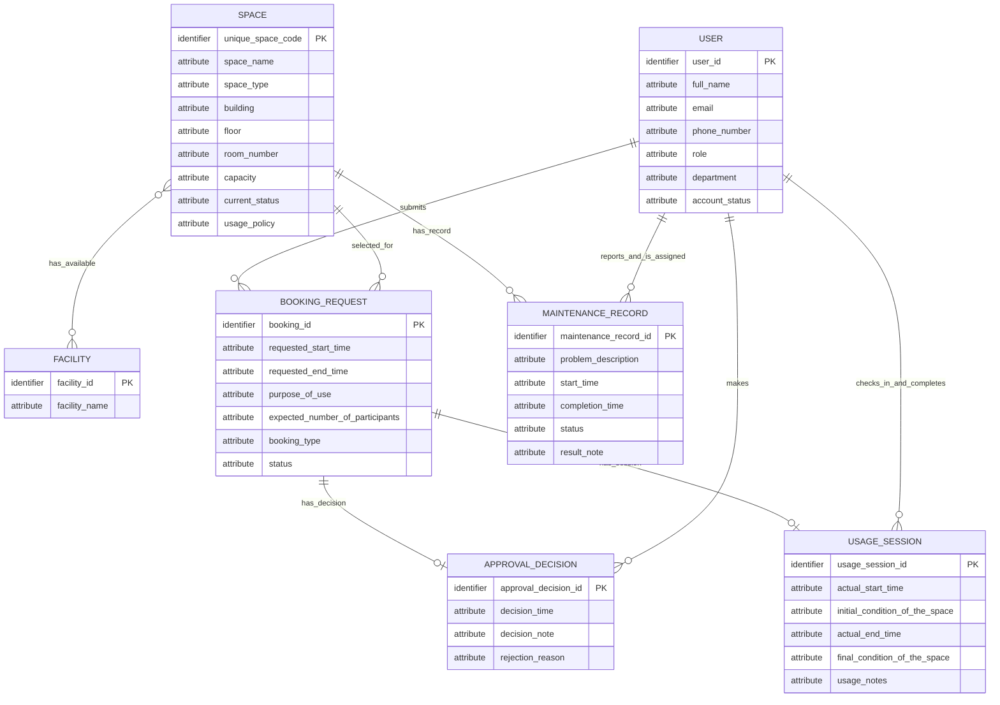

# Conceptual Database Design - Group 03

## 1. Source Documents

- Requested input: `outputs/01-business-req-analysis-G03.md`
- Actual input used: `outputs/01-business-req-analysis-G03.md`

## 2. Conceptual ERD

> Note: Where two or more distinct relationships exist between the same entity pair, only one representative line is shown in the diagram. See §4 Relationship Constraints for the full detail of each relationship.
> Note: `USER`–`USAGE_SESSION` represents 2 distinct roles: check-in person and completion person. `USER`–`MAINTENANCE_RECORD` represents 2 distinct roles: reporter and assigned staff member. See §4 Relationship Constraints for full detail.

## 3. Entity Definitions

### 3.1 User

A university account holder whose basic information and role are stored by the system.

Attributes:
- User ID *(identifier)* — source: upstream §4.1 User attribute list; BR-2.
- Full name — source: upstream §4.1 User attribute list; BR-2.
- Email — source: upstream §4.1 User attribute list; BR-2.
- Phone number — source: upstream §4.1 User attribute list; BR-2.
- Role — source: upstream §4.1 User attribute list; BR-2.
- Department — source: upstream §4.1 User attribute list; BR-2.
- Account status — source: upstream §4.1 User attribute list; BR-2.

> Relationships involving this entity are listed in §4 Relationship Constraints.

### 3.2 Space

A bookable shared campus space managed by the School.

Attributes:
- Unique space code *(identifier)* — source: upstream §4.2 Space attribute list; BR-3.
- Space name — source: upstream §4.2 Space attribute list; BR-3.
- Space type — source: upstream §4.2 Space attribute list; BR-3.
- Building — source: upstream §4.2 Space attribute list; BR-3.
- Floor — source: upstream §4.2 Space attribute list; BR-3.
- Room number — source: upstream §4.2 Space attribute list; BR-3.
- Capacity — source: upstream §4.2 Space attribute list; BR-3.
- Current status — source: upstream §4.2 Space attribute list; BR-3.
- Usage policy — source: upstream §4.2 Space attribute list; BR-3.

> Relationships involving this entity are listed in §4 Relationship Constraints.

### 3.3 Facility

A facility type that can be available in one or more spaces.

Attributes:
- Facility ID *(identifier)* — source: upstream §4.3 Facility attribute list; proposed identifier recorded in upstream §12 Assumptions.
- Facility name — source: upstream §4.3 Facility attribute list.

> Relationships involving this entity are listed in §4 Relationship Constraints.

### 3.4 Booking Request

A user-submitted request to use a selected space for a requested time period and purpose.

Attributes:
- Booking ID *(identifier)* — source: upstream §4.4 Booking Request attribute list; proposed identifier recorded in upstream §12 Assumptions.
- Requested start time — source: upstream §4.4 Booking Request attribute list; BR-5.
- Requested end time — source: upstream §4.4 Booking Request attribute list; BR-5.
- Purpose of use — source: upstream §4.4 Booking Request attribute list; BR-5.
- Expected number of participants — source: upstream §4.4 Booking Request attribute list; BR-5.
- Booking type — source: upstream §4.4 Booking Request attribute list; BR-6.
- Status — source: upstream §4.4 Booking Request attribute list; BR-7.

> Relationships involving this entity are listed in §4 Relationship Constraints.

### 3.5 Approval Decision

The recorded approval or rejection decision for a booking request that requires approval.

Attributes:
- Approval Decision ID *(identifier)* — source: upstream §4.5 Approval Decision attribute list; proposed identifier recorded in upstream §12 Assumptions.
- Decision time — source: upstream §4.5 Approval Decision attribute list; BR-12.
- Decision note — source: upstream §4.5 Approval Decision attribute list; BR-12.
- Rejection reason — source: upstream §4.5 Approval Decision attribute list; BR-13.

> Relationships involving this entity are listed in §4 Relationship Constraints.

### 3.6 Usage Session

The recorded actual use of a booking from check-in through completion.

Attributes:
- Usage Session ID *(identifier)* — source: upstream §4.6 Usage Session attribute list; proposed identifier recorded in upstream §12 Assumptions.
- Actual start time — source: upstream §4.6 Usage Session attribute list; BR-15.
- Initial condition of the space — source: upstream §4.6 Usage Session attribute list; BR-15.
- Actual end time — source: upstream §4.6 Usage Session attribute list; BR-17.
- Final condition of the space — source: upstream §4.6 Usage Session attribute list; BR-17.
- Usage notes — source: upstream §4.6 Usage Session attribute list; BR-17.

> Relationships involving this entity are listed in §4 Relationship Constraints.

### 3.7 Maintenance Record

A record of a maintenance problem and its handling for a space.

Attributes:
- Maintenance Record ID *(identifier)* — source: upstream §4.7 Maintenance Record attribute list; proposed identifier recorded in upstream §12 Assumptions.
- Problem description — source: upstream §4.7 Maintenance Record attribute list; BR-19.
- Start time — source: upstream §4.7 Maintenance Record attribute list; BR-19.
- Completion time — source: upstream §4.7 Maintenance Record attribute list; BR-19.
- Status — source: upstream §4.7 Maintenance Record attribute list; BR-19.
- Result note — source: upstream §4.7 Maintenance Record attribute list; BR-19.

> Relationships involving this entity are listed in §4 Relationship Constraints.

## 4. Relationship Constraints

This table is the authoritative relationship model. The Mermaid diagram in §2 is a visual aid only.

| Relationship Name | Entity A | Entity B | Cardinality | Participation | Explanation |
|---|---|---|---|---|---|
| SUBMITS | User | Booking Request | 1 to 0..* | A→B: Each User may submit zero or many Booking Requests. B→A: Each Booking Request must be submitted by exactly one User. | Source: upstream §5 “User submits Booking Request”; BR-5. |
| SELECTS_SPACE | Space | Booking Request | 1 to 0..* | A→B: Each Space may be selected by zero or many Booking Requests over time. B→A: Each Booking Request must select exactly one Space. | Source: upstream §5 “Booking Request selects Space”; BR-5. |
| HAS_FACILITY | Space | Facility | 0..* to 0..* | A→B: Each Space may have zero or many Facilities. B→A: Each Facility may be available in zero or many Spaces. | Source: upstream §5 “Space has Facility”; BR-4. |
| HAS_APPROVAL_DECISION | Booking Request | Approval Decision | 1 to 0..1 | A→B: Each Booking Request may have zero or one Approval Decision. B→A: Each Approval Decision must belong to exactly one Booking Request. | Source: upstream §5 “Booking Request has Approval Decision”; BR-11, BR-12, BR-13. |
| MAKES_DECISION | User | Approval Decision | 1 to 0..* | A→B: Each User may make zero or many Approval Decisions. B→A: Each Approval Decision must be made by exactly one User. | Source: upstream §5 “User makes Approval Decision”; BR-12. |
| HAS_USAGE_SESSION | Booking Request | Usage Session | 1 to 0..1 | A→B: Each Booking Request may have zero or one Usage Session. B→A: Each Usage Session must belong to exactly one Booking Request. | Source: upstream §5 “Booking Request has Usage Session”; BR-14 through BR-17. |
| CHECKED_IN_BY | User | Usage Session | 1 to 0..* | A→B: Each User may check in zero or many Usage Sessions. B→A: Each Usage Session must be checked in by exactly one User. | Source: upstream §5 “User checks in Usage Session”; BR-15. |
| COMPLETED_BY | User | Usage Session | 1 to 0..* | A→B: Each User may complete zero or many Usage Sessions. B→A: Each Usage Session may be completed by zero or one User until completion occurs, and a completed session has exactly one completing User. | Source: upstream §5 “User completes Usage Session”; BR-16, BR-17. |
| HAS_MAINTENANCE_RECORD | Space | Maintenance Record | 1 to 0..* | A→B: Each Space may have zero or many Maintenance Records. B→A: Each Maintenance Record must relate to exactly one Space. | Source: upstream §5 “Space has Maintenance Record”; BR-18, BR-19. |
| REPORTED_BY | User | Maintenance Record | 1 to 0..* | A→B: Each User may report zero or many Maintenance Records. B→A: Each Maintenance Record must have exactly one reporter User. | Source: upstream §5 “User reports Maintenance Record”; BR-19. |
| ASSIGNED_TO | User | Maintenance Record | 1 to 0..* | A→B: Each User may be assigned to zero or many Maintenance Records. B→A: Each Maintenance Record must have exactly one assigned staff User. | Source: upstream §5 “User is assigned to Maintenance Record”; BR-19. |

## 5. Business Rule Coverage

For every business rule in the upstream analysis (Section 6), explain how the conceptual design supports it, or explicitly state that enforcement is deferred.

| Upstream Rule | How the Design Supports It |
|---|---|
| BR-1: Each user must have a university account. | Captured by the User entity and User ID identifier. |
| BR-2: The system stores user ID, full name, email, phone number, role, department, and account status for each user. | Captured by the User entity attributes in §3.1. |
| BR-3: For each space, the system stores a unique space code, space name, space type, building, floor, room number, capacity, current status, and usage policy. | Captured by the Space entity attributes in §3.2, with Unique space code as identifier. |
| BR-4: The system stores the list of facilities available in each space. | Captured by Facility entity and HAS_FACILITY many-to-many relationship. |
| BR-5: Users can submit booking requests by selecting a space, requested start time, requested end time, purpose of use, and expected number of participants. | Captured by Booking Request attributes plus SUBMITS and SELECTS_SPACE relationships. |
| BR-6: A booking may be for a lecture, examination, seminar, workshop, meeting, student activity, or administrative event. | Captured by Booking Request attribute Booking type. |
| BR-7: Each booking request has a status such as pending, approved, rejected, cancelled, checked in, completed, or no-show. | Captured by Booking Request attribute Status; status-transition enforcement is not fully captured conceptually — enforcement deferred to logical/physical design. |
| BR-8: The system must prevent conflicting bookings. | Represented as a cross-entity constraint involving Booking Request and Space; detailed conflict enforcement deferred to logical/physical design. |
| BR-9: The same space cannot have two approved bookings with overlapping time periods. | Represented by Booking Request requested time attributes, Status, and SELECTS_SPACE relationship; overlap enforcement deferred to logical/physical design. |
| BR-10: A space that is under maintenance, temporarily closed, or retired cannot be booked. | Represented by Space Current status and SELECTS_SPACE relationship; enforcement of disallowed statuses deferred to logical/physical design. |
| BR-11: A booking request may require approval from a facility staff member or manager. | Captured by optional HAS_APPROVAL_DECISION relationship and MAKES_DECISION relationship to User. |
| BR-12: When a booking is approved or rejected, the system records the staff member who made the decision, the decision time, and a decision note. | Captured by Approval Decision attributes Decision time and Decision note, plus MAKES_DECISION relationship. |
| BR-13: If the booking is rejected, the rejection reason should be stored. | Captured by Approval Decision attribute Rejection reason. Conditional applicability for rejected decisions — enforcement deferred to logical/physical design. |
| BR-14: When the requester arrives, facility staff can check in the booking. | Captured by HAS_USAGE_SESSION and CHECKED_IN_BY relationships. |
| BR-15: At check-in, the system records the actual start time, the person who checked in the booking, and the initial condition of the space. | Captured by Usage Session attributes Actual start time and Initial condition of the space, plus CHECKED_IN_BY relationship. |
| BR-16: When the session ends, facility staff can complete the booking. | Captured by distinct COMPLETED_BY relationship. |
| BR-17: At completion, the system records the actual end time, the final condition of the space, and any usage notes. | Captured by Usage Session attributes Actual end time, Final condition of the space, and Usage notes. |
| BR-18: A space may have maintenance records for problems such as broken projectors, air-conditioning failure, damaged furniture, cleaning issues, or network problems. | Captured by HAS_MAINTENANCE_RECORD relationship and Maintenance Record entity. |
| BR-19: Each maintenance record stores the related space, reporter, assigned staff member, problem description, start time, completion time, status, and result note. | Captured by Maintenance Record attributes plus HAS_MAINTENANCE_RECORD, REPORTED_BY, and ASSIGNED_TO relationships. |
| BR-20: A space under maintenance cannot be booked. | Represented by Space Current status and SELECTS_SPACE relationship; enforcement deferred to logical/physical design because the conceptual model does not define the operational mechanism. |
| BR-21: The system should keep historical records of bookings and maintenance activities. | Supported by retaining Booking Request, Usage Session, Approval Decision, and Maintenance Record as event/history entities. |
| BR-22: Staff should be able to view booking history, upcoming bookings, spaces under maintenance, and no-show bookings. | Supported by User, Booking Request, Space, and Maintenance Record entities and their relationships; access/view permission enforcement deferred to logical/physical design. |

## 6. Design Reasoning

The conceptual model carries forward the seven entities from the upstream analysis: User, Space, Facility, Booking Request, Approval Decision, Usage Session, and Maintenance Record. Relationship-reference facts from the upstream analysis, such as selected space, decision staff member, check-in person, completion person, related space, reporter, and assigned staff member, are modeled as relationships rather than as attributes.

Approval Decision is kept separate from Booking Request because decision time, decision note, and rejection reason are facts about the approval/rejection event rather than general request details. Usage Session is kept separate from Booking Request because actual start/end times, space conditions, and usage notes are facts about actual use rather than requested use. Facility is modeled as a reusable facility type connected to Space through a many-to-many relationship, matching the upstream relationship row that a space may have several facilities and facility types may appear in multiple spaces.

Multiple relationships between the same entity pair are kept distinct in §4 because the roles are semantically different and may involve different users at different times. `CHECKED_IN_BY` and `COMPLETED_BY` both connect User to Usage Session, but the upstream analysis records the person who checked in separately from the completion action. `REPORTED_BY` and `ASSIGNED_TO` both connect User to Maintenance Record, but the upstream analysis identifies reporter and assigned staff member as different role-players. The Mermaid diagram merges each multi-relationship pair into one representative visual line only because Mermaid `erDiagram` rendering does not reliably display repeated lines between the same entity pair; §4 remains the authoritative relationship model.

The design does not resolve upstream open questions. Booking cancellation and no-show transitions, maintenance status values, requester eligibility, special equipment requests, usage policy enforcement, maintenance assignment authority, and whether maintenance records automatically change space status remain outside the asserted conceptual constraints.

## 7. Assumptions

Every assumption must carry a source tag:
- `[upstream]` — carried forward from the upstream analysis without change.
- `[upstream-corrected]` — item from upstream that was modified here (e.g. duplicate attribute removed, identifier added). Must state what changed and why.
- `[design-level]` — new assumption introduced at this stage, not present in upstream analysis.

- [upstream] `Facility ID` is a proposed identifier for Facility because the upstream analysis lists facility examples and says to store facilities available in each space, but does not name a facility identifier.
- [upstream] `Booking ID` is a proposed identifier for Booking Request because the upstream analysis describes booking requests but does not name a booking identifier.
- [upstream] `Approval Decision ID` is a proposed identifier for Approval Decision because the upstream analysis describes recorded approval/rejection details but does not name a decision identifier.
- [upstream] `Usage Session ID` is a proposed identifier for Usage Session because the upstream analysis describes check-in and completion records but does not name a usage-session identifier.
- [upstream] `Maintenance Record ID` is a proposed identifier for Maintenance Record because the upstream analysis describes maintenance records but does not name a maintenance-record identifier.
- [upstream] Approval Decision is modeled as a separate entity because the upstream analysis records decision-specific facts: decision maker, decision time, decision note, and rejection reason.
- [upstream] Usage Session is modeled as a separate entity because the upstream analysis records actual usage facts at check-in and completion that are distinct from requested booking facts.
- [upstream] `Decision note` and `rejection reason` are retained as distinct Approval Decision attributes because the upstream analysis names both; rejection reason applies when the booking is rejected.
- [upstream] The generic word “Staff” in the staff-view requirement is interpreted as Facility Staff because the upstream analysis lists Facility Staff as a user role and does not list a separate generic Staff role.
- [design-level] Attribute names in the Mermaid ERD use underscore formatting, such as `requested_start_time`, as visual equivalents of the source labels, such as “Requested start time”; the authoritative attribute labels are listed in §3.
- [design-level] No duplicate business fact from upstream required removal in this conceptual design; `rejection reason` appears only on Approval Decision, consistent with the upstream analysis.

## 8. Open Questions

- Layer A mentions checking whether a requester is allowed to use a room; should the new system enforce requester eligibility? This could affect User-to-Booking Request permissions and Space usage constraints.
- Layer A mentions checking whether special equipment is needed; should the new system record or validate requested equipment needs? This could require a relationship between Booking Request and Facility, but it is not modeled because Layer B does not state it.
- Layer B stores a space usage policy, but does not say how it is enforced; should booking requests be validated against usage policy? Enforcement is not modeled as a definite constraint.
- What action and role create the `cancelled` booking status, and from which statuses can cancellation occur? Cancellation transitions are not asserted in the conceptual model.
- What action and role create the `no-show` booking status, and from which status can a booking become no-show? No-show transitions are not asserted in the conceptual model.
- Can a booking move from pending directly to checked in if approval is not required, or does every checked-in booking first become approved? The conceptual model keeps HAS_USAGE_SESSION optional and does not assert this transition path.
- Which user roles are allowed to report maintenance issues? The REPORTED_BY relationship records a reporter User, but role restriction is unresolved.
- Which user roles are allowed to assign maintenance staff members? The ASSIGNED_TO relationship records an assigned User, but assignment authority is unresolved.
- What maintenance status values are allowed, and what transitions are permitted from start time to completion time? Maintenance status is modeled as an attribute only; allowed values and transitions are unresolved.
- Does creating an active maintenance record automatically set the related space status to under maintenance, or is the space status managed separately? The model includes both Space Current status and HAS_MAINTENANCE_RECORD but does not assert automatic synchronization.
- Does every approved or rejected booking require exactly one Approval Decision record, including bookings that do not require approval? The conceptual model uses optional HAS_APPROVAL_DECISION as specified upstream.
- BR-7 status-transition enforcement deferred to logical/physical design because the upstream analysis lists statuses but does not define all transitions.
- BR-8 and BR-9 booking conflict/overlap enforcement deferred to logical/physical design because the conceptual ERD can represent the involved entities and attributes but not the full temporal conflict rule.
- BR-10 and BR-20 unavailable-space booking enforcement deferred to logical/physical design because the conceptual ERD can represent Space Current status but not the operational validation mechanism.
- BR-13 conditional rejection-reason enforcement deferred to logical/physical design because the conceptual ERD stores the fact but does not enforce conditional applicability.
- BR-22 staff view/access enforcement deferred to logical/physical design because the conceptual ERD represents the information to view but not access-control behavior.
