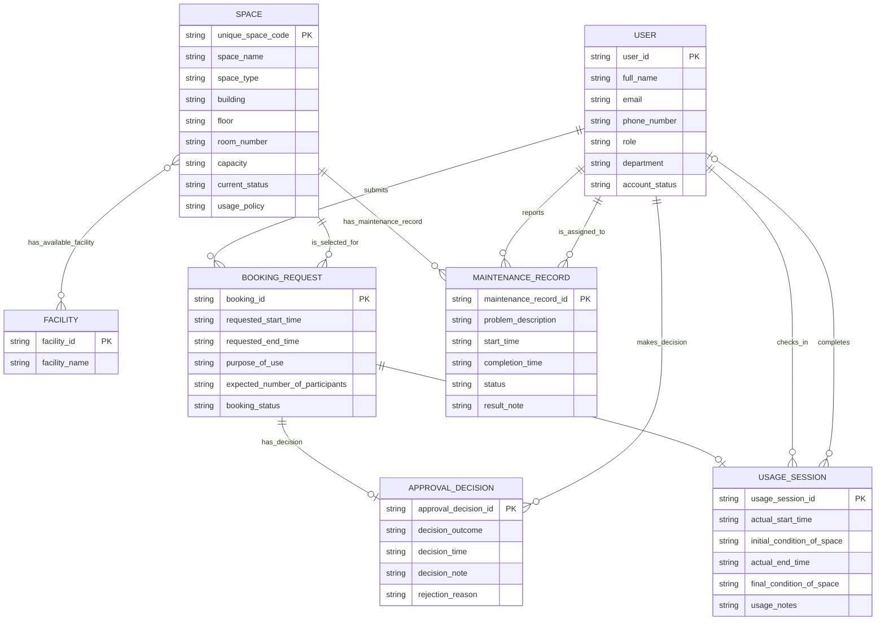

# Conceptual Database Design - Group 03

## 1. Source Documents

- Requested input: `outputs/01-business-req-analysis-G03.md`
- Actual input used: `outputs/01-business-req-analysis-G03.md`

## 2. Conceptual ERD

> Note: This ERD shows all 11 distinct relationships as separate relationship lines. The repeated `USER`–`USAGE_SESSION` and `USER`–`MAINTENANCE_RECORD` lines are intentionally not merged because each role is a distinct business relationship described in the upstream analysis.

## 3. Entity Definitions

### 3.1 User

A person with a university account whose basic information is stored by the system.

Attributes:
- user_id *(identifier)* — source: upstream §4.1 User attribute “User ID”; supports BR-01 and BR-02.
- full_name — source: upstream §4.1 User attribute “Full name”; supports BR-02.
- email — source: upstream §4.1 User attribute “Email”; supports BR-02.
- phone_number — source: upstream §4.1 User attribute “Phone number”; supports BR-02.
- role — source: upstream §4.1 User attribute “Role” and possible roles list; supports BR-03.
- department — source: upstream §4.1 User attribute “Department”; supports BR-02.
- account_status — source: upstream §4.1 User attribute “Account status”; supports BR-02.

> Relationships involving this entity are listed in §4 Relationship Constraints.

### 3.2 Space

A bookable shared campus space managed by the School.

Attributes:
- unique_space_code *(identifier)* — source: upstream §4.2 Space attribute “Unique space code”; supports BR-05.
- space_name — source: upstream §4.2 Space attribute “Space name”; supports BR-05.
- space_type — source: upstream §4.2 Space attribute “Space type”; supports BR-05.
- building — source: upstream §4.2 Space attribute “Building”; supports BR-05.
- floor — source: upstream §4.2 Space attribute “Floor”; supports BR-05.
- room_number — source: upstream §4.2 Space attribute “Room number”; supports BR-05.
- capacity — source: upstream §4.2 Space attribute “Capacity”; supports BR-05.
- current_status — source: upstream §4.2 Space attribute “Current status” and possible current statuses; supports BR-06 and BR-13.
- usage_policy — source: upstream §4.2 Space attribute “Usage policy”; supports BR-05.

> Relationships involving this entity are listed in §4 Relationship Constraints.

### 3.3 Facility

A facility type available in one or more spaces.

Attributes:
- facility_id *(identifier)* — source: upstream §4.3 Facility attribute “Facility ID [proposed identifier — not stated in source]”; carried forward as the conceptual identifier.
- facility_name — source: upstream §4.3 Facility attribute “Facility name” and possible facility names list; supports BR-07.

> Relationships involving this entity are listed in §4 Relationship Constraints.

### 3.4 Booking Request

A request submitted by a user to use a selected space for a requested time period and purpose.

Attributes:
- booking_id *(identifier)* — source: upstream §4.4 Booking Request attribute “Booking ID [proposed identifier — not stated in source]”; carried forward as the conceptual identifier.
- requested_start_time — source: upstream §4.4 Booking Request attribute “Requested start time”; supports BR-08 and BR-12.
- requested_end_time — source: upstream §4.4 Booking Request attribute “Requested end time”; supports BR-08 and BR-12.
- purpose_of_use — source: upstream §4.4 Booking Request attribute “Purpose of use” and possible purpose values; supports BR-08 and BR-09.
- expected_number_of_participants — source: upstream §4.4 Booking Request attribute “Expected number of participants”; supports BR-08.
- booking_status — source: upstream §4.4 Booking Request attribute “Booking status” and possible booking statuses; supports BR-10 and §7.1 booking transitions.

> Relationships involving this entity are listed in §4 Relationship Constraints.

### 3.5 Approval Decision

The record created when a booking request is approved or rejected.

Attributes:
- approval_decision_id *(identifier)* — source: upstream §4.5 Approval Decision attribute “Approval Decision ID [proposed identifier — not stated in source]”; carried forward as the conceptual identifier.
- decision_outcome — source: upstream §4.5 Approval Decision attribute “Decision outcome [proposed — derived from the source's ‘approved or rejected’ conditional, not stated as a separately stored fact]”; supports BR-15.
- decision_time — source: upstream §4.5 Approval Decision attribute “Decision time”; supports BR-15.
- decision_note — source: upstream §4.5 Approval Decision attribute “Decision note”; supports BR-15.
- rejection_reason — source: upstream §4.5 Approval Decision attribute “Rejection reason”; supports BR-16.

> Relationships involving this entity are listed in §4 Relationship Constraints.

### 3.6 Usage Session

The usage record for a booking after facility staff check in the requester and later complete the booking.

Attributes:
- usage_session_id *(identifier)* — source: upstream §4.6 Usage Session attribute “Usage Session ID [proposed identifier — not stated in source]”; carried forward as the conceptual identifier.
- actual_start_time — source: upstream §4.6 Usage Session attribute “Actual start time”; supports BR-18.
- initial_condition_of_space — source: upstream §4.6 Usage Session attribute “Initial condition of the space”; supports BR-18.
- actual_end_time — source: upstream §4.6 Usage Session attribute “Actual end time”; supports BR-19.
- final_condition_of_space — source: upstream §4.6 Usage Session attribute “Final condition of the space”; supports BR-19.
- usage_notes — source: upstream §4.6 Usage Session attribute “Usage notes”; supports BR-19.

> Relationships involving this entity are listed in §4 Relationship Constraints.

### 3.7 Maintenance Record

A record of a maintenance problem or activity for a space.

Attributes:
- maintenance_record_id *(identifier)* — source: upstream §4.7 Maintenance Record attribute “Maintenance Record ID [proposed identifier — not stated in source]”; carried forward as the conceptual identifier.
- problem_description — source: upstream §4.7 Maintenance Record attribute “Problem description”; supports BR-21 and BR-22.
- start_time — source: upstream §4.7 Maintenance Record attribute “Start time”; supports BR-22.
- completion_time — source: upstream §4.7 Maintenance Record attribute “Completion time”; supports BR-22.
- status — source: upstream §4.7 Maintenance Record attribute “Status”; supports BR-22.
- result_note — source: upstream §4.7 Maintenance Record attribute “Result note”; supports BR-22.

> Relationships involving this entity are listed in §4 Relationship Constraints.

## 4. Relationship Constraints

This table is the authoritative relationship model. The Mermaid diagram in §2 is a visual aid only.

> Write the `Cardinality` value in the same order as the columns: Entity-A side first, then Entity-B side (e.g. `1 to 0..*` means A=1, B=0..*). Keep this orientation uniform on every row — do not flip it for individual rows.

| Relationship Name | Entity A | Entity B | Cardinality | Participation | Explanation |
|---|---|---|---|---|---|
| SUBMITS | User | Booking Request | 1 to 0..* | A→B: Each User may submit zero or many Booking Requests. B→A: Each Booking Request must be submitted by exactly one User. | Source: upstream §5 “User submits Booking Request” and BR-08. |
| SELECTS_SPACE | Space | Booking Request | 1 to 0..* | A→B: Each Space may be selected for zero or many Booking Requests. B→A: Each Booking Request must select exactly one Space. | Source: upstream §5 “Booking Request selects Space” and BR-08. |
| HAS_FACILITY | Space | Facility | 0..* to 0..* | A→B: Each Space may have zero or many Facilities. B→A: Each Facility may be available in zero or many Spaces. | Source: upstream §5 “Space has Facility” and BR-07; upstream assumption treats Facility as reusable type/name. |
| HAS_APPROVAL_DECISION | Booking Request | Approval Decision | 1 to 0..1 | A→B: Each Booking Request may have zero or one Approval Decision. B→A: Each Approval Decision must belong to exactly one Booking Request. | Source: upstream §5 “Booking Request has Approval Decision” and BR-14 through BR-16. |
| MAKES_DECISION | User | Approval Decision | 1 to 0..* | A→B: Each User may make zero or many Approval Decisions. B→A: Each Approval Decision must record exactly one User as the decision maker. | Source: upstream §5 “User makes Approval Decision” and BR-15; role permission scope is Facility Staff or Facility Manager per upstream §8. |
| HAS_USAGE_SESSION | Booking Request | Usage Session | 1 to 0..1 | A→B: Each Booking Request may have zero or one Usage Session. B→A: Each Usage Session must belong to exactly one Booking Request. | Source: upstream §5 “Booking Request has Usage Session” and BR-17 through BR-19. |
| CHECKED_IN_BY | User | Usage Session | 1 to 0..* | A→B: Each User may check in zero or many Usage Sessions. B→A: Each Usage Session must be checked in by exactly one User. | Source: upstream §5 “User checks in Usage Session,” BR-17, and BR-18. |
| COMPLETED_BY | User | Usage Session | 0..1 to 0..* | A→B: Each User may complete zero or many Usage Sessions. B→A: Each Usage Session may be completed by zero or one User until completion occurs. | Source: upstream §5 “User completes Usage Session” and BR-19; optionality reflects the workflow stage before completion. |
| HAS_MAINTENANCE_RECORD | Space | Maintenance Record | 1 to 0..* | A→B: Each Space may have zero or many Maintenance Records. B→A: Each Maintenance Record must relate to exactly one Space. | Source: upstream §5 “Space has Maintenance Record” and BR-20 through BR-22. |
| REPORTED_BY | User | Maintenance Record | 1 to 0..* | A→B: Each User may report zero or many Maintenance Records. B→A: Each Maintenance Record must have exactly one reporter. | Source: upstream §5 “User reports Maintenance Record” and BR-22. |
| ASSIGNED_TO | User | Maintenance Record | 1 to 0..* | A→B: Each User may be assigned to zero or many Maintenance Records. B→A: Each Maintenance Record must have exactly one assigned staff member. | Source: upstream §5 “User is assigned to Maintenance Record” and BR-22. |

## 5. Business Rule Coverage

For every business rule in the upstream analysis (Section 6), explain how the conceptual design supports it, or explicitly state that enforcement is deferred.

| Upstream Rule | How the Design Supports It |
|---|---|
| BR-01: Each user must have a university account. | Supported by the User entity and `user_id` identifier. |
| BR-02: The system stores user ID, full name, email, phone number, role, department, and account status for each user. | Supported by User attributes `user_id`, `full_name`, `email`, `phone_number`, `role`, `department`, and `account_status`. |
| BR-03: A user may be a student, lecturer, teaching assistant, facility staff, department administrator, or facility manager. | Supported by User attribute `role`; allowed-role enforcement is deferred to logical/physical design. |
| BR-04: The School manages many bookable spaces. | Supported by the Space entity. |
| BR-05: For each space, the system stores unique space code, space name, space type, building, floor, room number, capacity, current status, and usage policy. | Supported by Space attributes `unique_space_code`, `space_name`, `space_type`, `building`, `floor`, `room_number`, `capacity`, `current_status`, and `usage_policy`. |
| BR-06: A space may be available, in use, under maintenance, temporarily closed, or retired. | Supported by Space attribute `current_status`; allowed-status enforcement is deferred to logical/physical design. |
| BR-07: Each space may have several facilities, and the system stores the list of facilities available in each space. | Supported by Facility entity and HAS_FACILITY many-to-many relationship between Space and Facility. |
| BR-08: Users can submit booking requests by selecting a space, requested start time, requested end time, purpose of use, and expected number of participants. | Supported by Booking Request attributes and SUBMITS plus SELECTS_SPACE relationships. |
| BR-09: A booking may be for a lecture, examination, seminar, workshop, meeting, student activity, or administrative event. | Supported by Booking Request attribute `purpose_of_use`; allowed-purpose enforcement is deferred to logical/physical design. |
| BR-10: Each booking request has a status such as pending, approved, rejected, cancelled, checked in, completed, or no-show. | Supported by Booking Request attribute `booking_status`; allowed-status enforcement is deferred to logical/physical design. |
| BR-11: The system must prevent conflicting bookings. | Represented conceptually by Booking Request requested times and SELECTS_SPACE relationship; conflict enforcement is deferred to logical/physical design. |
| BR-12: The same space cannot have two approved bookings with overlapping time periods. | Represented conceptually by Space–Booking Request relationship, requested time attributes, and `booking_status`; overlap enforcement is deferred to logical/physical design and remains listed in §8. |
| BR-13: A space that is under maintenance, temporarily closed, or retired cannot be booked. | Represented conceptually by Space `current_status` and SELECTS_SPACE relationship; unavailable-space booking prevention is deferred to logical/physical design and remains listed in §8. |
| BR-14: A booking request may require approval from a facility staff member or manager. | Supported by HAS_APPROVAL_DECISION and MAKES_DECISION relationships; criteria for which bookings require approval remain open in §8. |
| BR-15: When a booking is approved or rejected, the system records the staff member who made the decision, the decision time, and a decision note. | Supported by Approval Decision attributes `decision_outcome`, `decision_time`, `decision_note`, and MAKES_DECISION relationship. |
| BR-16: If the booking is rejected, the rejection reason should be stored. | Supported by Approval Decision attribute `rejection_reason`; conditional enforcement for rejected decisions is deferred to logical/physical design. |
| BR-17: When the requester arrives, facility staff can check in the booking. | Supported by HAS_USAGE_SESSION relationship and CHECKED_IN_BY relationship. |
| BR-18: During check-in, the system records the actual start time, the person who checked in the booking, and the initial condition of the space. | Supported by Usage Session attributes `actual_start_time`, `initial_condition_of_space`, and CHECKED_IN_BY relationship. |
| BR-19: When the session ends, facility staff can complete the booking by recording the actual end time, final condition of the space, and any usage notes. | Supported by Usage Session attributes `actual_end_time`, `final_condition_of_space`, `usage_notes`, and COMPLETED_BY relationship. |
| BR-20: The system supports basic maintenance management for spaces. | Supported by Maintenance Record entity and HAS_MAINTENANCE_RECORD relationship. |
| BR-21: A space may have maintenance records for problems such as broken projectors, air-conditioning failure, damaged furniture, cleaning issues, or network problems. | Supported by HAS_MAINTENANCE_RECORD relationship and Maintenance Record `problem_description`. |
| BR-22: Each maintenance record stores the related space, reporter, assigned staff member, problem description, start time, completion time, status, and result note. | Supported by Maintenance Record attributes plus HAS_MAINTENANCE_RECORD, REPORTED_BY, and ASSIGNED_TO relationships. |
| BR-23: A space under maintenance cannot be booked. | Represented conceptually by Space `current_status` and SELECTS_SPACE relationship; unavailable-space enforcement is deferred to logical/physical design and remains listed in §8. |
| BR-24: The system should keep historical records of bookings and maintenance activities. | Supported by Booking Request, Approval Decision, Usage Session, and Maintenance Record entities and their relationships. Retention policy details are not specified upstream. |
| BR-25: Staff should be able to view booking history, upcoming bookings, spaces under maintenance, and no-show bookings. | Supported by storing booking status, requested times, space current status, and maintenance records; view/query and authorization implementation are deferred, and staff scope remains open in §8. |

## 6. Design Reasoning

The design uses the seven entities identified in upstream §4 and does not introduce additional entities for roles, statuses, purposes, or history views because the upstream analysis models these as attributes or derived views rather than independent business objects. Relationship-reference facts from the upstream analysis, such as selected space, decision maker, check-in person, completion person, related space, reporter, and assigned staff member, are represented as relationships rather than entity attributes to keep the model conceptual.

`Space`–`Facility` is modeled as many-to-many because upstream §5 explicitly says a space can have several facilities and records an assumption that facility is a reusable type/name across spaces. `Approval Decision` owns `rejection_reason`; it is not duplicated on `Booking Request` because the upstream analysis already follows the single-source-of-truth rule and assigns decision facts to the decision event record. `decision_outcome` is carried forward as a visibly tagged upstream-derived attribute because upstream §4.5 included it and upstream §12 explains the derivation from the “approved or rejected” decision event.

Multiple relationships between the same entity pair are kept distinct because they represent different business roles that may occur at different times or involve different users. `CHECKED_IN_BY` and `COMPLETED_BY` are separate User–Usage Session relationships; the Mermaid ERD draws both lines separately and uses different optionality for completion because a usage session may exist after check-in but before completion. `REPORTED_BY` and `ASSIGNED_TO` are also separate User–Maintenance Record relationships because the upstream analysis stores reporter and assigned staff member as separate maintenance facts.

Rules requiring temporal comparison, status-dependent prevention, role restriction, conditional rejection reason enforcement, and query/view behavior are acknowledged in §5 but deferred beyond the conceptual model. Upstream open questions are carried forward in §8 instead of being converted into unsupported conceptual constraints.

## 7. Assumptions

- [upstream] Facility ID is a proposed identifier for Facility because the source lists facilities but does not state a facility identifier.
- [upstream] Booking ID is a proposed identifier for Booking Request because the source does not state a booking identifier.
- [upstream] Approval Decision ID is a proposed identifier for Approval Decision because the source does not state a decision identifier.
- [upstream] Decision outcome is included as a derived attribute on Approval Decision because the source describes the decision event as “approved or rejected,” but does not list outcome as a separately stored fact.
- [upstream] Usage Session ID is a proposed identifier for Usage Session because the source does not state a usage-session identifier.
- [upstream] Maintenance Record ID is a proposed identifier for Maintenance Record because the source does not state a maintenance-record identifier.
- [upstream] Decision note and rejection reason are kept as distinct Approval Decision attributes because the source states both a decision note for approved/rejected bookings and a rejection reason specifically if the booking is rejected.
- [upstream] Facility is treated as a reusable facility type/name across spaces because the source says each space may have several facilities and does not state that each listed facility item is unique to exactly one space.
- [upstream] The Layer A role “staff” was not added as a separate actor because Layer B lists specific user roles and includes Facility Staff; the ambiguous scope of generic “staff” for viewing remains an Open Question.

## 8. Open Questions

- Question: How is Space usage policy enforced, if at all, during booking submission or approval? — Scope: Business Workflow. Design impact: no conceptual constraint is added between Booking Request purpose and Space usage policy.
- Question: Which prior status, trigger, and actor cause a Booking Request to become Cancelled? — Scope: Business Workflow. Design impact: Cancelled remains only a possible `booking_status` value, not a modeled transition relationship or constraint.
- Question: Which prior status, trigger, and actor cause a Booking Request to become No-show? — Scope: Business Workflow. Design impact: No-show remains only a possible `booking_status` value, not a modeled transition relationship or constraint.
- Question: Which booking requests require approval, and can any booking bypass approval? — Scope: Business Workflow. Design impact: HAS_APPROVAL_DECISION remains optional from Booking Request to Approval Decision.
- Question: What are the allowed status values and lifecycle transitions for Maintenance Record status? — Scope: Business Workflow. Design impact: Maintenance Record keeps a `status` attribute, but no maintenance status value list or transition constraints are modeled.
- Question: Which user roles are allowed to report maintenance issues? — Scope: Authorization. Design impact: REPORTED_BY links Maintenance Record to User without restricting the User role at the conceptual level.
- Question: Which user roles are allowed to assign the assigned staff member on a Maintenance Record? — Scope: Authorization. Design impact: ASSIGNED_TO links Maintenance Record to User without modeling the actor who performs assignment.
- Question: Does “staff should be able to view booking history, upcoming bookings, spaces under maintenance, and no-show bookings” mean Facility Staff only, or does it include other staff roles such as Teaching Assistant, Department Administrator, or Facility Manager? — Scope: Authorization. Design impact: no separate view-permission entity or constraint is added.
- Question: Does creating, starting, completing, or changing a Maintenance Record automatically change the related Space current status to or from Under maintenance? — Scope: Mixed. Design impact: no automatic synchronization constraint is modeled between Maintenance Record status and Space current_status.
- Question: Are booking requested start/end time ordering and maintenance start/completion time ordering required constraints, or only recorded values? — Scope: Database. Design impact: time-order validation is deferred beyond conceptual design.
- Question: Is expected number of participants only recorded, or must it be compared with Space capacity during booking or approval? — Scope: Business Workflow. Design impact: no capacity-comparison constraint is added.
- Question: What values are allowed for User account status? — Scope: Database. Design impact: User keeps `account_status`, but no allowed-value set is modeled.
- Question: Approved-booking overlap prevention requires comparing multiple Booking Requests for the same Space and overlapping requested time periods. — Scope: Database. Design impact: the conceptual model includes the relevant Space–Booking Request relationship and time/status attributes, but enforcement is deferred to logical/physical design.
- Question: Booking prevention for spaces under maintenance, temporarily closed, or retired requires checking Space current_status when creating or approving a Booking Request. — Scope: Database. Design impact: the conceptual model includes Space current_status and SELECTS_SPACE, but enforcement is deferred to logical/physical design.
- Question: Conditional rejection reason storage applies only when the Approval Decision outcome is Rejected. — Scope: Database. Design impact: the conceptual model includes both `decision_outcome` and `rejection_reason`, but conditional enforcement is deferred to logical/physical design.
