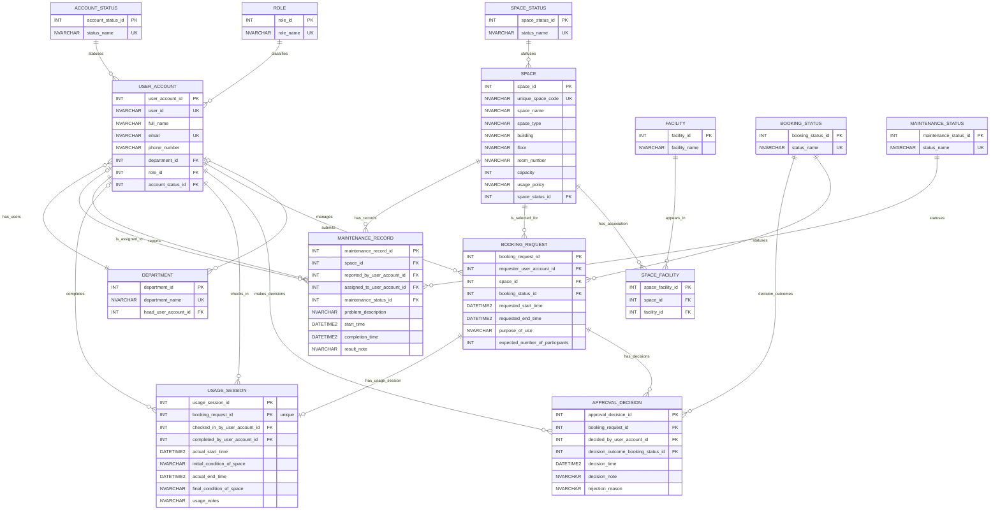

# Logical Database Design - Group 03

## 1. Source Documents and Path Discrepancies

This logical design transforms the Step 2 conceptual design into a SQL Server-oriented relational schema.

| Source | Required / Contract Path | Used Path | Purpose | Discrepancy |
|---|---|---|---|---|
| Project routing contract | `AGENTS.md` | `AGENTS.md` | Output-path and workflow contract | None |
| Step 2 conceptual design | `outputs/02-erd-design-G03.md` | `outputs/02-erd-design-G03.md` | Primary input for entities, attributes, relationships, and cardinalities | None |
| Step 1 requirement analysis | `outputs/01-business-req-analysis-G03.md` | `outputs/01-business-req-analysis-G03.md` | Traceability, assumptions, and open questions only | None |
| Logical output | `outputs/03-logical-design-G03.md` | `outputs/03-logical-design-G03.md` | Final output of this stage | None |

Traceability inventory used before drafting:

- Conceptual entities mapped: `USER_ACCOUNT`, `DEPARTMENT`, `ROLE`, `ACCOUNT_STATUS`, `SPACE`, `SPACE_STATUS`, `FACILITY`, `BOOKING_REQUEST`, `BOOKING_STATUS`, `APPROVAL_DECISION`, `USAGE_SESSION`, `MAINTENANCE_RECORD`, `MAINTENANCE_STATUS`.
- Conceptual M:N relationship resolved: `SPACE`–`FACILITY` via `SPACE_FACILITY`.
- Conceptual relationships mapped: `BELONGS_TO`, `IS_MANAGED_BY`, `HAS_ROLE`, `HAS_ACCOUNT_STATUS`, `HAS_SPACE_STATUS`, `HAS_BOOKING_STATUS`, `HAS_DECISION_OUTCOME`, `HAS_MAINTENANCE_STATUS`, `HAS_FACILITY`, `SUBMITS`, `SELECTS`, `HAS_APPROVAL_DECISION`, `MAKES_DECISION`, `HAS_USAGE_SESSION`, `CHECKS_IN`, `COMPLETES`, `HAS_MAINTENANCE_RECORD`, `REPORTS`, `ASSIGNED_TO`.

## 2. Relational Schema

### 2.0 Logical Conventions and Constraint Criteria

**Primary-key standardization.** Every table uses a system-generated surrogate `INT IDENTITY(1,1)` primary key with a named `PK_...` constraint. Natural/business identifiers from the conceptual model, such as `USER_ACCOUNT.user_id` and `SPACE.unique_space_code`, are demoted to regular attributes and protected with named `UNIQUE` constraints. All foreign keys reference surrogate `INT` primary keys, never demoted natural keys. This improves storage efficiency, join performance, and key stability: if a natural value such as a student code or space code needs correction, only the row containing that `UNIQUE` business attribute changes and no referencing rows need cascading updates.

**Foreign-key referential actions.** Every FK uses explicit actions:

- `ON DELETE CASCADE` is used only for pure current-state association rows with no audit/history value: `SPACE_FACILITY`.
- `ON DELETE NO ACTION` is used for master data and all historical/audit-bearing relationships so deleting parent rows cannot erase or orphan booking, decision, usage, or maintenance history (`BR-20`). Optional actor FKs also use `NO ACTION` rather than `SET NULL` because preserving who acted is more important than allowing actor deletion.
- `ON UPDATE NO ACTION` is used uniformly because all referenced primary keys are immutable surrogate `INT` values. Natural-key corrections occur on non-referenced `UNIQUE` attributes.

**Closed/open value classification.** Closed controlled vocabularies that govern authorization or lifecycle (`ROLE`, `ACCOUNT_STATUS`, `SPACE_STATUS`, `BOOKING_STATUS`, `MAINTENANCE_STATUS`) are implemented as lookup/reference tables with `UNIQUE` name columns; no allowed-value `CHECK` duplicates those FKs. `purpose_of_use` is a closed process category with listed values and is implemented as a named `CHECK`. Open descriptive catalogs (`space_type`, `facility_name`) are left unconstrained because deployments may add valid values.

**Unresolved implementation rules.** Cross-row/cross-table rules that ordinary SQL Server PK/FK/UNIQUE/CHECK constraints cannot fully enforce are listed under the relevant tables and classified in §4.

### 2.1 `ROLE`

Source entity: controlled user role values.

| Column | Data Type | Nullability | Constraints / Notes | Source |
|---|---:|---:|---|---|
| `role_id` | `INT IDENTITY(1,1)` | NOT NULL | Surrogate PK | Conceptual ROLE identifier |
| `role_name` | `NVARCHAR(80)` | NOT NULL | Controlled role name | ROLE.role_name, BR-02 |

Primary key:
- `CONSTRAINT PK_ROLE PRIMARY KEY (role_id)`

Uniqueness constraints:
- `CONSTRAINT UQ_ROLE_role_name UNIQUE (role_name)`

### 2.2 `ACCOUNT_STATUS`

Source entity: controlled user account status values.

| Column | Data Type | Nullability | Constraints / Notes | Source |
|---|---:|---:|---|---|
| `account_status_id` | `INT IDENTITY(1,1)` | NOT NULL | Surrogate PK | Conceptual ACCOUNT_STATUS identifier |
| `status_name` | `NVARCHAR(80)` | NOT NULL | Controlled account status name | ACCOUNT_STATUS.status_name, BR-01 |

Primary key:
- `CONSTRAINT PK_ACCOUNT_STATUS PRIMARY KEY (account_status_id)`

Uniqueness constraints:
- `CONSTRAINT UQ_ACCOUNT_STATUS_status_name UNIQUE (status_name)`

### 2.3 `DEPARTMENT`

Source entity: department normalized from the user department attribute; includes optional managing user from the design directive.

| Column | Data Type | Nullability | Constraints / Notes | Source |
|---|---:|---:|---|---|
| `department_id` | `INT IDENTITY(1,1)` | NOT NULL | Surrogate PK | Conceptual DEPARTMENT identifier |
| `department_name` | `NVARCHAR(150)` | NOT NULL | Unique department name | DEPARTMENT.department_name |
| `head_user_account_id` | `INT` | NULL | Optional FK to managing user; `INT` matches `USER_ACCOUNT.user_account_id` | `IS_MANAGED_BY` |

Primary key:
- `CONSTRAINT PK_DEPARTMENT PRIMARY KEY (department_id)`

Foreign keys:
- `CONSTRAINT FK_DEPARTMENT_head_user_account_id FOREIGN KEY (head_user_account_id) REFERENCES USER_ACCOUNT(user_account_id) ON DELETE NO ACTION ON UPDATE NO ACTION` — optional role FK; deletion is restricted to preserve the managing-user fact where present; update is `NO ACTION` because surrogate PKs are immutable.

Uniqueness constraints:
- `CONSTRAINT UQ_DEPARTMENT_department_name UNIQUE (department_name)`

### 2.4 `USER_ACCOUNT`

Source entity: university account user.

| Column | Data Type | Nullability | Constraints / Notes | Source |
|---|---:|---:|---|---|
| `user_account_id` | `INT IDENTITY(1,1)` | NOT NULL | Surrogate PK | Logical surrogate for USER_ACCOUNT |
| `user_id` | `NVARCHAR(50)` | NOT NULL | Demoted natural/business identifier; unique | USER_ACCOUNT.user_id, BR-01 |
| `full_name` | `NVARCHAR(200)` | NOT NULL | Stored basic user information | USER_ACCOUNT.full_name, BR-01 |
| `email` | `NVARCHAR(254)` | NOT NULL | Candidate key; unique assumption | USER_ACCOUNT.email, BR-01 |
| `phone_number` | `NVARCHAR(40)` | NOT NULL | Stored basic user information | USER_ACCOUNT.phone_number, BR-01 |
| `department_id` | `INT` | NOT NULL | FK; `INT` matches `DEPARTMENT.department_id` | `BELONGS_TO` |
| `role_id` | `INT` | NOT NULL | FK; `INT` matches `ROLE.role_id` | `HAS_ROLE`, BR-02 |
| `account_status_id` | `INT` | NOT NULL | FK; `INT` matches `ACCOUNT_STATUS.account_status_id` | `HAS_ACCOUNT_STATUS` |

Primary key:
- `CONSTRAINT PK_USER_ACCOUNT PRIMARY KEY (user_account_id)`

Foreign keys:
- `CONSTRAINT FK_USER_ACCOUNT_department_id FOREIGN KEY (department_id) REFERENCES DEPARTMENT(department_id) ON DELETE NO ACTION ON UPDATE NO ACTION` — mandatory master-data FK; department deletion is restricted while users reference it; update is `NO ACTION` because surrogate PKs are immutable.
- `CONSTRAINT FK_USER_ACCOUNT_role_id FOREIGN KEY (role_id) REFERENCES ROLE(role_id) ON DELETE NO ACTION ON UPDATE NO ACTION` — mandatory lookup FK; lookup deletion is restricted while users reference it; update is `NO ACTION` because surrogate PKs are immutable.
- `CONSTRAINT FK_USER_ACCOUNT_account_status_id FOREIGN KEY (account_status_id) REFERENCES ACCOUNT_STATUS(account_status_id) ON DELETE NO ACTION ON UPDATE NO ACTION` — mandatory lookup FK; lookup deletion is restricted while users reference it; update is `NO ACTION` because surrogate PKs are immutable.

Uniqueness constraints:
- `CONSTRAINT UQ_USER_ACCOUNT_user_id UNIQUE (user_id)`
- `CONSTRAINT UQ_USER_ACCOUNT_email UNIQUE (email)`

### 2.5 `SPACE_STATUS`

Source entity: controlled space lifecycle/status values.

| Column | Data Type | Nullability | Constraints / Notes | Source |
|---|---:|---:|---|---|
| `space_status_id` | `INT IDENTITY(1,1)` | NOT NULL | Surrogate PK | Conceptual SPACE_STATUS identifier |
| `status_name` | `NVARCHAR(80)` | NOT NULL | Controlled status name | SPACE_STATUS.status_name, BR-04 |

Primary key:
- `CONSTRAINT PK_SPACE_STATUS PRIMARY KEY (space_status_id)`

Uniqueness constraints:
- `CONSTRAINT UQ_SPACE_STATUS_status_name UNIQUE (status_name)`

### 2.6 `SPACE`

Source entity: bookable shared campus space.

| Column | Data Type | Nullability | Constraints / Notes | Source |
|---|---:|---:|---|---|
| `space_id` | `INT IDENTITY(1,1)` | NOT NULL | Surrogate PK | Logical surrogate for SPACE |
| `unique_space_code` | `NVARCHAR(50)` | NOT NULL | Demoted natural/business identifier; unique | SPACE.unique_space_code, BR-03 |
| `space_name` | `NVARCHAR(200)` | NOT NULL | Descriptive name; not unique | SPACE.space_name |
| `space_type` | `NVARCHAR(100)` | NOT NULL | Open descriptive catalog; no CHECK/lookup | SPACE.space_type |
| `building` | `NVARCHAR(100)` | NOT NULL | Location attribute | SPACE.building |
| `floor` | `NVARCHAR(50)` | NOT NULL | Location attribute | SPACE.floor |
| `room_number` | `NVARCHAR(50)` | NOT NULL | Location attribute | SPACE.room_number |
| `capacity` | `INT` | NOT NULL | Count of capacity | SPACE.capacity |
| `usage_policy` | `NVARCHAR(1000)` | NOT NULL | Stored policy text; enforcement open | SPACE.usage_policy |
| `space_status_id` | `INT` | NOT NULL | FK; `INT` matches `SPACE_STATUS.space_status_id` | `HAS_SPACE_STATUS`, BR-04 |

Primary key:
- `CONSTRAINT PK_SPACE PRIMARY KEY (space_id)`

Foreign keys:
- `CONSTRAINT FK_SPACE_space_status_id FOREIGN KEY (space_status_id) REFERENCES SPACE_STATUS(space_status_id) ON DELETE NO ACTION ON UPDATE NO ACTION` — mandatory lookup FK; deletion is restricted while spaces reference it; update is `NO ACTION` because surrogate PKs are immutable.

Uniqueness constraints:
- `CONSTRAINT UQ_SPACE_unique_space_code UNIQUE (unique_space_code)`

CHECK constraints:
- `CONSTRAINT CK_SPACE_capacity_positive CHECK (capacity > 0)`

Unresolved / implementation rules:
- Enforcement of `usage_policy` against bookings is unresolved upstream and carried as an open question.
- Preventing booking for under-maintenance, temporarily closed, or retired spaces requires cross-table implementation logic involving `SPACE.space_status_id` and `BOOKING_REQUEST`.

### 2.7 `FACILITY`

Source entity: facility item available in spaces.

| Column | Data Type | Nullability | Constraints / Notes | Source |
|---|---:|---:|---|---|
| `facility_id` | `INT IDENTITY(1,1)` | NOT NULL | Surrogate PK | Conceptual FACILITY identifier |
| `facility_name` | `NVARCHAR(150)` | NOT NULL | Open descriptive catalog; no UNIQUE/CHECK because deployments may repeat/extend labels | FACILITY.facility_name, BR-05 |

Primary key:
- `CONSTRAINT PK_FACILITY PRIMARY KEY (facility_id)`

### 2.8 `SPACE_FACILITY`

Associative table resolving the conceptual M:N `HAS_FACILITY` relationship.

| Column | Data Type | Nullability | Constraints / Notes | Source |
|---|---:|---:|---|---|
| `space_facility_id` | `INT IDENTITY(1,1)` | NOT NULL | Surrogate PK for consistency with all-table surrogate PK rule | Logical surrogate for junction table |
| `space_id` | `INT` | NOT NULL | FK; `INT` matches `SPACE.space_id` | `HAS_FACILITY` |
| `facility_id` | `INT` | NOT NULL | FK; `INT` matches `FACILITY.facility_id` | `HAS_FACILITY` |

Primary key:
- `CONSTRAINT PK_SPACE_FACILITY PRIMARY KEY (space_facility_id)`

Foreign keys:
- `CONSTRAINT FK_SPACE_FACILITY_space_id FOREIGN KEY (space_id) REFERENCES SPACE(space_id) ON DELETE CASCADE ON UPDATE NO ACTION` — pure dependent current-state association; deleting a space removes meaningless association rows; update is `NO ACTION` because surrogate PKs are immutable.
- `CONSTRAINT FK_SPACE_FACILITY_facility_id FOREIGN KEY (facility_id) REFERENCES FACILITY(facility_id) ON DELETE CASCADE ON UPDATE NO ACTION` — pure dependent current-state association; deleting a facility removes meaningless association rows; update is `NO ACTION` because surrogate PKs are immutable.

Uniqueness constraints:
- `CONSTRAINT UQ_SPACE_FACILITY_space_id_facility_id UNIQUE (space_id, facility_id)`

### 2.9 `BOOKING_STATUS`

Source entity: controlled booking lifecycle/status values. Also referenced by approval decision outcome per the upstream design directive.

| Column | Data Type | Nullability | Constraints / Notes | Source |
|---|---:|---:|---|---|
| `booking_status_id` | `INT IDENTITY(1,1)` | NOT NULL | Surrogate PK | Conceptual BOOKING_STATUS identifier |
| `status_name` | `NVARCHAR(80)` | NOT NULL | Controlled booking status name | BOOKING_STATUS.status_name, BR-08 |

Primary key:
- `CONSTRAINT PK_BOOKING_STATUS PRIMARY KEY (booking_status_id)`

Uniqueness constraints:
- `CONSTRAINT UQ_BOOKING_STATUS_status_name UNIQUE (status_name)`

### 2.10 `BOOKING_REQUEST`

Source entity: user's request to use a selected space for a requested period and purpose.

| Column | Data Type | Nullability | Constraints / Notes | Source |
|---|---:|---:|---|---|
| `booking_request_id` | `INT IDENTITY(1,1)` | NOT NULL | Surrogate PK | Conceptual BOOKING_REQUEST identifier |
| `requester_user_account_id` | `INT` | NOT NULL | FK; `INT` matches `USER_ACCOUNT.user_account_id` | `SUBMITS`, BR-06 |
| `space_id` | `INT` | NOT NULL | FK; `INT` matches `SPACE.space_id` | `SELECTS`, BR-06 |
| `booking_status_id` | `INT` | NOT NULL | FK; `INT` matches `BOOKING_STATUS.booking_status_id` | `HAS_BOOKING_STATUS`, BR-08 |
| `requested_start_time` | `DATETIME2(0)` | NOT NULL | Requested start | BOOKING_REQUEST.requested_start_time |
| `requested_end_time` | `DATETIME2(0)` | NOT NULL | Requested end | BOOKING_REQUEST.requested_end_time |
| `purpose_of_use` | `NVARCHAR(80)` | NOT NULL | Closed process category; CHECK-enforced | BOOKING_REQUEST.purpose_of_use, BR-07 |
| `expected_number_of_participants` | `INT` | NOT NULL | Count of expected participants | BOOKING_REQUEST.expected_number_of_participants |

Primary key:
- `CONSTRAINT PK_BOOKING_REQUEST PRIMARY KEY (booking_request_id)`

Foreign keys:
- `CONSTRAINT FK_BOOKING_REQUEST_requester_user_account_id FOREIGN KEY (requester_user_account_id) REFERENCES USER_ACCOUNT(user_account_id) ON DELETE NO ACTION ON UPDATE NO ACTION` — historical booking FK; user deletion is restricted to preserve booking history; update is `NO ACTION` because surrogate PKs are immutable.
- `CONSTRAINT FK_BOOKING_REQUEST_space_id FOREIGN KEY (space_id) REFERENCES SPACE(space_id) ON DELETE NO ACTION ON UPDATE NO ACTION` — historical booking FK; space deletion is restricted to preserve booking history; update is `NO ACTION` because surrogate PKs are immutable.
- `CONSTRAINT FK_BOOKING_REQUEST_booking_status_id FOREIGN KEY (booking_status_id) REFERENCES BOOKING_STATUS(booking_status_id) ON DELETE NO ACTION ON UPDATE NO ACTION` — mandatory lookup FK; lookup deletion is restricted while bookings reference it; update is `NO ACTION` because surrogate PKs are immutable.

CHECK constraints:
- `CONSTRAINT CK_BOOKING_REQUEST_requested_time_order CHECK (requested_end_time > requested_start_time)`
- `CONSTRAINT CK_BOOKING_REQUEST_expected_participants_positive CHECK (expected_number_of_participants > 0)`
- `CONSTRAINT CK_BOOKING_REQUEST_purpose_of_use CHECK (purpose_of_use IN (N'lecture', N'examination', N'seminar', N'workshop', N'meeting', N'student activity', N'administrative event'))`

Unresolved / implementation rules:
- `BR-10` no overlapping approved bookings for the same space/time requires a SQL Server trigger, stored procedure, or serialized transaction rule.
- `BR-11` unavailable-space booking prevention requires cross-table logic against `SPACE_STATUS` and booking status.
- Participant count versus `SPACE.capacity` is not required by the source and remains an open question.

### 2.11 `APPROVAL_DECISION`

Source entity: approval/rejection decision event for a booking request.

| Column | Data Type | Nullability | Constraints / Notes | Source |
|---|---:|---:|---|---|
| `approval_decision_id` | `INT IDENTITY(1,1)` | NOT NULL | Surrogate PK | Conceptual APPROVAL_DECISION identifier |
| `booking_request_id` | `INT` | NOT NULL | Plain non-unique FK; `INT` matches `BOOKING_REQUEST.booking_request_id` | `HAS_APPROVAL_DECISION` |
| `decided_by_user_account_id` | `INT` | NOT NULL | FK; `INT` matches `USER_ACCOUNT.user_account_id` | `MAKES_DECISION`, BR-13 |
| `decision_outcome_booking_status_id` | `INT` | NOT NULL | FK to shared booking-status lookup; only approved/rejected meaningful by assumption | `HAS_DECISION_OUTCOME`, BR-13 |
| `decision_time` | `DATETIME2(0)` | NOT NULL | Decision timestamp | APPROVAL_DECISION.decision_time |
| `decision_note` | `NVARCHAR(1000)` | NULL | Optional note; source says note is recorded but not that it is mandatory content | APPROVAL_DECISION.decision_note |
| `rejection_reason` | `NVARCHAR(1000)` | NULL | Required when outcome is rejected; full enforcement needs seed-aware logic | APPROVAL_DECISION.rejection_reason, BR-14 |

Primary key:
- `CONSTRAINT PK_APPROVAL_DECISION PRIMARY KEY (approval_decision_id)`

Foreign keys:
- `CONSTRAINT FK_APPROVAL_DECISION_booking_request_id FOREIGN KEY (booking_request_id) REFERENCES BOOKING_REQUEST(booking_request_id) ON DELETE NO ACTION ON UPDATE NO ACTION` — historical decision FK; booking deletion is restricted to preserve decision history; update is `NO ACTION` because surrogate PKs are immutable. This FK is deliberately **not UNIQUE** because conceptual cardinality is `BOOKING_REQUEST 0..* — APPROVAL_DECISION 1..1`.
- `CONSTRAINT FK_APPROVAL_DECISION_decided_by_user_account_id FOREIGN KEY (decided_by_user_account_id) REFERENCES USER_ACCOUNT(user_account_id) ON DELETE NO ACTION ON UPDATE NO ACTION` — audit actor FK; user deletion is restricted to preserve who made the decision; update is `NO ACTION` because surrogate PKs are immutable.
- `CONSTRAINT FK_APPROVAL_DECISION_decision_outcome_booking_status_id FOREIGN KEY (decision_outcome_booking_status_id) REFERENCES BOOKING_STATUS(booking_status_id) ON DELETE NO ACTION ON UPDATE NO ACTION` — shared lookup FK for decision outcome; lookup deletion is restricted while decisions reference it; update is `NO ACTION` because surrogate PKs are immutable.

CHECK constraints:
- `CONSTRAINT CK_APPROVAL_DECISION_rejection_reason CHECK (decision_outcome_booking_status_id <> <BOOKING_STATUS_ID_FOR_REJECTED> OR (rejection_reason IS NOT NULL AND LEN(LTRIM(RTRIM(rejection_reason))) > 0))`

Unresolved / implementation rules:
- `BR-14` rejected approvals must store a rejection reason. The named logical CHECK above expresses the required in-row condition, but the placeholder `<BOOKING_STATUS_ID_FOR_REJECTED>` must be resolved during implementation after lookup seed values are fixed, or replaced by an equivalent trigger / persisted-code pattern.
- Decision-maker role restriction to facility staff or facility manager requires implementation logic joining through `USER_ACCOUNT.role_id` and `ROLE.role_name`.
- Only `approved` and `rejected` booking status rows are meaningful as decision outcomes; restricting the FK domain to those two lookup rows is deferred until seed IDs or a status-code pattern is defined.

### 2.12 `USAGE_SESSION`

Source entity: actual checked-in/completed use of a booking.

| Column | Data Type | Nullability | Constraints / Notes | Source |
|---|---:|---:|---|---|
| `usage_session_id` | `INT IDENTITY(1,1)` | NOT NULL | Surrogate PK | Conceptual USAGE_SESSION identifier |
| `booking_request_id` | `INT` | NOT NULL | FK and unique; `INT` matches `BOOKING_REQUEST.booking_request_id` | `HAS_USAGE_SESSION` |
| `checked_in_by_user_account_id` | `INT` | NOT NULL | FK; `INT` matches `USER_ACCOUNT.user_account_id` | `CHECKS_IN`, BR-15 |
| `completed_by_user_account_id` | `INT` | NULL | Optional FK; `INT` matches `USER_ACCOUNT.user_account_id` | `COMPLETES`, BR-16 |
| `actual_start_time` | `DATETIME2(0)` | NOT NULL | Actual start recorded at check-in | USAGE_SESSION.actual_start_time |
| `initial_condition_of_space` | `NVARCHAR(1000)` | NOT NULL | Initial condition recorded at check-in | USAGE_SESSION.initial_condition_of_space |
| `actual_end_time` | `DATETIME2(0)` | NULL | Lifecycle-dependent; only present after completion | USAGE_SESSION.actual_end_time |
| `final_condition_of_space` | `NVARCHAR(1000)` | NULL | Lifecycle-dependent; only present after completion | USAGE_SESSION.final_condition_of_space |
| `usage_notes` | `NVARCHAR(1000)` | NULL | Optional usage notes | USAGE_SESSION.usage_notes |

Primary key:
- `CONSTRAINT PK_USAGE_SESSION PRIMARY KEY (usage_session_id)`

Foreign keys:
- `CONSTRAINT FK_USAGE_SESSION_booking_request_id FOREIGN KEY (booking_request_id) REFERENCES BOOKING_REQUEST(booking_request_id) ON DELETE NO ACTION ON UPDATE NO ACTION` — historical usage FK; booking deletion is restricted to preserve usage history; update is `NO ACTION` because surrogate PKs are immutable.
- `CONSTRAINT FK_USAGE_SESSION_checked_in_by_user_account_id FOREIGN KEY (checked_in_by_user_account_id) REFERENCES USER_ACCOUNT(user_account_id) ON DELETE NO ACTION ON UPDATE NO ACTION` — audit actor FK; deletion is restricted to preserve who checked in; update is `NO ACTION` because surrogate PKs are immutable.
- `CONSTRAINT FK_USAGE_SESSION_completed_by_user_account_id FOREIGN KEY (completed_by_user_account_id) REFERENCES USER_ACCOUNT(user_account_id) ON DELETE NO ACTION ON UPDATE NO ACTION` — optional audit actor FK; `SET NULL` rejected because preserving who completed is valuable; update is `NO ACTION` because surrogate PKs are immutable.

Uniqueness constraints:
- `CONSTRAINT UQ_USAGE_SESSION_booking_request_id UNIQUE (booking_request_id)`

CHECK constraints:
- `CONSTRAINT CK_USAGE_SESSION_actual_time_order CHECK (actual_end_time IS NULL OR actual_end_time > actual_start_time)`

Unresolved / implementation rules:
- Check-in and completion role restrictions to facility staff require implementation logic joining `USER_ACCOUNT` to `ROLE`.

### 2.13 `MAINTENANCE_STATUS`

Source entity: maintenance status lookup. Upstream does not specify allowed values.

| Column | Data Type | Nullability | Constraints / Notes | Source |
|---|---:|---:|---|---|
| `maintenance_status_id` | `INT IDENTITY(1,1)` | NOT NULL | Surrogate PK | Conceptual MAINTENANCE_STATUS identifier |
| `status_name` | `NVARCHAR(80)` | NOT NULL | Controlled maintenance status name; actual values unresolved | MAINTENANCE_STATUS.status_name |

Primary key:
- `CONSTRAINT PK_MAINTENANCE_STATUS PRIMARY KEY (maintenance_status_id)`

Uniqueness constraints:
- `CONSTRAINT UQ_MAINTENANCE_STATUS_status_name UNIQUE (status_name)`

### 2.14 `MAINTENANCE_RECORD`

Source entity: maintenance record for a space problem.

| Column | Data Type | Nullability | Constraints / Notes | Source |
|---|---:|---:|---|---|
| `maintenance_record_id` | `INT IDENTITY(1,1)` | NOT NULL | Surrogate PK | Conceptual MAINTENANCE_RECORD identifier |
| `space_id` | `INT` | NOT NULL | FK; `INT` matches `SPACE.space_id` | `HAS_MAINTENANCE_RECORD`, BR-18 |
| `reported_by_user_account_id` | `INT` | NOT NULL | FK; `INT` matches `USER_ACCOUNT.user_account_id` | `REPORTS`, BR-18 |
| `assigned_to_user_account_id` | `INT` | NULL | Optional FK; `INT` matches `USER_ACCOUNT.user_account_id` | `ASSIGNED_TO`, upstream timing assumption |
| `maintenance_status_id` | `INT` | NOT NULL | FK; `INT` matches `MAINTENANCE_STATUS.maintenance_status_id` | `HAS_MAINTENANCE_STATUS`, BR-18 |
| `problem_description` | `NVARCHAR(1000)` | NOT NULL | Stored problem description | MAINTENANCE_RECORD.problem_description |
| `start_time` | `DATETIME2(0)` | NOT NULL | Maintenance start time | MAINTENANCE_RECORD.start_time |
| `completion_time` | `DATETIME2(0)` | NULL | Lifecycle-dependent; absent before completion | MAINTENANCE_RECORD.completion_time |
| `result_note` | `NVARCHAR(1000)` | NULL | Result note may be absent before completion | MAINTENANCE_RECORD.result_note |

Primary key:
- `CONSTRAINT PK_MAINTENANCE_RECORD PRIMARY KEY (maintenance_record_id)`

Foreign keys:
- `CONSTRAINT FK_MAINTENANCE_RECORD_space_id FOREIGN KEY (space_id) REFERENCES SPACE(space_id) ON DELETE NO ACTION ON UPDATE NO ACTION` — historical maintenance FK; space deletion is restricted to preserve maintenance history; update is `NO ACTION` because surrogate PKs are immutable.
- `CONSTRAINT FK_MAINTENANCE_RECORD_reported_by_user_account_id FOREIGN KEY (reported_by_user_account_id) REFERENCES USER_ACCOUNT(user_account_id) ON DELETE NO ACTION ON UPDATE NO ACTION` — audit actor FK; user deletion is restricted to preserve reporter history; update is `NO ACTION` because surrogate PKs are immutable.
- `CONSTRAINT FK_MAINTENANCE_RECORD_assigned_to_user_account_id FOREIGN KEY (assigned_to_user_account_id) REFERENCES USER_ACCOUNT(user_account_id) ON DELETE NO ACTION ON UPDATE NO ACTION` — optional audit actor FK; `SET NULL` rejected because preserving assigned staff is valuable; update is `NO ACTION` because surrogate PKs are immutable.
- `CONSTRAINT FK_MAINTENANCE_RECORD_maintenance_status_id FOREIGN KEY (maintenance_status_id) REFERENCES MAINTENANCE_STATUS(maintenance_status_id) ON DELETE NO ACTION ON UPDATE NO ACTION` — mandatory lookup FK; lookup deletion is restricted while maintenance records reference it; update is `NO ACTION` because surrogate PKs are immutable.

CHECK constraints:
- `CONSTRAINT CK_MAINTENANCE_RECORD_time_order CHECK (completion_time IS NULL OR completion_time > start_time)`

Unresolved / implementation rules:
- Maintenance status values and transitions are unresolved upstream.
- Whether maintenance records automatically set `SPACE` to under maintenance is unresolved upstream.
- Reporter eligibility and assignment workflow require authorization/workflow clarification.

## 3. Relationship Mapping

| Conceptual Relationship | Cardinality / Participation | Logical Mapping |
|---|---|---|
| `BELONGS_TO` | USER_ACCOUNT `1..1` — DEPARTMENT `0..*` | `USER_ACCOUNT.department_id INT NOT NULL` → `DEPARTMENT.department_id`; `FK_USER_ACCOUNT_department_id`; no UNIQUE. |
| `IS_MANAGED_BY` | DEPARTMENT `0..1` — USER_ACCOUNT `0..*` | `DEPARTMENT.head_user_account_id INT NULL` → `USER_ACCOUNT.user_account_id`; `FK_DEPARTMENT_head_user_account_id`; no UNIQUE because one user may manage many departments. |
| `HAS_ROLE` | USER_ACCOUNT `1..1` — ROLE `0..*` | `USER_ACCOUNT.role_id INT NOT NULL` → `ROLE.role_id`; `FK_USER_ACCOUNT_role_id`. |
| `HAS_ACCOUNT_STATUS` | USER_ACCOUNT `1..1` — ACCOUNT_STATUS `0..*` | `USER_ACCOUNT.account_status_id INT NOT NULL` → `ACCOUNT_STATUS.account_status_id`; `FK_USER_ACCOUNT_account_status_id`. |
| `HAS_SPACE_STATUS` | SPACE `1..1` — SPACE_STATUS `0..*` | `SPACE.space_status_id INT NOT NULL` → `SPACE_STATUS.space_status_id`; `FK_SPACE_space_status_id`. |
| `HAS_BOOKING_STATUS` | BOOKING_REQUEST `1..1` — BOOKING_STATUS `0..*` | `BOOKING_REQUEST.booking_status_id INT NOT NULL` → `BOOKING_STATUS.booking_status_id`; `FK_BOOKING_REQUEST_booking_status_id`. |
| `HAS_DECISION_OUTCOME` | APPROVAL_DECISION `1..1` — BOOKING_STATUS `0..*` | `APPROVAL_DECISION.decision_outcome_booking_status_id INT NOT NULL` → `BOOKING_STATUS.booking_status_id`; `FK_APPROVAL_DECISION_decision_outcome_booking_status_id`. |
| `HAS_MAINTENANCE_STATUS` | MAINTENANCE_RECORD `1..1` — MAINTENANCE_STATUS `0..*` | `MAINTENANCE_RECORD.maintenance_status_id INT NOT NULL` → `MAINTENANCE_STATUS.maintenance_status_id`; `FK_MAINTENANCE_RECORD_maintenance_status_id`. |
| `HAS_FACILITY` (`SPACE` side) | SPACE `0..*` — FACILITY `0..*` | `SPACE_FACILITY.space_id INT NOT NULL` → `SPACE.space_id`; `FK_SPACE_FACILITY_space_id`; part of `UQ_SPACE_FACILITY_space_id_facility_id`. |
| `HAS_FACILITY` (`FACILITY` side) | SPACE `0..*` — FACILITY `0..*` | `SPACE_FACILITY.facility_id INT NOT NULL` → `FACILITY.facility_id`; `FK_SPACE_FACILITY_facility_id`; part of `UQ_SPACE_FACILITY_space_id_facility_id`. |
| `SUBMITS` | USER_ACCOUNT `0..*` — BOOKING_REQUEST `1..1` | `BOOKING_REQUEST.requester_user_account_id INT NOT NULL` → `USER_ACCOUNT.user_account_id`; `FK_BOOKING_REQUEST_requester_user_account_id`. |
| `SELECTS` | BOOKING_REQUEST `1..1` — SPACE `0..*` | `BOOKING_REQUEST.space_id INT NOT NULL` → `SPACE.space_id`; `FK_BOOKING_REQUEST_space_id`. |
| `HAS_APPROVAL_DECISION` | BOOKING_REQUEST `0..*` — APPROVAL_DECISION `1..1` | `APPROVAL_DECISION.booking_request_id INT NOT NULL` → `BOOKING_REQUEST.booking_request_id`; `FK_APPROVAL_DECISION_booking_request_id`; deliberately non-unique to preserve decision history. |
| `MAKES_DECISION` | USER_ACCOUNT `0..*` — APPROVAL_DECISION `1..1` | `APPROVAL_DECISION.decided_by_user_account_id INT NOT NULL` → `USER_ACCOUNT.user_account_id`; `FK_APPROVAL_DECISION_decided_by_user_account_id`. |
| `HAS_USAGE_SESSION` | BOOKING_REQUEST `0..1` — USAGE_SESSION `1..1` | `USAGE_SESSION.booking_request_id INT NOT NULL` → `BOOKING_REQUEST.booking_request_id`; `FK_USAGE_SESSION_booking_request_id`; `UQ_USAGE_SESSION_booking_request_id` enforces at most one session per booking. |
| `CHECKS_IN` | USER_ACCOUNT `0..*` — USAGE_SESSION `1..1` | `USAGE_SESSION.checked_in_by_user_account_id INT NOT NULL` → `USER_ACCOUNT.user_account_id`; `FK_USAGE_SESSION_checked_in_by_user_account_id`. |
| `COMPLETES` | USER_ACCOUNT `0..*` — USAGE_SESSION `0..1` | `USAGE_SESSION.completed_by_user_account_id INT NULL` → `USER_ACCOUNT.user_account_id`; `FK_USAGE_SESSION_completed_by_user_account_id`. |
| `HAS_MAINTENANCE_RECORD` | SPACE `0..*` — MAINTENANCE_RECORD `1..1` | `MAINTENANCE_RECORD.space_id INT NOT NULL` → `SPACE.space_id`; `FK_MAINTENANCE_RECORD_space_id`. |
| `REPORTS` | USER_ACCOUNT `0..*` — MAINTENANCE_RECORD `1..1` | `MAINTENANCE_RECORD.reported_by_user_account_id INT NOT NULL` → `USER_ACCOUNT.user_account_id`; `FK_MAINTENANCE_RECORD_reported_by_user_account_id`. |
| `ASSIGNED_TO` | USER_ACCOUNT `0..*` — MAINTENANCE_RECORD `0..1` | `MAINTENANCE_RECORD.assigned_to_user_account_id INT NULL` → `USER_ACCOUNT.user_account_id`; `FK_MAINTENANCE_RECORD_assigned_to_user_account_id`. |

## 4. Traceability from Requirements to Tables and Constraints

| Requirement / Rule | Logical Tables / Columns | Logical Treatment |
|---|---|---|
| BR-01: User account and basic information are stored. | `USER_ACCOUNT`, `DEPARTMENT`, `ROLE`, `ACCOUNT_STATUS` | Attributes stored as columns; role/department/status enforced by FKs; `user_id` and `email` enforced by UNIQUE. |
| BR-02: User roles include student, lecturer, teaching assistant, facility staff, department administrator, facility manager. | `ROLE.role_name`, `USER_ACCOUNT.role_id` | Closed authorization vocabulary enforced by lookup FK; seed values inserted later. |
| BR-03: Space details are stored. | `SPACE` columns | Attributes stored; `unique_space_code` enforced by UNIQUE; `capacity > 0` CHECK. |
| BR-04: Space statuses include available, in use, under maintenance, temporarily closed, retired. | `SPACE_STATUS.status_name`, `SPACE.space_status_id` | Closed lifecycle vocabulary enforced by lookup FK; seed values inserted later. |
| BR-05: Spaces may have facilities. | `FACILITY`, `SPACE_FACILITY` | M:N resolved by junction table with FK pair and `UQ_SPACE_FACILITY_space_id_facility_id`. |
| BR-06: Users submit booking requests by selecting space, times, purpose, expected participants. | `BOOKING_REQUEST` FKs and columns | Submission and selected space enforced by FKs; requested time order and participant positivity by CHECK. |
| BR-07: Booking purposes are listed. | `BOOKING_REQUEST.purpose_of_use` | Closed process-category values enforced by `CK_BOOKING_REQUEST_purpose_of_use`. |
| BR-08: Each booking has a status. | `BOOKING_STATUS`, `BOOKING_REQUEST.booking_status_id` | Closed lifecycle vocabulary enforced by FK. |
| BR-09 / BR-10: No conflicting approved bookings; same space cannot have approved overlapping bookings. | `BOOKING_REQUEST.space_id`, `booking_status_id`, requested times | Requires SQL Server implementation logic: trigger, stored procedure, or serialized transaction rule; ordinary CHECK cannot compare rows. |
| BR-11: Under-maintenance, temporarily closed, or retired spaces cannot be booked. | `SPACE.space_status_id`, `BOOKING_REQUEST.space_id` | Requires cross-table implementation logic at booking insert/status approval time. |
| BR-12: Booking may require approval. | `APPROVAL_DECISION.booking_request_id` | Optional 0..* decision history supported by non-unique FK. Approval criteria are an open question. |
| BR-13: Decision maker, time, note, and approved/rejected outcome are recorded. | `APPROVAL_DECISION`, `BOOKING_STATUS`, `USER_ACCOUNT` | FKs record booking, decision maker, outcome; `decision_time` stored; role restriction requires implementation logic. |
| BR-14: Rejected approval stores rejection reason. | `APPROVAL_DECISION.rejection_reason`, `decision_outcome_booking_status_id` | Nonblank reason CHECK for supplied reasons; full rejected⇒reason rule requires seed-aware trigger or code-based implementation due lookup FK outcome. |
| BR-15: Check-in details are recorded. | `USAGE_SESSION.actual_start_time`, `initial_condition_of_space`, `checked_in_by_user_account_id` | Stored columns and mandatory check-in actor FK; role restriction requires implementation logic. |
| BR-16: Completion details are recorded. | `USAGE_SESSION.actual_end_time`, `final_condition_of_space`, `usage_notes`, `completed_by_user_account_id` | Lifecycle nullable completion columns; time order enforced by CHECK; role restriction requires implementation logic. |
| BR-17: Space may have maintenance records. | `MAINTENANCE_RECORD.space_id` | Enforced by FK from maintenance record to space. |
| BR-18: Maintenance record details are stored. | `MAINTENANCE_RECORD` columns and FKs | Related space, reporter, assigned staff, status, problem, start/completion, result note represented; completion order CHECK. |
| BR-19: Space under maintenance cannot be booked. | `SPACE_STATUS`, `SPACE`, `BOOKING_REQUEST`, `MAINTENANCE_RECORD` | Requires cross-table implementation logic; active-maintenance/status synchronization is open. |
| BR-20: Historical booking and maintenance records are kept. | Historical tables and FK `ON DELETE NO ACTION` | Historical rows preserved by restrictive referential actions. |
| BR-21: Staff can view history/upcoming/maintenance/no-show lists. | `BOOKING_REQUEST`, `BOOKING_STATUS`, `SPACE`, `MAINTENANCE_RECORD`, `ROLE` | Data supports queries; authorization mapping of generic “Staff” remains an open question. |
| No overlapping approved bookings for same space/time. | `BOOKING_REQUEST` | Requires SQL Server implementation logic (trigger/procedure/transaction); not enforceable by ordinary row CHECK. |
| No booking for unavailable spaces. | `SPACE`, `SPACE_STATUS`, `BOOKING_REQUEST` | Requires SQL Server implementation logic because it is cross-table and lifecycle-dependent. |
| Approval decision maker role restriction. | `APPROVAL_DECISION.decided_by_user_account_id`, `USER_ACCOUNT.role_id`, `ROLE.role_name` | Requires implementation logic to allow facility staff/facility manager only. |
| Check-in and completion role restrictions. | `USAGE_SESSION` actor FKs, `USER_ACCOUNT`, `ROLE` | Requires implementation logic to allow facility staff only. |
| Rejected approval must store rejection reason. | `APPROVAL_DECISION` | Requires seed-aware implementation logic; named nonblank CHECK included for supplied reason text. |
| Maintenance status handling and active-maintenance effect. | `MAINTENANCE_STATUS`, `MAINTENANCE_RECORD`, `SPACE_STATUS` | Open question; no unsupported synchronization rule asserted. |
| Participant count versus space capacity. | `BOOKING_REQUEST.expected_number_of_participants`, `SPACE.capacity` | Open question; not enforced because upstream did not require the comparison. |

## 5. Assumptions Carried Forward

- [upstream] DEPARTMENT and lookup entities (`ROLE`, `ACCOUNT_STATUS`, `SPACE_STATUS`, `BOOKING_STATUS`, `MAINTENANCE_STATUS`) are modeled as separate entities/tables.
- [upstream] `decision_outcome` on `APPROVAL_DECISION` references `BOOKING_STATUS`; only `approved` and `rejected` are meaningful decision outcomes, but the domain is not further restricted at this stage.
- [upstream] `decision_note` and `rejection_reason` are distinct facts on `APPROVAL_DECISION`.
- [upstream] The source word “closed” maps to the listed status “temporarily closed.”
- [upstream] “manager” in approval is treated as the “facility manager” role.
- [upstream] `BOOKING_REQUEST` has at most one `USAGE_SESSION` because a session records one start-to-end use.
- [upstream] `ASSIGNED_TO` is optional on `MAINTENANCE_RECORD` because assignment timing is not stated.
- [logical-stage] Every table uses a surrogate `INT IDENTITY` primary key; natural/business identifiers are demoted to named `UNIQUE` attributes.
- [logical-stage] `USER_ACCOUNT.email` is treated as a candidate key and constrained unique for account identification; this follows common account semantics and is recorded as an assumption because the source stores email but does not explicitly say it is unique.
- [logical-stage] `SPACE_FACILITY` uses a surrogate `space_facility_id` primary key plus `UQ_SPACE_FACILITY_space_id_facility_id` to satisfy the all-table surrogate-PK standard while preventing duplicate associations.
- [logical-stage] `decision_note`, `usage_notes`, `actual_end_time`, `final_condition_of_space`, `completion_time`, and `result_note` are nullable because they are optional or lifecycle-dependent in the upstream workflow.
- [logical-stage] Full enforcement of rejected decision reason depends on either seeded lookup IDs or a later code pattern; the logical schema records the FK and a nonblank reason CHECK, and leaves the cross-table conditional as implementation logic.

## 6. Open Questions Carried Forward and Newly Raised

- Question: How, if at all, should the stored usage policy be enforced against booking requests? — Affects `SPACE.usage_policy` and booking validation.
- Question: Which listed account roles are included in generic “Staff” viewing permissions? — Affects authorization, not table structure.
- Question: Which prior booking status, trigger, and actor set a booking request to cancelled? — Affects booking lifecycle implementation and possible audit/event design.
- Question: Which prior booking status, trigger, and actor set a booking request to no-show? — Affects booking lifecycle implementation and possible audit/event design.
- Question: What are the allowed maintenance status values and transitions? — Affects `MAINTENANCE_STATUS` seed values and lifecycle logic.
- Question: Which role is allowed to report a maintenance issue? — Affects authorization logic for `MAINTENANCE_RECORD.reported_by_user_account_id`.
- Question: Who assigns the assigned staff member on a maintenance record, and when is assignment required? — Affects assignment workflow and possible assignment audit.
- Question: Does creating/opening a maintenance record automatically change the related space status to under maintenance, or is space status updated independently? — Affects synchronization logic between `MAINTENANCE_RECORD` and `SPACE`.
- Question: What criteria determine whether a booking request requires approval? — Affects approval workflow rules.
- Question: Should Layer-A-only requester eligibility and special-equipment checks become explicit requirements? — Affects possible future authorization/equipment request entities.
- [logical-stage] Should `BOOKING_STATUS` include a stable machine-readable `status_code` in addition to `status_name` so `APPROVAL_DECISION` can enforce `rejected ⇒ rejection_reason` with a deterministic persisted-code pattern? — Affects implementation of `BR-14`.
- [logical-stage] Should expected participants be constrained to `SPACE.capacity`? — Upstream stores both values but does not require this comparison.

## 7. Relational Schema Diagram (Crow's-Foot)

