# Phase 2 Updated ERD and Logical Design - Group 03

## 1. Metadata, Inputs, and Design Status

Owned artifact: `outputs/09-updated-erd-and-logical-design-G03.md`

Design status: complete Phase 2 conceptual/logical update for migration handoff. This artifact preserves the Phase 1 schema and adds only the structures required by artifact 08. It does not write migration DDL, procedures, indexes, test scripts, generated data, or analytical SQL.

Inputs read:

| Source | Use |
|---|---|
| `AGENTS.md` | Phase 2 workflow, DBMS, output path, global traceability and inference-labeling rules |
| `outputs/08-requirement-change-analysis-G03.md` | Primary source for Phase 2 requirements and open questions |
| `outputs/02-erd-design-G03.md` | Phase 1 conceptual baseline |
| `outputs/03-logical-design-G03.md` | Phase 1 logical baseline |
| `outputs/04-design-validation-G03.md` | Phase 1 accepted-with-conditions review |
| `outputs/05-db-definition-G03.sql` | Phase 1 implementation-alignment check only |

Phase 2 design scope:

- Preserve all 14 Phase 1 tables.
- Modify `BOOKING_STATUS`, `APPROVAL_DECISION`, and `MAINTENANCE_RECORD`.
- Add `APPROVAL_METHOD`, `MAINTENANCE_IMPACT_LEVEL`, `MAINTENANCE_IMPACT_EVENT`, `BOOKING_ADVISORY_ACKNOWLEDGEMENT`, `INSTANT_APPROVAL_SPACE_TYPE`, and `ACADEMIC_SEMESTER`.
- Classify approved-booking overlap prevention, out-of-service maintenance overlap prevention, advisory disclosure completeness, and instant/staff concurrency safety as implementation logic.

## 2. Design Conventions and Tagged Assumptions

Conventions retained from Phase 1:

- SQL Server is the target DBMS.
- Every relation uses a surrogate `INT IDENTITY(1,1)` primary key.
- Existing natural/business identifiers remain regular attributes protected by named `UNIQUE` constraints.
- Every FK references a surrogate `INT` PK and declares `ON DELETE` and `ON UPDATE`.
- Historical and audit-bearing references use `ON DELETE NO ACTION ON UPDATE NO ACTION`.
- Pure current-state association rows may use `ON DELETE CASCADE ON UPDATE NO ACTION`.
- Cross-row and cross-table rules are not claimed as ordinary `CHECK` constraints.

New Phase 2 design assumptions:

- The interval-overlap convention is half-open `[start, end)` [proposed — not stated in source]. Two intervals overlap when start A is before end B and start B is before end A. This convention affects P2-BR-04, P2-BR-12, P2-BR-19, P2-BR-24, and P2-BR-25.
- `BOOKING_STATUS.status_code` [proposed — not stated in source] is added as a stable machine-readable candidate key to resolve the Phase 1 validation condition around rejected decisions and to avoid relying on display text.
- `APPROVAL_METHOD` [proposed — not stated in source] records whether an approval decision was made by staff or instant approval.
- `APPROVAL_DECISION.decided_by_user_account_id` becomes nullable [proposed — not stated in source] only to support instant approval. Staff approval still requires a decision maker by implementation logic.
- `MAINTENANCE_IMPACT_LEVEL` [proposed — not stated in source as a separate lookup] stores supported impact levels. Required seed codes are `out_of_service` and `advisory`.
- `MAINTENANCE_IMPACT_EVENT` [proposed — not stated in source] stores impact-level changes so escalation/downgrade timing is reconstructible.
- `BOOKING_ADVISORY_ACKNOWLEDGEMENT` [proposed — not stated in source as a table] stores one row per booking and advisory maintenance record disclosed to the requester. This avoids reducing acknowledgement to a single Boolean and proves which simultaneous advisories were disclosed.
- `BOOKING_ADVISORY_ACKNOWLEDGEMENT.advisory_message_snapshot` [proposed — not stated in source] is nullable and preserves the displayed advisory text when available; acknowledgement is still traceable through the referenced maintenance record if no snapshot is stored.
- `INSTANT_APPROVAL_SPACE_TYPE` [proposed — not stated in source] stores selected space-type values eligible for instant approval. It does not define or evaluate usage policy.
- `ACADEMIC_SEMESTER` [proposed — not stated in source] supports semester-scoped reporting and data generation. Booking rows do not store a semester FK, avoiding a derived attribute that could become inconsistent with booking time.
- Existing Phase 1 maintenance rows should be migrated with current impact level `out_of_service` [proposed — inferred from Phase 2 saying out-of-service works exactly as Phase 1]. The migration artifact must make this backfill explicit.

## 3. Phase 1 Change Inventory

| Phase 1 table | Status | Phase 2 treatment |
|---|---|---|
| `ROLE` | Unchanged | Preserved as role lookup. |
| `ACCOUNT_STATUS` | Unchanged | Preserved as account-status lookup. |
| `DEPARTMENT` | Unchanged | Preserved with optional `head_user_account_id`. |
| `USER_ACCOUNT` | Unchanged | Preserved; referenced by new configuration/event relations. |
| `SPACE_STATUS` | Unchanged | Preserved; Phase 2 maintenance impact does not replace current space status. |
| `SPACE` | Unchanged | Preserved; `space_type` is referenced by instant-approval configuration by value. |
| `FACILITY` | Unchanged | Preserved for room finder support. |
| `SPACE_FACILITY` | Unchanged | Preserved as M:N space/facility association. |
| `BOOKING_STATUS` | Modified | Adds `status_code` [proposed — not stated in source] as a stable candidate key. |
| `BOOKING_REQUEST` | Unchanged | Preserved; advisory acknowledgements and decisions are separate relations. |
| `APPROVAL_DECISION` | Modified | Adds approval method and permits nullable decision maker for instant approval only. |
| `USAGE_SESSION` | Unchanged | Preserved. |
| `MAINTENANCE_STATUS` | Unchanged | Preserved; status/open state remains separate from impact level. |
| `MAINTENANCE_RECORD` | Modified | Adds current maintenance impact level. |

New Phase 2 tables:

| New table | Purpose | Driving IDs |
|---|---|---|
| `APPROVAL_METHOD` | Distinguish staff approval from instant approval without inventing policy logic. | P2-BR-16, P2-BR-17, P2-BR-20 |
| `MAINTENANCE_IMPACT_LEVEL` | Represent advisory and out-of-service behavior. | P2-BR-02 through P2-BR-06 |
| `MAINTENANCE_IMPACT_EVENT` | Preserve impact change history and escalation time. | P2-BR-11 through P2-BR-13, P2-BR-25 |
| `BOOKING_ADVISORY_ACKNOWLEDGEMENT` | Store each advisory disclosed to each booking. | P2-BR-07, P2-BR-08, P2-BR-09, P2-BR-10 |
| `INSTANT_APPROVAL_SPACE_TYPE` | Store selected space types eligible for instant approval. | P2-BR-16 |
| `ACADEMIC_SEMESTER` | Support semester-scoped reports and generator coverage. | P2-BR-22, P2-BR-23, P2-BR-33 |

No Phase 1 table is deprecated.

## 4. Updated Entities and Attributes

Unchanged Phase 1 entities keep their Phase 1 meanings and attributes: `ROLE`, `ACCOUNT_STATUS`, `DEPARTMENT`, `USER_ACCOUNT`, `SPACE_STATUS`, `SPACE`, `FACILITY`, `SPACE_FACILITY`, `BOOKING_REQUEST`, `USAGE_SESSION`, and `MAINTENANCE_STATUS`.

Modified entities:

- `BOOKING_STATUS`: adds `status_code` [proposed — not stated in source], unique and stable, while retaining `status_name`.
- `APPROVAL_DECISION`: adds `decision_method_id` and makes `decided_by_user_account_id` nullable for instant approvals [proposed — not stated in source].
- `MAINTENANCE_RECORD`: adds `impact_level_id` to store the current impact level.

New entities:

- `APPROVAL_METHOD`: approval method lookup with required seed codes `staff_approval` and `instant_approval`.
- `MAINTENANCE_IMPACT_LEVEL`: maintenance impact lookup with required seed codes `out_of_service` and `advisory`.
- `MAINTENANCE_IMPACT_EVENT`: event history for current and past impact-level changes.
- `BOOKING_ADVISORY_ACKNOWLEDGEMENT`: association/audit entity connecting a booking to each advisory disclosed at booking time.
- `INSTANT_APPROVAL_SPACE_TYPE`: configuration entity for selected space-type values eligible for instant approval.
- `ACADEMIC_SEMESTER`: reporting-support entity for semester windows.

## 5. Relationships, Cardinalities, and Participation

Unchanged Phase 1 relationships remain as defined in artifact 03. New and modified relationships are:

| Relationship | Cardinality | Participation and rationale |
|---|---|---|
| `APPROVAL_METHOD` classifies `APPROVAL_DECISION` | `APPROVAL_METHOD 0..*` to `APPROVAL_DECISION 1..1` | Each decision has exactly one method; a method may classify many or no decisions. |
| `USER_ACCOUNT` makes `APPROVAL_DECISION` | `USER_ACCOUNT 0..*` to `APPROVAL_DECISION 0..1` | Modified: staff decisions require one user by implementation logic; instant decisions may have no user actor. |
| `MAINTENANCE_IMPACT_LEVEL` classifies current `MAINTENANCE_RECORD` | `MAINTENANCE_IMPACT_LEVEL 0..*` to `MAINTENANCE_RECORD 1..1` | Each maintenance record has one current impact level. |
| `MAINTENANCE_RECORD` has `MAINTENANCE_IMPACT_EVENT` | `MAINTENANCE_RECORD 0..*` to `MAINTENANCE_IMPACT_EVENT 1..1` | A maintenance record may have zero or many impact events; each event belongs to one record. |
| `MAINTENANCE_IMPACT_LEVEL` old value on `MAINTENANCE_IMPACT_EVENT` | `MAINTENANCE_IMPACT_LEVEL 0..*` to `MAINTENANCE_IMPACT_EVENT 0..1` | Old impact may be absent for an initial/backfill event. |
| `MAINTENANCE_IMPACT_LEVEL` new value on `MAINTENANCE_IMPACT_EVENT` | `MAINTENANCE_IMPACT_LEVEL 0..*` to `MAINTENANCE_IMPACT_EVENT 1..1` | Every impact event records the new impact level. |
| `USER_ACCOUNT` changes `MAINTENANCE_IMPACT_EVENT` | `USER_ACCOUNT 0..*` to `MAINTENANCE_IMPACT_EVENT 0..1` | Actor is nullable because the source says impact may change but does not state who changes it. |
| `BOOKING_REQUEST` has `BOOKING_ADVISORY_ACKNOWLEDGEMENT` | `BOOKING_REQUEST 0..*` to `BOOKING_ADVISORY_ACKNOWLEDGEMENT 1..1` | A booking may acknowledge zero or many advisories; each acknowledgement belongs to one booking. |
| `MAINTENANCE_RECORD` is acknowledged by `BOOKING_ADVISORY_ACKNOWLEDGEMENT` | `MAINTENANCE_RECORD 0..*` to `BOOKING_ADVISORY_ACKNOWLEDGEMENT 1..1` | One advisory may be acknowledged by zero or many bookings. |
| `MAINTENANCE_IMPACT_LEVEL` snapshots `BOOKING_ADVISORY_ACKNOWLEDGEMENT` | `MAINTENANCE_IMPACT_LEVEL 0..*` to `BOOKING_ADVISORY_ACKNOWLEDGEMENT 1..1` | Snapshot records the impact level disclosed at acknowledgement time. Implementation logic must restrict this to advisory. |
| `USER_ACCOUNT` configures `INSTANT_APPROVAL_SPACE_TYPE` | `USER_ACCOUNT 0..*` to `INSTANT_APPROVAL_SPACE_TYPE 0..1` | Configuration actor is optional because the source does not define configuration workflow. |

`ACADEMIC_SEMESTER` intentionally has no FK from `BOOKING_REQUEST`; semester reports use booking time compared to semester start/end.

## 6. Canonical Mermaid `erDiagram`

```mermaid
erDiagram
    ROLE {
        INT role_id PK
        NVARCHAR role_name UK
    }
    ACCOUNT_STATUS {
        INT account_status_id PK
        NVARCHAR status_name UK
    }
    DEPARTMENT {
        INT department_id PK
        NVARCHAR department_name UK
        INT head_user_account_id FK
    }
    USER_ACCOUNT {
        INT user_account_id PK
        NVARCHAR user_id UK
        NVARCHAR full_name
        NVARCHAR email UK
        NVARCHAR phone_number
        INT department_id FK
        INT role_id FK
        INT account_status_id FK
    }
    SPACE_STATUS {
        INT space_status_id PK
        NVARCHAR status_name UK
    }
    SPACE {
        INT space_id PK
        NVARCHAR unique_space_code UK
        NVARCHAR space_name
        NVARCHAR space_type
        NVARCHAR building
        NVARCHAR floor
        NVARCHAR room_number
        INT capacity
        NVARCHAR usage_policy
        INT space_status_id FK
    }
    FACILITY {
        INT facility_id PK
        NVARCHAR facility_name
    }
    SPACE_FACILITY {
        INT space_facility_id PK
        INT space_id FK
        INT facility_id FK
    }
    BOOKING_STATUS {
        INT booking_status_id PK
        NVARCHAR status_code UK
        NVARCHAR status_name UK
    }
    BOOKING_REQUEST {
        INT booking_request_id PK
        INT requester_user_account_id FK
        INT space_id FK
        INT booking_status_id FK
        DATETIME2 requested_start_time
        DATETIME2 requested_end_time
        NVARCHAR purpose_of_use
        INT expected_number_of_participants
    }
    APPROVAL_METHOD {
        INT approval_method_id PK
        NVARCHAR method_code UK
        NVARCHAR method_name UK
    }
    APPROVAL_DECISION {
        INT approval_decision_id PK
        INT booking_request_id FK
        INT decided_by_user_account_id FK
        INT decision_outcome_booking_status_id FK
        INT decision_method_id FK
        DATETIME2 decision_time
        NVARCHAR decision_note
        NVARCHAR rejection_reason
    }
    USAGE_SESSION {
        INT usage_session_id PK
        INT booking_request_id FK
        INT checked_in_by_user_account_id FK
        INT completed_by_user_account_id FK
        DATETIME2 actual_start_time
        NVARCHAR initial_condition_of_space
        DATETIME2 actual_end_time
        NVARCHAR final_condition_of_space
        NVARCHAR usage_notes
    }
    MAINTENANCE_STATUS {
        INT maintenance_status_id PK
        NVARCHAR status_name UK
    }
    MAINTENANCE_IMPACT_LEVEL {
        INT impact_level_id PK
        NVARCHAR impact_level_code UK
        NVARCHAR impact_level_name UK
    }
    MAINTENANCE_RECORD {
        INT maintenance_record_id PK
        INT space_id FK
        INT reported_by_user_account_id FK
        INT assigned_to_user_account_id FK
        INT maintenance_status_id FK
        INT impact_level_id FK
        NVARCHAR problem_description
        DATETIME2 start_time
        DATETIME2 completion_time
        NVARCHAR result_note
    }
    MAINTENANCE_IMPACT_EVENT {
        INT maintenance_impact_event_id PK
        INT maintenance_record_id FK
        INT old_impact_level_id FK
        INT new_impact_level_id FK
        INT changed_by_user_account_id FK
        DATETIME2 changed_at
        NVARCHAR change_note
    }
    BOOKING_ADVISORY_ACKNOWLEDGEMENT {
        INT advisory_acknowledgement_id PK
        INT booking_request_id FK
        INT maintenance_record_id FK
        INT acknowledged_impact_level_id FK
        DATETIME2 acknowledged_at
        NVARCHAR advisory_message_snapshot
    }
    INSTANT_APPROVAL_SPACE_TYPE {
        INT instant_approval_space_type_id PK
        NVARCHAR space_type UK
        BIT is_active
        DATETIME2 configured_at
        INT configured_by_user_account_id FK
        NVARCHAR configuration_note
    }
    ACADEMIC_SEMESTER {
        INT semester_id PK
        NVARCHAR semester_code UK
        NVARCHAR academic_year_label
        NVARCHAR semester_name
        DATE semester_start_date
        DATE semester_end_date
    }

    USER_ACCOUNT |o--o{ DEPARTMENT : manages
    DEPARTMENT ||--o{ USER_ACCOUNT : has_users
    ROLE ||--o{ USER_ACCOUNT : classifies
    ACCOUNT_STATUS ||--o{ USER_ACCOUNT : statuses
    SPACE_STATUS ||--o{ SPACE : statuses
    SPACE ||--o{ SPACE_FACILITY : has_association
    FACILITY ||--o{ SPACE_FACILITY : appears_in
    BOOKING_STATUS ||--o{ BOOKING_REQUEST : booking_statuses
    BOOKING_STATUS ||--o{ APPROVAL_DECISION : decision_outcomes
    APPROVAL_METHOD ||--o{ APPROVAL_DECISION : methods
    USER_ACCOUNT ||--o{ BOOKING_REQUEST : submits
    SPACE ||--o{ BOOKING_REQUEST : is_selected_for
    BOOKING_REQUEST ||--o{ APPROVAL_DECISION : has_decisions
    USER_ACCOUNT |o--o{ APPROVAL_DECISION : makes_decisions
    BOOKING_REQUEST ||--o| USAGE_SESSION : has_usage_session
    USER_ACCOUNT ||--o{ USAGE_SESSION : checks_in
    USER_ACCOUNT |o--o{ USAGE_SESSION : completes
    MAINTENANCE_STATUS ||--o{ MAINTENANCE_RECORD : statuses
    MAINTENANCE_IMPACT_LEVEL ||--o{ MAINTENANCE_RECORD : current_impacts
    SPACE ||--o{ MAINTENANCE_RECORD : has_records
    USER_ACCOUNT ||--o{ MAINTENANCE_RECORD : reports
    USER_ACCOUNT |o--o{ MAINTENANCE_RECORD : is_assigned_to
    MAINTENANCE_RECORD ||--o{ MAINTENANCE_IMPACT_EVENT : has_impact_events
    MAINTENANCE_IMPACT_LEVEL |o--o{ MAINTENANCE_IMPACT_EVENT : old_impacts
    MAINTENANCE_IMPACT_LEVEL ||--o{ MAINTENANCE_IMPACT_EVENT : new_impacts
    USER_ACCOUNT |o--o{ MAINTENANCE_IMPACT_EVENT : changes_impact
    BOOKING_REQUEST ||--o{ BOOKING_ADVISORY_ACKNOWLEDGEMENT : has_acknowledgements
    MAINTENANCE_RECORD ||--o{ BOOKING_ADVISORY_ACKNOWLEDGEMENT : acknowledged_as_advisory
    MAINTENANCE_IMPACT_LEVEL ||--o{ BOOKING_ADVISORY_ACKNOWLEDGEMENT : acknowledged_impact
    USER_ACCOUNT |o--o{ INSTANT_APPROVAL_SPACE_TYPE : configures
```

## 7. Complete Relational Schema Definitions

### 7.1 `ROLE` - Unchanged

| Column | Data Type | Nullability | Notes |
|---|---:|---:|---|
| `role_id` | `INT IDENTITY(1,1)` | NOT NULL | Surrogate PK |
| `role_name` | `NVARCHAR(80)` | NOT NULL | Unique role display name |

Constraints: `PK_ROLE`, `UQ_ROLE_role_name`.

### 7.2 `ACCOUNT_STATUS` - Unchanged

| Column | Data Type | Nullability | Notes |
|---|---:|---:|---|
| `account_status_id` | `INT IDENTITY(1,1)` | NOT NULL | Surrogate PK |
| `status_name` | `NVARCHAR(80)` | NOT NULL | Unique status display name |

Constraints: `PK_ACCOUNT_STATUS`, `UQ_ACCOUNT_STATUS_status_name`.

### 7.3 `DEPARTMENT` - Unchanged

| Column | Data Type | Nullability | Notes |
|---|---:|---:|---|
| `department_id` | `INT IDENTITY(1,1)` | NOT NULL | Surrogate PK |
| `department_name` | `NVARCHAR(150)` | NOT NULL | Unique department name |
| `head_user_account_id` | `INT` | NULL | Optional FK to `USER_ACCOUNT` |

Constraints: `PK_DEPARTMENT`, `UQ_DEPARTMENT_department_name`, `FK_DEPARTMENT_head_user_account_id`.

### 7.4 `USER_ACCOUNT` - Unchanged

| Column | Data Type | Nullability | Notes |
|---|---:|---:|---|
| `user_account_id` | `INT IDENTITY(1,1)` | NOT NULL | Surrogate PK |
| `user_id` | `NVARCHAR(50)` | NOT NULL | Unique business identifier |
| `full_name` | `NVARCHAR(200)` | NOT NULL | User name |
| `email` | `NVARCHAR(254)` | NOT NULL | Unique candidate key assumption from Phase 1 |
| `phone_number` | `NVARCHAR(40)` | NOT NULL | User phone |
| `department_id` | `INT` | NOT NULL | FK to `DEPARTMENT` |
| `role_id` | `INT` | NOT NULL | FK to `ROLE` |
| `account_status_id` | `INT` | NOT NULL | FK to `ACCOUNT_STATUS` |

Constraints: `PK_USER_ACCOUNT`, `UQ_USER_ACCOUNT_user_id`, `UQ_USER_ACCOUNT_email`, `FK_USER_ACCOUNT_department_id`, `FK_USER_ACCOUNT_role_id`, `FK_USER_ACCOUNT_account_status_id`.

### 7.5 `SPACE_STATUS` - Unchanged

| Column | Data Type | Nullability | Notes |
|---|---:|---:|---|
| `space_status_id` | `INT IDENTITY(1,1)` | NOT NULL | Surrogate PK |
| `status_name` | `NVARCHAR(80)` | NOT NULL | Unique space-status display name |

Constraints: `PK_SPACE_STATUS`, `UQ_SPACE_STATUS_status_name`.

### 7.6 `SPACE` - Unchanged

| Column | Data Type | Nullability | Notes |
|---|---:|---:|---|
| `space_id` | `INT IDENTITY(1,1)` | NOT NULL | Surrogate PK |
| `unique_space_code` | `NVARCHAR(50)` | NOT NULL | Unique business code |
| `space_name` | `NVARCHAR(200)` | NOT NULL | Space name |
| `space_type` | `NVARCHAR(100)` | NOT NULL | Open descriptive value; may be selected by instant-approval config |
| `building` | `NVARCHAR(100)` | NOT NULL | Location |
| `floor` | `NVARCHAR(50)` | NOT NULL | Location |
| `room_number` | `NVARCHAR(50)` | NOT NULL | Location |
| `capacity` | `INT` | NOT NULL | Must be positive |
| `usage_policy` | `NVARCHAR(1000)` | NOT NULL | Stored policy text; executable predicate remains open |
| `space_status_id` | `INT` | NOT NULL | FK to `SPACE_STATUS` |

Constraints: `PK_SPACE`, `UQ_SPACE_unique_space_code`, `CK_SPACE_capacity_positive`, `FK_SPACE_space_status_id`.

### 7.7 `FACILITY` - Unchanged

| Column | Data Type | Nullability | Notes |
|---|---:|---:|---|
| `facility_id` | `INT IDENTITY(1,1)` | NOT NULL | Surrogate PK |
| `facility_name` | `NVARCHAR(150)` | NOT NULL | Facility name; not unique in Phase 1 |

Constraints: `PK_FACILITY`.

### 7.8 `SPACE_FACILITY` - Unchanged

| Column | Data Type | Nullability | Notes |
|---|---:|---:|---|
| `space_facility_id` | `INT IDENTITY(1,1)` | NOT NULL | Surrogate PK |
| `space_id` | `INT` | NOT NULL | FK to `SPACE` |
| `facility_id` | `INT` | NOT NULL | FK to `FACILITY` |

Constraints: `PK_SPACE_FACILITY`, `UQ_SPACE_FACILITY_space_id_facility_id`, `FK_SPACE_FACILITY_space_id`, `FK_SPACE_FACILITY_facility_id`.

### 7.9 `BOOKING_STATUS` - Modified

| Column | Data Type | Nullability | Notes |
|---|---:|---:|---|
| `booking_status_id` | `INT IDENTITY(1,1)` | NOT NULL | Surrogate PK |
| `status_code` | `NVARCHAR(40)` | NOT NULL | Stable code [proposed — not stated in source]; required seeds: `pending`, `approved`, `rejected`, `cancelled`, `checked_in`, `completed`, `no_show` |
| `status_name` | `NVARCHAR(80)` | NOT NULL | Display name |

Constraints: `PK_BOOKING_STATUS`, `UQ_BOOKING_STATUS_status_code`, `UQ_BOOKING_STATUS_status_name`.

Required seed rows:

| `status_code` | `status_name` |
|---|---|
| `pending` | `pending` |
| `approved` | `approved` |
| `rejected` | `rejected` |
| `cancelled` | `cancelled` |
| `checked_in` | `checked in` |
| `completed` | `completed` |
| `no_show` | `no-show` |

### 7.10 `BOOKING_REQUEST` - Unchanged

| Column | Data Type | Nullability | Notes |
|---|---:|---:|---|
| `booking_request_id` | `INT IDENTITY(1,1)` | NOT NULL | Surrogate PK |
| `requester_user_account_id` | `INT` | NOT NULL | FK to requester `USER_ACCOUNT` |
| `space_id` | `INT` | NOT NULL | FK to selected `SPACE` |
| `booking_status_id` | `INT` | NOT NULL | FK to `BOOKING_STATUS` |
| `requested_start_time` | `DATETIME2(0)` | NOT NULL | Requested start |
| `requested_end_time` | `DATETIME2(0)` | NOT NULL | Requested end |
| `purpose_of_use` | `NVARCHAR(80)` | NOT NULL | Closed Phase 1 purpose set |
| `expected_number_of_participants` | `INT` | NOT NULL | Must be positive |

Constraints: `PK_BOOKING_REQUEST`, `FK_BOOKING_REQUEST_requester_user_account_id`, `FK_BOOKING_REQUEST_space_id`, `FK_BOOKING_REQUEST_booking_status_id`, `CK_BOOKING_REQUEST_requested_time_order`, `CK_BOOKING_REQUEST_expected_participants_positive`, `CK_BOOKING_REQUEST_purpose_of_use`.

### 7.11 `APPROVAL_METHOD` - New

| Column | Data Type | Nullability | Notes |
|---|---:|---:|---|
| `approval_method_id` | `INT IDENTITY(1,1)` | NOT NULL | Surrogate PK |
| `method_code` | `NVARCHAR(40)` | NOT NULL | Stable code [proposed — not stated in source]; required seeds: `staff_approval`, `instant_approval` |
| `method_name` | `NVARCHAR(80)` | NOT NULL | Display name |

Constraints: `PK_APPROVAL_METHOD`, `UQ_APPROVAL_METHOD_method_code`, `UQ_APPROVAL_METHOD_method_name`.

Required seed rows:

| `method_code` | `method_name` |
|---|---|
| `staff_approval` | `staff approval` |
| `instant_approval` | `instant approval` |

### 7.12 `APPROVAL_DECISION` - Modified

| Column | Data Type | Nullability | Notes |
|---|---:|---:|---|
| `approval_decision_id` | `INT IDENTITY(1,1)` | NOT NULL | Surrogate PK |
| `booking_request_id` | `INT` | NOT NULL | FK to `BOOKING_REQUEST`; deliberately non-unique |
| `decided_by_user_account_id` | `INT` | NULL | FK to `USER_ACCOUNT`; nullable only for instant approval [proposed — not stated in source] |
| `decision_outcome_booking_status_id` | `INT` | NOT NULL | FK to `BOOKING_STATUS`; implementation logic restricts outcome to approved/rejected |
| `decision_method_id` | `INT` | NOT NULL | FK to `APPROVAL_METHOD` |
| `decision_time` | `DATETIME2(0)` | NOT NULL | Decision timestamp |
| `decision_note` | `NVARCHAR(1000)` | NULL | Optional note |
| `rejection_reason` | `NVARCHAR(1000)` | NULL | Required for rejected outcome by implementation logic |

Constraints: `PK_APPROVAL_DECISION`, `FK_APPROVAL_DECISION_booking_request_id`, `FK_APPROVAL_DECISION_decided_by_user_account_id`, `FK_APPROVAL_DECISION_decision_outcome_booking_status_id`, `FK_APPROVAL_DECISION_decision_method_id`.

### 7.13 `USAGE_SESSION` - Unchanged

| Column | Data Type | Nullability | Notes |
|---|---:|---:|---|
| `usage_session_id` | `INT IDENTITY(1,1)` | NOT NULL | Surrogate PK |
| `booking_request_id` | `INT` | NOT NULL | FK to `BOOKING_REQUEST`; unique |
| `checked_in_by_user_account_id` | `INT` | NOT NULL | FK to `USER_ACCOUNT` |
| `completed_by_user_account_id` | `INT` | NULL | Optional FK to `USER_ACCOUNT` |
| `actual_start_time` | `DATETIME2(0)` | NOT NULL | Actual start |
| `initial_condition_of_space` | `NVARCHAR(1000)` | NOT NULL | Initial condition |
| `actual_end_time` | `DATETIME2(0)` | NULL | Completion-dependent |
| `final_condition_of_space` | `NVARCHAR(1000)` | NULL | Completion-dependent |
| `usage_notes` | `NVARCHAR(1000)` | NULL | Optional notes |

Constraints: `PK_USAGE_SESSION`, `UQ_USAGE_SESSION_booking_request_id`, `FK_USAGE_SESSION_booking_request_id`, `FK_USAGE_SESSION_checked_in_by_user_account_id`, `FK_USAGE_SESSION_completed_by_user_account_id`, `CK_USAGE_SESSION_actual_time_order`.

### 7.14 `MAINTENANCE_STATUS` - Unchanged

| Column | Data Type | Nullability | Notes |
|---|---:|---:|---|
| `maintenance_status_id` | `INT IDENTITY(1,1)` | NOT NULL | Surrogate PK |
| `status_name` | `NVARCHAR(80)` | NOT NULL | Unique status display name; value set remains open |

Constraints: `PK_MAINTENANCE_STATUS`, `UQ_MAINTENANCE_STATUS_status_name`.

### 7.15 `MAINTENANCE_IMPACT_LEVEL` - New

| Column | Data Type | Nullability | Notes |
|---|---:|---:|---|
| `impact_level_id` | `INT IDENTITY(1,1)` | NOT NULL | Surrogate PK |
| `impact_level_code` | `NVARCHAR(40)` | NOT NULL | Stable code [proposed — not stated in source]; required seeds: `out_of_service`, `advisory` |
| `impact_level_name` | `NVARCHAR(80)` | NOT NULL | Display name |

Constraints: `PK_MAINTENANCE_IMPACT_LEVEL`, `UQ_MAINTENANCE_IMPACT_LEVEL_impact_level_code`, `UQ_MAINTENANCE_IMPACT_LEVEL_impact_level_name`.

Required seed rows:

| `impact_level_code` | `impact_level_name` |
|---|---|
| `out_of_service` | `out-of-service` |
| `advisory` | `advisory` |

### 7.16 `MAINTENANCE_RECORD` - Modified

| Column | Data Type | Nullability | Notes |
|---|---:|---:|---|
| `maintenance_record_id` | `INT IDENTITY(1,1)` | NOT NULL | Surrogate PK |
| `space_id` | `INT` | NOT NULL | FK to `SPACE` |
| `reported_by_user_account_id` | `INT` | NOT NULL | FK to reporter `USER_ACCOUNT` |
| `assigned_to_user_account_id` | `INT` | NULL | Optional FK to assigned `USER_ACCOUNT` |
| `maintenance_status_id` | `INT` | NOT NULL | FK to `MAINTENANCE_STATUS` |
| `impact_level_id` | `INT` | NOT NULL | FK to current `MAINTENANCE_IMPACT_LEVEL` |
| `problem_description` | `NVARCHAR(1000)` | NOT NULL | Problem description |
| `start_time` | `DATETIME2(0)` | NOT NULL | Maintenance start |
| `completion_time` | `DATETIME2(0)` | NULL | Maintenance completion |
| `result_note` | `NVARCHAR(1000)` | NULL | Result note |

Constraints: `PK_MAINTENANCE_RECORD`, `FK_MAINTENANCE_RECORD_space_id`, `FK_MAINTENANCE_RECORD_reported_by_user_account_id`, `FK_MAINTENANCE_RECORD_assigned_to_user_account_id`, `FK_MAINTENANCE_RECORD_maintenance_status_id`, `FK_MAINTENANCE_RECORD_impact_level_id`, `CK_MAINTENANCE_RECORD_time_order`.

### 7.17 `MAINTENANCE_IMPACT_EVENT` - New

| Column | Data Type | Nullability | Notes |
|---|---:|---:|---|
| `maintenance_impact_event_id` | `INT IDENTITY(1,1)` | NOT NULL | Surrogate PK |
| `maintenance_record_id` | `INT` | NOT NULL | FK to `MAINTENANCE_RECORD` |
| `old_impact_level_id` | `INT` | NULL | Nullable for initial/backfill event |
| `new_impact_level_id` | `INT` | NOT NULL | FK to new impact level |
| `changed_by_user_account_id` | `INT` | NULL | Optional actor FK [proposed — not stated in source] |
| `changed_at` | `DATETIME2(0)` | NOT NULL | Impact change timestamp [proposed — not stated in source but required for reconstructing escalation timing] |
| `change_note` | `NVARCHAR(1000)` | NULL | Optional note [proposed — not stated in source] |

Constraints: `PK_MAINTENANCE_IMPACT_EVENT`, `FK_MAINTENANCE_IMPACT_EVENT_maintenance_record_id`, `FK_MAINTENANCE_IMPACT_EVENT_old_impact_level_id`, `FK_MAINTENANCE_IMPACT_EVENT_new_impact_level_id`, `FK_MAINTENANCE_IMPACT_EVENT_changed_by_user_account_id`, `CK_MAINTENANCE_IMPACT_EVENT_distinct_levels`.

`CK_MAINTENANCE_IMPACT_EVENT_distinct_levels`: `old_impact_level_id IS NULL OR old_impact_level_id <> new_impact_level_id`.

### 7.18 `BOOKING_ADVISORY_ACKNOWLEDGEMENT` - New

| Column | Data Type | Nullability | Notes |
|---|---:|---:|---|
| `advisory_acknowledgement_id` | `INT IDENTITY(1,1)` | NOT NULL | Surrogate PK |
| `booking_request_id` | `INT` | NOT NULL | FK to `BOOKING_REQUEST` |
| `maintenance_record_id` | `INT` | NOT NULL | FK to disclosed `MAINTENANCE_RECORD` |
| `acknowledged_impact_level_id` | `INT` | NOT NULL | FK snapshot to `MAINTENANCE_IMPACT_LEVEL`; implementation logic restricts to advisory |
| `acknowledged_at` | `DATETIME2(0)` | NOT NULL | Acknowledgement timestamp [proposed — not stated in source] |
| `advisory_message_snapshot` | `NVARCHAR(1000)` | NULL | Optional displayed-message snapshot [proposed — not stated in source] |

Constraints: `PK_BOOKING_ADVISORY_ACKNOWLEDGEMENT`, `UQ_BOOKING_ADVISORY_ACKNOWLEDGEMENT_booking_maintenance`, `FK_BOOKING_ADVISORY_ACKNOWLEDGEMENT_booking_request_id`, `FK_BOOKING_ADVISORY_ACKNOWLEDGEMENT_maintenance_record_id`, `FK_BOOKING_ADVISORY_ACKNOWLEDGEMENT_acknowledged_impact_level_id`.

### 7.19 `INSTANT_APPROVAL_SPACE_TYPE` - New

| Column | Data Type | Nullability | Notes |
|---|---:|---:|---|
| `instant_approval_space_type_id` | `INT IDENTITY(1,1)` | NOT NULL | Surrogate PK |
| `space_type` | `NVARCHAR(100)` | NOT NULL | Space-type value selected for instant approval [proposed — not stated in source] |
| `is_active` | `BIT` | NOT NULL | Active/inactive selector [proposed — not stated in source] |
| `configured_at` | `DATETIME2(0)` | NULL | Optional configuration timestamp |
| `configured_by_user_account_id` | `INT` | NULL | Optional FK to configuring user |
| `configuration_note` | `NVARCHAR(1000)` | NULL | Optional note |

Constraints: `PK_INSTANT_APPROVAL_SPACE_TYPE`, `UQ_INSTANT_APPROVAL_SPACE_TYPE_space_type`, `FK_INSTANT_APPROVAL_SPACE_TYPE_configured_by_user_account_id`.

### 7.20 `ACADEMIC_SEMESTER` - New

| Column | Data Type | Nullability | Notes |
|---|---:|---:|---|
| `semester_id` | `INT IDENTITY(1,1)` | NOT NULL | Surrogate PK |
| `semester_code` | `NVARCHAR(40)` | NOT NULL | Stable semester code [proposed — not stated in source] |
| `academic_year_label` | `NVARCHAR(20)` | NOT NULL | Reporting label |
| `semester_name` | `NVARCHAR(80)` | NOT NULL | Reporting label |
| `semester_start_date` | `DATE` | NOT NULL | Inclusive semester start [proposed — not stated in source] |
| `semester_end_date` | `DATE` | NOT NULL | Exclusive semester end [proposed — not stated in source] |

Constraints: `PK_ACADEMIC_SEMESTER`, `UQ_ACADEMIC_SEMESTER_semester_code`, `UQ_ACADEMIC_SEMESTER_academic_year_label_semester_name`, `CK_ACADEMIC_SEMESTER_date_order`.

`CK_ACADEMIC_SEMESTER_date_order`: `semester_end_date > semester_start_date`.

## 8. Named Constraints and Referential Actions

All PK, UNIQUE, and CHECK constraints are listed in Section 7. FK referential actions:

| FK | Action |
|---|---|
| `FK_DEPARTMENT_head_user_account_id` | `ON DELETE NO ACTION ON UPDATE NO ACTION` |
| `FK_USER_ACCOUNT_department_id` | `ON DELETE NO ACTION ON UPDATE NO ACTION` |
| `FK_USER_ACCOUNT_role_id` | `ON DELETE NO ACTION ON UPDATE NO ACTION` |
| `FK_USER_ACCOUNT_account_status_id` | `ON DELETE NO ACTION ON UPDATE NO ACTION` |
| `FK_SPACE_space_status_id` | `ON DELETE NO ACTION ON UPDATE NO ACTION` |
| `FK_SPACE_FACILITY_space_id` | `ON DELETE CASCADE ON UPDATE NO ACTION` |
| `FK_SPACE_FACILITY_facility_id` | `ON DELETE CASCADE ON UPDATE NO ACTION` |
| `FK_BOOKING_REQUEST_requester_user_account_id` | `ON DELETE NO ACTION ON UPDATE NO ACTION` |
| `FK_BOOKING_REQUEST_space_id` | `ON DELETE NO ACTION ON UPDATE NO ACTION` |
| `FK_BOOKING_REQUEST_booking_status_id` | `ON DELETE NO ACTION ON UPDATE NO ACTION` |
| `FK_APPROVAL_DECISION_booking_request_id` | `ON DELETE NO ACTION ON UPDATE NO ACTION` |
| `FK_APPROVAL_DECISION_decided_by_user_account_id` | `ON DELETE NO ACTION ON UPDATE NO ACTION` |
| `FK_APPROVAL_DECISION_decision_outcome_booking_status_id` | `ON DELETE NO ACTION ON UPDATE NO ACTION` |
| `FK_APPROVAL_DECISION_decision_method_id` | `ON DELETE NO ACTION ON UPDATE NO ACTION` |
| `FK_USAGE_SESSION_booking_request_id` | `ON DELETE NO ACTION ON UPDATE NO ACTION` |
| `FK_USAGE_SESSION_checked_in_by_user_account_id` | `ON DELETE NO ACTION ON UPDATE NO ACTION` |
| `FK_USAGE_SESSION_completed_by_user_account_id` | `ON DELETE NO ACTION ON UPDATE NO ACTION` |
| `FK_MAINTENANCE_RECORD_space_id` | `ON DELETE NO ACTION ON UPDATE NO ACTION` |
| `FK_MAINTENANCE_RECORD_reported_by_user_account_id` | `ON DELETE NO ACTION ON UPDATE NO ACTION` |
| `FK_MAINTENANCE_RECORD_assigned_to_user_account_id` | `ON DELETE NO ACTION ON UPDATE NO ACTION` |
| `FK_MAINTENANCE_RECORD_maintenance_status_id` | `ON DELETE NO ACTION ON UPDATE NO ACTION` |
| `FK_MAINTENANCE_RECORD_impact_level_id` | `ON DELETE NO ACTION ON UPDATE NO ACTION` |
| `FK_MAINTENANCE_IMPACT_EVENT_maintenance_record_id` | `ON DELETE NO ACTION ON UPDATE NO ACTION` |
| `FK_MAINTENANCE_IMPACT_EVENT_old_impact_level_id` | `ON DELETE NO ACTION ON UPDATE NO ACTION` |
| `FK_MAINTENANCE_IMPACT_EVENT_new_impact_level_id` | `ON DELETE NO ACTION ON UPDATE NO ACTION` |
| `FK_MAINTENANCE_IMPACT_EVENT_changed_by_user_account_id` | `ON DELETE NO ACTION ON UPDATE NO ACTION` |
| `FK_BOOKING_ADVISORY_ACKNOWLEDGEMENT_booking_request_id` | `ON DELETE NO ACTION ON UPDATE NO ACTION` |
| `FK_BOOKING_ADVISORY_ACKNOWLEDGEMENT_maintenance_record_id` | `ON DELETE NO ACTION ON UPDATE NO ACTION` |
| `FK_BOOKING_ADVISORY_ACKNOWLEDGEMENT_acknowledged_impact_level_id` | `ON DELETE NO ACTION ON UPDATE NO ACTION` |
| `FK_INSTANT_APPROVAL_SPACE_TYPE_configured_by_user_account_id` | `ON DELETE NO ACTION ON UPDATE NO ACTION` |

## 9. Business-Rule Enforcement Classification

| Rule | Enforcement classification |
|---|---|
| Positive capacity and participant count | Row `CHECK`: `CK_SPACE_capacity_positive`, `CK_BOOKING_REQUEST_expected_participants_positive`. |
| Time ordering inside one row | Row `CHECK`: booking, usage, maintenance, semester, and impact-event checks listed in Section 7. |
| Purpose values | Row `CHECK`: `CK_BOOKING_REQUEST_purpose_of_use`. |
| Duplicate space/facility and duplicate booking/advisory acknowledgement | `UNIQUE`: `UQ_SPACE_FACILITY_space_id_facility_id`, `UQ_BOOKING_ADVISORY_ACKNOWLEDGEMENT_booking_maintenance`. |
| Current impact level on every maintenance record | FK plus mandatory `impact_level_id`; legacy backfill handled by artifact 10. |
| Out-of-service maintenance blocks overlapping bookings | Cross-table implementation logic using maintenance impact, maintenance interval, booking status, booking interval, and same space. Not an ordinary `CHECK`. |
| Advisory maintenance permits booking but requires notification/acknowledgement | Cross-table implementation logic must create one acknowledgement row for every active advisory disclosed at booking time. |
| Multiple simultaneous maintenance records | Supported structurally by `SPACE 1..* MAINTENANCE_RECORD`; no uniqueness prevents overlaps. |
| Impact escalation/downgrade while open | Supported structurally by `MAINTENANCE_IMPACT_EVENT`; implementation logic must restrict changes to open maintenance records if required. |
| Affected approved bookings after escalation | Query/report logic over impact events, maintenance intervals, booking intervals, booking status, and same space. |
| Approved booking non-overlap under instant/staff concurrency | Concurrency implementation logic. The schema supplies required facts; no row `CHECK` can enforce the invariant. |
| Instant approval for selected space types | Cross-table implementation logic using `INSTANT_APPROVAL_SPACE_TYPE`, `SPACE.space_type`, and unresolved usage-policy predicate. |
| Staff approval decision maker required | Cross-table implementation logic: `decided_by_user_account_id` must be present for `staff_approval` method and role must be facility staff/manager. |
| Instant approval decision maker optional | Supported by nullable `decided_by_user_account_id` and `APPROVAL_METHOD`. |
| Rejected decision requires rejection reason | Cross-table implementation logic using `BOOKING_STATUS.status_code = rejected`; not a seed-ID placeholder. |
| Reports by semester | Query logic using `ACADEMIC_SEMESTER` dates and booking requested intervals. |
| Required facility list matching | Query logic over `SPACE`, `FACILITY`, and `SPACE_FACILITY`; "all facilities" vs "any facility" remains open. |

## 10. Functional Dependencies by Relation

| Relation | Candidate keys | Non-trivial FDs |
|---|---|---|
| `ROLE` | `{role_id}`, `{role_name}` | `role_id -> role_name`; `role_name -> role_id` |
| `ACCOUNT_STATUS` | `{account_status_id}`, `{status_name}` | `account_status_id -> status_name`; `status_name -> account_status_id` |
| `DEPARTMENT` | `{department_id}`, `{department_name}` | `department_id -> department_name, head_user_account_id`; `department_name -> department_id, head_user_account_id` |
| `USER_ACCOUNT` | `{user_account_id}`, `{user_id}`, `{email}` | `user_account_id -> user_id, full_name, email, phone_number, department_id, role_id, account_status_id`; `user_id -> user_account_id, full_name, email, phone_number, department_id, role_id, account_status_id`; `email -> user_account_id, user_id, full_name, phone_number, department_id, role_id, account_status_id` |
| `SPACE_STATUS` | `{space_status_id}`, `{status_name}` | `space_status_id -> status_name`; `status_name -> space_status_id` |
| `SPACE` | `{space_id}`, `{unique_space_code}` | `space_id -> unique_space_code, space_name, space_type, building, floor, room_number, capacity, usage_policy, space_status_id`; `unique_space_code -> space_id, space_name, space_type, building, floor, room_number, capacity, usage_policy, space_status_id` |
| `FACILITY` | `{facility_id}` | `facility_id -> facility_name` |
| `SPACE_FACILITY` | `{space_facility_id}`, `{space_id, facility_id}` | `space_facility_id -> space_id, facility_id`; `space_id, facility_id -> space_facility_id` |
| `BOOKING_STATUS` | `{booking_status_id}`, `{status_code}`, `{status_name}` | `booking_status_id -> status_code, status_name`; `status_code -> booking_status_id, status_name`; `status_name -> booking_status_id, status_code` |
| `BOOKING_REQUEST` | `{booking_request_id}` | `booking_request_id -> requester_user_account_id, space_id, booking_status_id, requested_start_time, requested_end_time, purpose_of_use, expected_number_of_participants` |
| `APPROVAL_METHOD` | `{approval_method_id}`, `{method_code}`, `{method_name}` | `approval_method_id -> method_code, method_name`; `method_code -> approval_method_id, method_name`; `method_name -> approval_method_id, method_code` |
| `APPROVAL_DECISION` | `{approval_decision_id}` | `approval_decision_id -> booking_request_id, decided_by_user_account_id, decision_outcome_booking_status_id, decision_method_id, decision_time, decision_note, rejection_reason` |
| `USAGE_SESSION` | `{usage_session_id}`, `{booking_request_id}` | `usage_session_id -> booking_request_id, checked_in_by_user_account_id, completed_by_user_account_id, actual_start_time, initial_condition_of_space, actual_end_time, final_condition_of_space, usage_notes`; `booking_request_id -> usage_session_id, checked_in_by_user_account_id, completed_by_user_account_id, actual_start_time, initial_condition_of_space, actual_end_time, final_condition_of_space, usage_notes` |
| `MAINTENANCE_STATUS` | `{maintenance_status_id}`, `{status_name}` | `maintenance_status_id -> status_name`; `status_name -> maintenance_status_id` |
| `MAINTENANCE_IMPACT_LEVEL` | `{impact_level_id}`, `{impact_level_code}`, `{impact_level_name}` | `impact_level_id -> impact_level_code, impact_level_name`; `impact_level_code -> impact_level_id, impact_level_name`; `impact_level_name -> impact_level_id, impact_level_code` |
| `MAINTENANCE_RECORD` | `{maintenance_record_id}` | `maintenance_record_id -> space_id, reported_by_user_account_id, assigned_to_user_account_id, maintenance_status_id, impact_level_id, problem_description, start_time, completion_time, result_note` |
| `MAINTENANCE_IMPACT_EVENT` | `{maintenance_impact_event_id}` | `maintenance_impact_event_id -> maintenance_record_id, old_impact_level_id, new_impact_level_id, changed_by_user_account_id, changed_at, change_note` |
| `BOOKING_ADVISORY_ACKNOWLEDGEMENT` | `{advisory_acknowledgement_id}`, `{booking_request_id, maintenance_record_id}` | `advisory_acknowledgement_id -> booking_request_id, maintenance_record_id, acknowledged_impact_level_id, acknowledged_at, advisory_message_snapshot`; `booking_request_id, maintenance_record_id -> advisory_acknowledgement_id, acknowledged_impact_level_id, acknowledged_at, advisory_message_snapshot` |
| `INSTANT_APPROVAL_SPACE_TYPE` | `{instant_approval_space_type_id}`, `{space_type}` | `instant_approval_space_type_id -> space_type, is_active, configured_at, configured_by_user_account_id, configuration_note`; `space_type -> instant_approval_space_type_id, is_active, configured_at, configured_by_user_account_id, configuration_note` |
| `ACADEMIC_SEMESTER` | `{semester_id}`, `{semester_code}`, `{academic_year_label, semester_name}` | `semester_id -> semester_code, academic_year_label, semester_name, semester_start_date, semester_end_date`; `semester_code -> semester_id, academic_year_label, semester_name, semester_start_date, semester_end_date`; `academic_year_label, semester_name -> semester_id, semester_code, semester_start_date, semester_end_date` |

## 11. Normalization Proof Through 3NF

All relations are in 1NF because every attribute is atomic and repeating groups are decomposed into relations: space/facility pairs, booking/advisory acknowledgements, impact events, lookup values, and semester windows are not stored as lists inside a parent row.

2NF:

- Relations with single-attribute candidate keys satisfy 2NF because no non-prime attribute can depend on part of a single-column key.
- `SPACE_FACILITY`, `BOOKING_ADVISORY_ACKNOWLEDGEMENT`, and `ACADEMIC_SEMESTER` each have composite candidate keys, but their non-prime attributes depend on the whole composite candidate key, not on a proper subset. For `BOOKING_ADVISORY_ACKNOWLEDGEMENT`, acknowledgement time and optional message are facts of the booking/advisory pair, not of the booking alone or the maintenance record alone.

3NF assessment:

| Relation | Prime attributes | 3NF result |
|---|---|---|
| `ROLE` | `role_id`, `role_name` | Every non-trivial FD determinant is a candidate key; 3NF. |
| `ACCOUNT_STATUS` | `account_status_id`, `status_name` | Every non-trivial FD determinant is a candidate key; 3NF. |
| `DEPARTMENT` | `department_id`, `department_name` | Determinants are candidate keys; `head_user_account_id` depends on department, not on another non-key attribute; 3NF. |
| `USER_ACCOUNT` | `user_account_id`, `user_id`, `email` | Candidate keys determine all non-prime attributes; department/role/status descriptive data is decomposed to lookup/master relations; 3NF. |
| `SPACE_STATUS` | `space_status_id`, `status_name` | Every determinant is a candidate key; 3NF. |
| `SPACE` | `space_id`, `unique_space_code` | Candidate keys determine all non-prime attributes; status descriptive data is decomposed; 3NF. |
| `FACILITY` | `facility_id` | Only FD is from key to facility name; 3NF. |
| `SPACE_FACILITY` | `space_facility_id`, `space_id`, `facility_id` | Pair candidate key prevents duplicate association; no non-key descriptive attribute; 3NF. |
| `BOOKING_STATUS` | `booking_status_id`, `status_code`, `status_name` | Each determinant is a candidate key; 3NF. |
| `BOOKING_REQUEST` | `booking_request_id` | Booking status, requester, and space details are referenced, not duplicated; 3NF. |
| `APPROVAL_METHOD` | `approval_method_id`, `method_code`, `method_name` | Every determinant is a candidate key; 3NF. |
| `APPROVAL_DECISION` | `approval_decision_id` | Decision outcome and method descriptions are decomposed to lookups; decision facts depend on the decision event; 3NF. |
| `USAGE_SESSION` | `usage_session_id`, `booking_request_id` | Both candidate keys determine all usage facts; no transitive dependency among non-prime attributes; 3NF. |
| `MAINTENANCE_STATUS` | `maintenance_status_id`, `status_name` | Every determinant is a candidate key; 3NF. |
| `MAINTENANCE_IMPACT_LEVEL` | `impact_level_id`, `impact_level_code`, `impact_level_name` | Every determinant is a candidate key; 3NF. |
| `MAINTENANCE_RECORD` | `maintenance_record_id` | Status and impact descriptions are decomposed; maintenance facts depend on the maintenance record; 3NF. |
| `MAINTENANCE_IMPACT_EVENT` | `maintenance_impact_event_id` | Event facts depend on the impact event; impact descriptions and user details are decomposed; 3NF. |
| `BOOKING_ADVISORY_ACKNOWLEDGEMENT` | `advisory_acknowledgement_id`, `booking_request_id`, `maintenance_record_id` | The composite pair is a candidate key; acknowledgement facts depend on the pair; maintenance and booking details are not duplicated except optional message snapshot as an audit fact; 3NF. |
| `INSTANT_APPROVAL_SPACE_TYPE` | `instant_approval_space_type_id`, `space_type` | Configuration facts depend on the configured space-type value; configuring user details are referenced; 3NF. |
| `ACADEMIC_SEMESTER` | `semester_id`, `semester_code`, `academic_year_label`, `semester_name` | Candidate keys determine all date attributes; no non-key attribute determines another non-key attribute under the selected design; 3NF. |

No decomposition is required beyond the relations already listed.

## 12. Requirement-to-Entity/Table/Constraint Traceability

| Requirement | Design mapping |
|---|---|
| P2-BR-01 | All Phase 1 tables preserved; migration impact is additive. |
| P2-BR-02 through P2-BR-06 | `MAINTENANCE_IMPACT_LEVEL`, `MAINTENANCE_RECORD.impact_level_id`, `FK_MAINTENANCE_RECORD_impact_level_id`. |
| P2-BR-07, P2-BR-08 | `BOOKING_ADVISORY_ACKNOWLEDGEMENT`, `UQ_BOOKING_ADVISORY_ACKNOWLEDGEMENT_booking_maintenance`, acknowledgement FKs. |
| P2-BR-09, P2-BR-10 | No uniqueness prevents simultaneous maintenance records; `MAINTENANCE_RECORD` current impact supports mixed levels. |
| P2-BR-11 | `MAINTENANCE_IMPACT_EVENT`, `CK_MAINTENANCE_IMPACT_EVENT_distinct_levels`. |
| P2-BR-12, P2-BR-13 | `MAINTENANCE_IMPACT_EVENT.changed_at`, `MAINTENANCE_RECORD`, `BOOKING_REQUEST`, and implementation/report logic for overlap. |
| P2-BR-14, P2-BR-15 | Existing `BOOKING_REQUEST` and concurrency classification. |
| P2-BR-16 | `INSTANT_APPROVAL_SPACE_TYPE`, `APPROVAL_METHOD`, modified `APPROVAL_DECISION`. Usage-policy predicate remains open. |
| P2-BR-17 | `APPROVAL_METHOD.staff_approval`, existing `APPROVAL_DECISION` staff actor logic. |
| P2-BR-18 through P2-BR-21 | Existing booking facts plus `APPROVAL_METHOD`; enforcement is concurrency implementation logic, not a row constraint. |
| P2-BR-22, P2-BR-23 | `ACADEMIC_SEMESTER`, `BOOKING_REQUEST`, `BOOKING_STATUS.status_code`; analytical SQL implements reports. |
| P2-BR-24 | `SPACE`, `FACILITY`, `SPACE_FACILITY`, `BOOKING_REQUEST`, `BOOKING_STATUS`, `MAINTENANCE_RECORD`, `MAINTENANCE_IMPACT_LEVEL`; analytical SQL implements finder. |
| P2-BR-25 | `MAINTENANCE_IMPACT_EVENT`, `MAINTENANCE_RECORD`, `BOOKING_REQUEST`, `BOOKING_STATUS`; analytical SQL implements affected-bookings report. |
| P2-BR-26 | Artifact 16 consumes this design; no extra table required. |
| P2-BR-27, P2-BR-28, P2-BR-34, P2-BR-35 | Facts needed for tuning are present; indexes are owned by artifact 15. |
| P2-BR-29 | This artifact follows artifact 08. |
| P2-BR-30 | Updated ERD/logical schema provided in Sections 4 through 8. |
| P2-BR-31 | Migration-impact matrix below defines additive changes and backfill assumptions. |
| P2-BR-32 | Concurrency facts and approval paths are represented; implementation is artifact 12. |
| P2-BR-33 | `ACADEMIC_SEMESTER`, booking statuses, maintenance impact, and acknowledgement relations support generator requirements. |
| P2-BR-36 | FDs and 3NF proof are Sections 10 and 11. |
| P2-BR-37 | Report documentation consumes this design; no extra table required. |
| P2-BR-38, P2-BR-39 | Output path and `.sql` discrepancy are handled by project workflow, not schema. |

## 13. Migration-Impact Matrix

| Change | Migration impact |
|---|---|
| Add `BOOKING_STATUS.status_code` | Add nullable column, backfill existing status rows with required codes, then make NOT NULL and unique. |
| Add `APPROVAL_METHOD` | Create lookup and seed `staff_approval`, `instant_approval`. |
| Modify `APPROVAL_DECISION` | Add `decision_method_id`; backfill existing decisions as `staff_approval`; alter `decided_by_user_account_id` to nullable only after preserving existing non-null staff rows. |
| Add `MAINTENANCE_IMPACT_LEVEL` | Create lookup and seed `out_of_service`, `advisory`. |
| Modify `MAINTENANCE_RECORD` | Add `impact_level_id`; backfill existing Phase 1 records as `out_of_service` [proposed — inferred from Phase 2 "exactly as in Phase 1"]; then make NOT NULL. |
| Add `MAINTENANCE_IMPACT_EVENT` | Create event table; optionally insert one initial/backfill event per existing maintenance row so current impact history is explicit [proposed — not stated in source]. |
| Add `BOOKING_ADVISORY_ACKNOWLEDGEMENT` | Create empty historical/audit table; no Phase 1 backfill because Phase 1 had no advisory acknowledgement facts. |
| Add `INSTANT_APPROVAL_SPACE_TYPE` | Create empty configuration table; selected space types remain data/configuration, not hard-coded schema. |
| Add `ACADEMIC_SEMESTER` | Create reporting support table and seed at least the semesters needed by the generated data. |
| Existing DDL drop/recreate block | Must not be reused for Phase 2 migration; artifact 10 must be additive and data-preserving per AGENTS.md. |

## 14. Assumptions

- The inference-tagged assumptions in Section 2 are part of this design and must be carried to artifact 10.
- Existing Phase 1 rows in `MAINTENANCE_RECORD` are treated as out-of-service for migration because Phase 1 allowed no booking under maintenance.
- `BOOKING_STATUS.status_code` is selected to resolve the Phase 1 rejected-reason placeholder and support deterministic report predicates.
- Acknowledgement is modeled as one row per booking/advisory pair, not a Boolean on booking.
- Impact-change events are preserved separately from the current impact level so affected-booking reports can use escalation timing.
- `ACADEMIC_SEMESTER.semester_end_date` is exclusive under the half-open date-window convention [proposed — not stated in source].
- `INSTANT_APPROVAL_SPACE_TYPE.space_type` references `SPACE.space_type` by value, because Phase 1 intentionally kept `space_type` as an open descriptive attribute rather than a lookup table.

## 15. Open Questions Carried Forward

- Which space types are selected for instant approval?
- What executable predicate determines that a request satisfies `SPACE.usage_policy`?
- Should instant approvals have a synthetic system actor, or is nullable `decided_by_user_account_id` sufficient?
- What maintenance status values mean "active" and "still open"?
- Are `out_of_service` and `advisory` the complete impact-level domain, or only the currently required values?
- When impact level is downgraded, is requester notification required?
- Do checked-in and completed bookings count as "approved bookings" for reports?
- What are the authoritative semester calendars?
- For required facility list matching, does the room finder require all requested facilities or any requested facility?
- Must requester contact attempts or outcomes after escalation be stored, or is finding affected bookings sufficient?
- Which roles count as generic "Staff" for viewing reports/history?
- Which business event and actor set a booking to cancelled or no-show?
- Which role may report maintenance, and who assigns maintenance staff?
- Does opening maintenance automatically change `SPACE.space_status_id`, or is space status updated independently?
- Should expected participants be constrained to `SPACE.capacity` at booking submission, not only in room finder queries?
