# Artifact 09 — Updated ERD, Logical Design, Functional Dependencies, and 3NF

## 1. Metadata, inputs, and design status

This artifact extends the reviewed Phase 1 design for Phase 2. It is a design artifact, not an executable migration.

Authoritative inputs:

- `outputs/08-requirement-change-analysis-G03.md` — primary Phase 2 change analysis.
- `outputs/02-erd-design-G03.md` — Phase 1 conceptual baseline.
- `outputs/03-logical-design-G03.md` — Phase 1 logical baseline.
- `outputs/04-design-validation-G03.md` — accepted Phase 1 review findings.
- `outputs/05-db-definition-G03.sql` — implemented Phase 1 schema baseline.
- `req/phase-2-business-requirement.md` — consulted only to verify traceability and avoid strengthening the source.

Design principle: preserve every Phase 1 relation and add only data needed to represent Phase 2 facts. Runtime locking, retry, isolation, and transaction behavior belong to artifacts 11–13 and are not modeled as tables.

## 2. Design conventions and tagged assumptions

- Microsoft SQL Server is the target DBMS.
- Preserve the Phase 1 surrogate `INT IDENTITY(1,1)` primary-key convention and its approved business keys.
- Every physical FK targets a surrogate `INT` PK. All FKs use `ON UPDATE NO ACTION`; delete actions are listed in Section 8.
- Historical/audit facts use `ON DELETE NO ACTION`; the Phase 1 pure association `SPACE_FACILITY` retains `ON DELETE CASCADE`.
- Cross-row, cross-table, lifecycle, and concurrency predicates are implementation logic, not ordinary row `CHECK` constraints.
- Booking and maintenance overlaps use half-open intervals `[start, end)` [proposed — not stated in source].
- All business `DATETIME2` values use Vietnam-local wall-clock time. System-generated values are converted from UTC with SQL Server zone `SE Asia Standard Time`, so behavior does not depend on the database host timezone [approved demo convention — not stated in source].
- Every other proposed design choice is tagged at its point of use and repeated in Section 14.

Deliberate exclusions:

- No `SPACE_TYPE` lookup: Phase 2 only requires selecting existing `SPACE.space_type` values; converting the Phase 1 text attribute into a new master table is unnecessary and would make the migration more invasive.
- No `MAINTENANCE_ERROR` table or mandatory error category: the source requires maintenance impact, escalation, and acknowledgement, not a normalized error taxonomy.
- No per-type participant threshold: for this demo, instant eligibility compares `BOOKING_REQUEST.expected_number_of_participants <= SPACE.capacity` [approved demo rule — not stated in source]. `SPACE.usage_policy` remains stored unchanged and is not parsed as executable text.
- No acknowledgement timestamp, message, or impact snapshot: the source requires the acknowledgement to be stored with the booking; the booking/advisory pair is sufficient to represent that fact.
- No configuration audit columns: who selected a type, when, and why are not required.
- No `APPROVAL_METHOD` lookup: instant versus staff approval is represented by the decision actor. A seeded `System` role and one dedicated system user represent automatic decisions [approved demo rule — not stated in source].
- No `ACADEMIC_SEMESTER` table: analytical queries can receive semester start/end parameters; the source does not require a semester master.
- No lock, mutex, retry, or transaction-log tables: concurrency safety is an implementation concern.

## 3. Phase 1 change inventory

| Phase 1 relation | Classification | Phase 2 treatment |
|---|---|---|
| `ROLE`, `ACCOUNT_STATUS`, `DEPARTMENT`, `USER_ACCOUNT` | Seed extension only | Preserve their structures; add role `System` and one dedicated active system user for automatic approval decisions [approved demo rule — not stated in source]. |
| `SPACE_STATUS`, `SPACE`, `FACILITY`, `SPACE_FACILITY` | Unchanged | Preserve room, capacity, policy, and facility facts; keep `SPACE.space_type` as text. |
| `BOOKING_STATUS` | Modified | Add stable `status_code` [proposed — not stated in source]. |
| `BOOKING_REQUEST` | Unchanged | Preserve request, interval, purpose, participant count, and status facts. |
| `APPROVAL_DECISION` | Unchanged structure; expanded use | Store both staff decisions and automatic approval decisions. An automatic approval references the dedicated `System` user. |
| `USAGE_SESSION`, `MAINTENANCE_STATUS` | Unchanged | Preserve Phase 1 usage and maintenance-status facts. |
| `MAINTENANCE_RECORD` | Modified | Add current `impact_level_id`. |

New relations:

| Relation | Classification | Requirement basis |
|---|---|---|
| `MAINTENANCE_IMPACT_LEVEL` | New; [proposed lookup representation — not stated as a table in source] | P2-BR-02 through P2-BR-06 |
| `MAINTENANCE_IMPACT_EVENT` | New; [proposed history representation — not stated as a table in source] | P2-BR-11 through P2-BR-13 and P2-BR-25 |
| `BOOKING_ADVISORY_ACKNOWLEDGEMENT` | New; [proposed association representation — not stated as a table in source] | P2-BR-07/P2-BR-08 |
| `INSTANT_APPROVAL_SPACE_TYPE` | New; [proposed configuration representation — not stated as a table in source] | P2-BR-16 |

No Phase 1 relation is deprecated.

## 4. Updated entities and attributes

- `BOOKING_STATUS` adds only `status_code` [proposed — not stated in source].
- `MAINTENANCE_RECORD` adds only `impact_level_id` [proposed physical representation — the source states the impact fact, not its column form].
- `MAINTENANCE_IMPACT_LEVEL` represents the behavior-governing impact domain.
- `MAINTENANCE_IMPACT_EVENT` represents baseline/current transitions needed to reconstruct escalation time.
- `BOOKING_ADVISORY_ACKNOWLEDGEMENT` represents a specific booking being informed of a specific advisory.
- `INSTANT_APPROVAL_SPACE_TYPE` represents selected values from the existing open `SPACE.space_type` vocabulary.
- `ROLE` includes `System`, and `USER_ACCOUNT` includes one dedicated active system principal used only as `APPROVAL_DECISION.decided_by_user_account_id` for automatic approvals [approved demo rule — not stated in source].

## 5. Relationships, cardinalities, and participation

- A maintenance record has exactly one current impact level; an impact level classifies zero or many maintenance records.
- After migration, a maintenance record has one baseline impact event plus zero or more later transitions.
- An impact event has exactly one new impact and zero or one old impact.
- A booking may acknowledge zero or many advisory records; an advisory may be acknowledged by zero or many bookings.
- A booking/advisory pair may have at most one acknowledgement.
- The instant-approval configuration contains zero or many distinct space-type values and has no physical FK to `SPACE`.
- Existing Phase 1 relationships and cardinalities remain unchanged.

## 6. Canonical Mermaid `erDiagram`

The diagram contains one relationship line for every physical foreign key in Section 7. Logical matching between `SPACE.space_type` and `INSTANT_APPROVAL_SPACE_TYPE.space_type` is intentionally not a foreign key because Phase 1 has no unique space-type parent relation.

```mermaid
erDiagram
    ROLE {
        int role_id PK
        nvarchar role_name UK
    }

    ACCOUNT_STATUS {
        int account_status_id PK
        nvarchar status_name UK
    }

    DEPARTMENT {
        int department_id PK
        nvarchar department_name UK
        int head_user_account_id FK
    }

    USER_ACCOUNT {
        int user_account_id PK
        nvarchar user_id UK
        nvarchar full_name
        nvarchar email UK
        nvarchar phone_number
        int department_id FK
        int role_id FK
        int account_status_id FK
    }

    SPACE_STATUS {
        int space_status_id PK
        nvarchar status_name UK
    }

    SPACE {
        int space_id PK
        nvarchar unique_space_code UK
        nvarchar space_name
        nvarchar space_type
        nvarchar building
        nvarchar floor
        nvarchar room_number
        int capacity
        nvarchar usage_policy
        int space_status_id FK
    }

    FACILITY {
        int facility_id PK
        nvarchar facility_name
    }

    SPACE_FACILITY {
        int space_facility_id PK
        int space_id FK
        int facility_id FK
    }

    BOOKING_STATUS {
        int booking_status_id PK
        nvarchar status_code UK
        nvarchar status_name UK
    }

    BOOKING_REQUEST {
        int booking_request_id PK
        int requester_user_account_id FK
        int space_id FK
        int booking_status_id FK
        datetime2 requested_start_time
        datetime2 requested_end_time
        nvarchar purpose_of_use
        int expected_number_of_participants
    }

    APPROVAL_DECISION {
        int approval_decision_id PK
        int booking_request_id FK
        int decided_by_user_account_id FK
        int decision_outcome_booking_status_id FK
        datetime2 decision_time
        nvarchar decision_note
        nvarchar rejection_reason
    }

    USAGE_SESSION {
        int usage_session_id PK
        int booking_request_id FK
        int checked_in_by_user_account_id FK
        int completed_by_user_account_id FK
        datetime2 actual_start_time
        nvarchar initial_condition_of_space
        datetime2 actual_end_time
        nvarchar final_condition_of_space
        nvarchar usage_notes
    }

    MAINTENANCE_STATUS {
        int maintenance_status_id PK
        nvarchar status_name UK
    }

    MAINTENANCE_IMPACT_LEVEL {
        int impact_level_id PK
        nvarchar impact_level_code UK
    }

    MAINTENANCE_RECORD {
        int maintenance_record_id PK
        int space_id FK
        int reported_by_user_account_id FK
        int assigned_to_user_account_id FK
        int maintenance_status_id FK
        int impact_level_id FK
        nvarchar problem_description
        datetime2 start_time
        datetime2 completion_time
        nvarchar result_note
    }

    MAINTENANCE_IMPACT_EVENT {
        int maintenance_impact_event_id PK
        int maintenance_record_id FK
        int old_impact_level_id FK
        int new_impact_level_id FK
        datetime2 changed_at
    }

    BOOKING_ADVISORY_ACKNOWLEDGEMENT {
        int advisory_acknowledgement_id PK
        int booking_request_id FK
        int maintenance_record_id FK
    }

    INSTANT_APPROVAL_SPACE_TYPE {
        int instant_approval_space_type_id PK
        nvarchar space_type UK
    }

    USER_ACCOUNT |o--o{ DEPARTMENT : manages
    DEPARTMENT ||--o{ USER_ACCOUNT : has_users
    ROLE ||--o{ USER_ACCOUNT : classifies
    ACCOUNT_STATUS ||--o{ USER_ACCOUNT : statuses
    SPACE_STATUS ||--o{ SPACE : statuses
    SPACE ||--o{ SPACE_FACILITY : has_association
    FACILITY ||--o{ SPACE_FACILITY : appears_in
    BOOKING_STATUS ||--o{ BOOKING_REQUEST : booking_statuses
    BOOKING_STATUS ||--o{ APPROVAL_DECISION : decision_outcomes
    USER_ACCOUNT ||--o{ BOOKING_REQUEST : submits
    SPACE ||--o{ BOOKING_REQUEST : is_selected_for
    BOOKING_REQUEST ||--o{ APPROVAL_DECISION : has_decisions
    USER_ACCOUNT ||--o{ APPROVAL_DECISION : makes_decisions
    BOOKING_REQUEST ||--o| USAGE_SESSION : has_usage_session
    USER_ACCOUNT ||--o{ USAGE_SESSION : checks_in
    USER_ACCOUNT |o--o{ USAGE_SESSION : completes
    MAINTENANCE_STATUS ||--o{ MAINTENANCE_RECORD : statuses
    MAINTENANCE_IMPACT_LEVEL ||--o{ MAINTENANCE_RECORD : current_impacts
    SPACE ||--o{ MAINTENANCE_RECORD : has_records
    USER_ACCOUNT ||--o{ MAINTENANCE_RECORD : reports
    USER_ACCOUNT |o--o{ MAINTENANCE_RECORD : is_assigned_to
    MAINTENANCE_RECORD ||--o{ MAINTENANCE_IMPACT_EVENT : has_impact_events
    MAINTENANCE_IMPACT_LEVEL |o--o{ MAINTENANCE_IMPACT_EVENT : old_impacts
    MAINTENANCE_IMPACT_LEVEL ||--o{ MAINTENANCE_IMPACT_EVENT : new_impacts
    BOOKING_REQUEST ||--o{ BOOKING_ADVISORY_ACKNOWLEDGEMENT : has_acknowledgements
    MAINTENANCE_RECORD ||--o{ BOOKING_ADVISORY_ACKNOWLEDGEMENT : acknowledged_as_advisory
```

## 7. Complete relational schema definitions

SQL Server types and nullability are stated explicitly. Unchanged Phase 1 columns preserve the implemented baseline even where the original prose was silent.

### 7.1 Phase 1 relations retained

#### ROLE

- `role_id INT IDENTITY(1,1) NOT NULL` — PK.
- `role_name NVARCHAR(80) NOT NULL` — UQ.

#### ACCOUNT_STATUS

- `account_status_id INT IDENTITY(1,1) NOT NULL` — PK.
- `status_name NVARCHAR(80) NOT NULL` — UQ.

#### DEPARTMENT

- `department_id INT IDENTITY(1,1) NOT NULL` — PK.
- `department_name NVARCHAR(150) NOT NULL` — UQ.
- `head_user_account_id INT NULL` — FK → `USER_ACCOUNT.user_account_id`, `ON DELETE NO ACTION`.

#### USER_ACCOUNT

- `user_account_id INT IDENTITY(1,1) NOT NULL` — PK.
- `user_id NVARCHAR(50) NOT NULL` — UQ.
- `full_name NVARCHAR(200) NOT NULL`.
- `email NVARCHAR(254) NOT NULL` — UQ.
- `phone_number NVARCHAR(40) NOT NULL`.
- `department_id INT NOT NULL` — FK → `DEPARTMENT.department_id`, `ON DELETE NO ACTION`.
- `role_id INT NOT NULL` — FK → `ROLE.role_id`, `ON DELETE NO ACTION`.
- `account_status_id INT NOT NULL` — FK → `ACCOUNT_STATUS.account_status_id`, `ON DELETE NO ACTION`.

#### SPACE_STATUS

- `space_status_id INT IDENTITY(1,1) NOT NULL` — PK.
- `status_name NVARCHAR(80) NOT NULL` — UQ.

#### SPACE

- `space_id INT IDENTITY(1,1) NOT NULL` — PK.
- `unique_space_code NVARCHAR(50) NOT NULL` — UQ.
- `space_name NVARCHAR(200) NOT NULL`.
- `space_type NVARCHAR(100) NOT NULL`.
- `building NVARCHAR(100) NOT NULL`.
- `floor NVARCHAR(50) NOT NULL`.
- `room_number NVARCHAR(50) NOT NULL`.
- `capacity INT NOT NULL` — CK `capacity > 0`.
- `usage_policy NVARCHAR(1000) NOT NULL`.
- `space_status_id INT NOT NULL` — FK → `SPACE_STATUS.space_status_id`, `ON DELETE NO ACTION`.

#### FACILITY

- `facility_id INT IDENTITY(1,1) NOT NULL` — PK.
- `facility_name NVARCHAR(150) NOT NULL`.

#### SPACE_FACILITY

- `space_facility_id INT IDENTITY(1,1) NOT NULL` — PK.
- `space_id INT NOT NULL` — FK → `SPACE.space_id`, `ON DELETE CASCADE`.
- `facility_id INT NOT NULL` — FK → `FACILITY.facility_id`, `ON DELETE CASCADE`.
- UQ: `(space_id, facility_id)`.

#### BOOKING_STATUS — modified

- `booking_status_id INT IDENTITY(1,1) NOT NULL` — PK.
- `status_code NVARCHAR(40) NOT NULL` — UQ; [proposed — not stated in source].
- `status_name NVARCHAR(80) NOT NULL` — UQ.
- Initial codes [proposed — not stated in source]: `pending`, `approved`, `rejected`, `cancelled`, `checked_in`, `completed`, and `no_show`, mapped to the reviewed Phase 1 display values.

#### BOOKING_REQUEST

- `booking_request_id INT IDENTITY(1,1) NOT NULL` — PK.
- `requester_user_account_id INT NOT NULL` — FK → `USER_ACCOUNT.user_account_id`, `ON DELETE NO ACTION`.
- `space_id INT NOT NULL` — FK → `SPACE.space_id`, `ON DELETE NO ACTION`.
- `booking_status_id INT NOT NULL` — FK → `BOOKING_STATUS.booking_status_id`, `ON DELETE NO ACTION`.
- `requested_start_time DATETIME2(0) NOT NULL`.
- `requested_end_time DATETIME2(0) NOT NULL`.
- `purpose_of_use NVARCHAR(80) NOT NULL`.
- `expected_number_of_participants INT NOT NULL`.
- CK: `requested_end_time > requested_start_time`; `expected_number_of_participants > 0`; `purpose_of_use` remains restricted to the Phase 1 value set.

#### APPROVAL_DECISION

- `approval_decision_id INT IDENTITY(1,1) NOT NULL` — PK.
- `booking_request_id INT NOT NULL` — FK → `BOOKING_REQUEST.booking_request_id`, `ON DELETE NO ACTION`.
- `decided_by_user_account_id INT NOT NULL` — FK → `USER_ACCOUNT.user_account_id`, `ON DELETE NO ACTION`; staff decisions use an authorized staff/manager and automatic approvals use the dedicated user whose role is `System`.
- `decision_outcome_booking_status_id INT NOT NULL` — FK → `BOOKING_STATUS.booking_status_id`, `ON DELETE NO ACTION`; implementation logic restricts the referenced status to approved/rejected.
- `decision_time DATETIME2(0) NOT NULL`.
- `decision_note NVARCHAR(1000) NULL`.
- `rejection_reason NVARCHAR(1000) NULL`.
- Conditional rule: a rejected outcome requires a nonblank `rejection_reason`; enforce in the write procedure/trigger because it depends on the referenced status code.

#### USAGE_SESSION

- `usage_session_id INT IDENTITY(1,1) NOT NULL` — PK.
- `booking_request_id INT NOT NULL` — UQ; FK → `BOOKING_REQUEST.booking_request_id`, `ON DELETE NO ACTION`.
- `checked_in_by_user_account_id INT NOT NULL` — FK → `USER_ACCOUNT.user_account_id`, `ON DELETE NO ACTION`.
- `completed_by_user_account_id INT NULL` — FK → `USER_ACCOUNT.user_account_id`, `ON DELETE NO ACTION`.
- `actual_start_time DATETIME2(0) NOT NULL`.
- `initial_condition_of_space NVARCHAR(1000) NOT NULL`.
- `actual_end_time DATETIME2(0) NULL`.
- `final_condition_of_space NVARCHAR(1000) NULL`.
- `usage_notes NVARCHAR(1000) NULL`.
- CK: `actual_end_time IS NULL OR actual_end_time > actual_start_time`.
- Conditional rule: completion-dependent fields remain consistent with the completed lifecycle state.

#### MAINTENANCE_STATUS

- `maintenance_status_id INT IDENTITY(1,1) NOT NULL` — PK.
- `status_name NVARCHAR(80) NOT NULL` — UQ.

#### MAINTENANCE_RECORD — modified

- `maintenance_record_id INT IDENTITY(1,1) NOT NULL` — PK.
- `space_id INT NOT NULL` — FK → `SPACE.space_id`, `ON DELETE NO ACTION`.
- `reported_by_user_account_id INT NOT NULL` — FK → `USER_ACCOUNT.user_account_id`, `ON DELETE NO ACTION`.
- `assigned_to_user_account_id INT NULL` — FK → `USER_ACCOUNT.user_account_id`, `ON DELETE NO ACTION`.
- `maintenance_status_id INT NOT NULL` — FK → `MAINTENANCE_STATUS.maintenance_status_id`, `ON DELETE NO ACTION`.
- `impact_level_id INT NOT NULL` — FK → `MAINTENANCE_IMPACT_LEVEL.impact_level_id`, `ON DELETE NO ACTION`.
- `problem_description NVARCHAR(1000) NOT NULL`.
- `start_time DATETIME2(0) NOT NULL`.
- `completion_time DATETIME2(0) NULL`.
- `result_note NVARCHAR(1000) NULL`.
- CK: `completion_time IS NULL OR completion_time > start_time`.
- Conditional rule: completed status, `completion_time`, and `result_note` must remain consistent; enforce in the maintenance write procedure/trigger.

### 7.2 New Phase 2 relations

#### MAINTENANCE_IMPACT_LEVEL

- `impact_level_id INT IDENTITY(1,1) NOT NULL` — PK.
- `impact_level_code NVARCHAR(40) NOT NULL` — UQ.
- Initial controlled values: `advisory` and `out_of_service`; [proposed labels — the source states the concepts, not literal stored codes].

#### MAINTENANCE_IMPACT_EVENT

- `maintenance_impact_event_id INT IDENTITY(1,1) NOT NULL` — PK.
- `maintenance_record_id INT NOT NULL` — FK → `MAINTENANCE_RECORD.maintenance_record_id`, `ON DELETE NO ACTION`.
- `old_impact_level_id INT NULL` — FK → `MAINTENANCE_IMPACT_LEVEL.impact_level_id`, `ON DELETE NO ACTION`; null only for a baseline event.
- `new_impact_level_id INT NOT NULL` — FK → `MAINTENANCE_IMPACT_LEVEL.impact_level_id`, `ON DELETE NO ACTION`.
- `changed_at DATETIME2(0) NOT NULL` — default `CONVERT(DATETIME2(0), SYSUTCDATETIME() AT TIME ZONE 'UTC' AT TIME ZONE 'SE Asia Standard Time')` [approved demo convention — not stated in source].
- CK: `old_impact_level_id IS NULL OR old_impact_level_id <> new_impact_level_id`.
- Ordering key for same-second events: `(changed_at, maintenance_impact_event_id)`.
- Invariant: each maintenance record receives one baseline event when created/migrated, and every later impact update appends one event in the same transaction that updates `MAINTENANCE_RECORD.impact_level_id`.

#### BOOKING_ADVISORY_ACKNOWLEDGEMENT

- `advisory_acknowledgement_id INT IDENTITY(1,1) NOT NULL` — PK.
- `booking_request_id INT NOT NULL` — FK → `BOOKING_REQUEST.booking_request_id`, `ON DELETE NO ACTION`.
- `maintenance_record_id INT NOT NULL` — FK → `MAINTENANCE_RECORD.maintenance_record_id`, `ON DELETE NO ACTION`.
- UQ: `(booking_request_id, maintenance_record_id)`.
- Write rule: the booking and advisory must refer to the same space, the maintenance record must be an active advisory, and acknowledgement must be required by the booking path. These cross-table predicates are enforced transactionally, not by a `CHECK`.

#### INSTANT_APPROVAL_SPACE_TYPE

- `instant_approval_space_type_id INT IDENTITY(1,1) NOT NULL` — PK.
- `space_type NVARCHAR(100) NOT NULL` — UQ.
- Semantics: row existence means the matching `SPACE.space_type` value is selected for the instant path.
- CK `CK_INSTANT_APPROVAL_SPACE_TYPE_nonblank`: `LTRIM(RTRIM(space_type)) <> N''`. Whether a value must already occur in `SPACE` is an open policy question; allowing future configured types is the weaker assumption.

## 8. Named constraints and referential actions

All foreign keys below use `ON UPDATE NO ACTION`. Unless shown as `CASCADE`, they use `ON DELETE NO ACTION`.

| Relation | Named PK/UQ/CK constraints | Named FKs and delete action |
|---|---|---|
| `ROLE` | `PK_ROLE`; `UQ_ROLE_role_name` | — |
| `ACCOUNT_STATUS` | `PK_ACCOUNT_STATUS`; `UQ_ACCOUNT_STATUS_status_name` | — |
| `DEPARTMENT` | `PK_DEPARTMENT`; `UQ_DEPARTMENT_department_name` | `FK_DEPARTMENT_head_user_account_id` |
| `USER_ACCOUNT` | `PK_USER_ACCOUNT`; `UQ_USER_ACCOUNT_user_id`; `UQ_USER_ACCOUNT_email` | `FK_USER_ACCOUNT_department_id`; `FK_USER_ACCOUNT_role_id`; `FK_USER_ACCOUNT_account_status_id` |
| `SPACE_STATUS` | `PK_SPACE_STATUS`; `UQ_SPACE_STATUS_status_name` | — |
| `SPACE` | `PK_SPACE`; `UQ_SPACE_unique_space_code`; `CK_SPACE_capacity_positive` | `FK_SPACE_space_status_id` |
| `FACILITY` | `PK_FACILITY` | — |
| `SPACE_FACILITY` | `PK_SPACE_FACILITY`; `UQ_SPACE_FACILITY_space_id_facility_id` | `FK_SPACE_FACILITY_space_id` (`CASCADE`); `FK_SPACE_FACILITY_facility_id` (`CASCADE`) |
| `BOOKING_STATUS` | `PK_BOOKING_STATUS`; `UQ_BOOKING_STATUS_status_code`; `UQ_BOOKING_STATUS_status_name` | — |
| `BOOKING_REQUEST` | `PK_BOOKING_REQUEST`; `CK_BOOKING_REQUEST_requested_time_order`; `CK_BOOKING_REQUEST_expected_participants_positive`; `CK_BOOKING_REQUEST_purpose_of_use` | `FK_BOOKING_REQUEST_requester_user_account_id`; `FK_BOOKING_REQUEST_space_id`; `FK_BOOKING_REQUEST_booking_status_id` |
| `APPROVAL_DECISION` | `PK_APPROVAL_DECISION` | `FK_APPROVAL_DECISION_booking_request_id`; `FK_APPROVAL_DECISION_decided_by_user_account_id`; `FK_APPROVAL_DECISION_decision_outcome_booking_status_id` |
| `USAGE_SESSION` | `PK_USAGE_SESSION`; `UQ_USAGE_SESSION_booking_request_id`; `CK_USAGE_SESSION_actual_time_order` | `FK_USAGE_SESSION_booking_request_id`; `FK_USAGE_SESSION_checked_in_by_user_account_id`; `FK_USAGE_SESSION_completed_by_user_account_id` |
| `MAINTENANCE_STATUS` | `PK_MAINTENANCE_STATUS`; `UQ_MAINTENANCE_STATUS_status_name` | — |
| `MAINTENANCE_IMPACT_LEVEL` | `PK_MAINTENANCE_IMPACT_LEVEL`; `UQ_MAINTENANCE_IMPACT_LEVEL_impact_level_code` | — |
| `MAINTENANCE_RECORD` | `PK_MAINTENANCE_RECORD`; `CK_MAINTENANCE_RECORD_time_order` | `FK_MAINTENANCE_RECORD_space_id`; `FK_MAINTENANCE_RECORD_reported_by_user_account_id`; `FK_MAINTENANCE_RECORD_assigned_to_user_account_id`; `FK_MAINTENANCE_RECORD_maintenance_status_id`; `FK_MAINTENANCE_RECORD_impact_level_id` |
| `MAINTENANCE_IMPACT_EVENT` | `PK_MAINTENANCE_IMPACT_EVENT`; `CK_MAINTENANCE_IMPACT_EVENT_distinct_levels` | `FK_MAINTENANCE_IMPACT_EVENT_maintenance_record_id`; `FK_MAINTENANCE_IMPACT_EVENT_old_impact_level_id`; `FK_MAINTENANCE_IMPACT_EVENT_new_impact_level_id` |
| `BOOKING_ADVISORY_ACKNOWLEDGEMENT` | `PK_BOOKING_ADVISORY_ACKNOWLEDGEMENT`; `UQ_BOOKING_ADVISORY_ACKNOWLEDGEMENT_booking_maintenance` | `FK_BOOKING_ADVISORY_ACKNOWLEDGEMENT_booking_request_id`; `FK_BOOKING_ADVISORY_ACKNOWLEDGEMENT_maintenance_record_id` |
| `INSTANT_APPROVAL_SPACE_TYPE` | `PK_INSTANT_APPROVAL_SPACE_TYPE`; `UQ_INSTANT_APPROVAL_SPACE_TYPE_space_type`; `CK_INSTANT_APPROVAL_SPACE_TYPE_nonblank` | — |

## 9. Business-rule enforcement classification

| Rule | Enforcement class |
|---|---|
| PK, UQ, positive values, time ordering, and FK existence | Declarative constraints in Section 8 |
| Rejected outcome requires nonblank reason; completion fields move together | Procedure/trigger lifecycle logic |
| Booking and acknowledgement refer to the same space; acknowledged maintenance is active advisory | Transactional cross-table validation |
| Current impact and appended impact event remain synchronized | One maintenance transaction |
| Approved-booking non-overlap across instant and staff paths | Shared transaction/locking protocol in artifacts 11–13; occupancy status codes are exactly `approved` and `checked_in` [approved demo rule]. |
| Out-of-service exclusion and complete advisory acknowledgement | Revalidated inside the same booking/approval transaction |

Approved-booking overlap uses [proposed — not stated in source] half-open intervals:

`existing.requested_start_time < candidate.requested_end_time AND candidate.requested_start_time < existing.requested_end_time`.

For the demo, instant approval is eligible when the space type is configured and `expected_number_of_participants <= SPACE.capacity` [approved demo rule — not stated in source]. `SPACE.usage_policy` is preserved verbatim but is not parsed or evaluated. Conflict, active out-of-service, and acknowledgement rules must also hold. No per-type threshold, maximum duration, teaching-hours rule, or requester-role restriction is added.

For maintenance:

- a maintenance record is active/open exactly when its current `MAINTENANCE_STATUS.status_name` is `Reported` or `In progress` [approved demo rule — not stated in source];
- an active record's effective current impact is `MAINTENANCE_RECORD.impact_level_id`, which must equal the newest `MAINTENANCE_IMPACT_EVENT.new_impact_level_id` ordered by `(changed_at, maintenance_impact_event_id)`;
- active out-of-service maintenance blocks overlapping bookings;
- every active advisory maintenance record that overlaps the requested interval remains bookable only after that specific advisory is acknowledged;
- advisory-to-out-of-service escalation updates current impact, appends its event, and identifies overlapping approved bookings atomically;
- synchronization with `SPACE.space_status_id` remains an open question; it does not change the resolved active/open mapping above.

For staff decisions, the existing `APPROVAL_DECISION` structure remains unchanged. Approval rechecks shared booking rules; rejection requires a reason. Every instant approval also inserts an approved `APPROVAL_DECISION` whose decision maker is the dedicated `System` user [approved demo rule — not stated in source].

## 10. Functional dependencies by relation

Surrogate primary keys determine all non-key attributes unless an alternate determinant is shown.

Candidate-key inventory:

- Every relation has its listed surrogate primary key as a candidate key.
- Alternate candidate keys are: `ROLE(role_name)`, `ACCOUNT_STATUS(status_name)`, `DEPARTMENT(department_name)`, `USER_ACCOUNT(user_id)`, `USER_ACCOUNT(email)`, `SPACE_STATUS(status_name)`, `SPACE(unique_space_code)`, `SPACE_FACILITY(space_id, facility_id)`, `BOOKING_STATUS(status_code)`, `BOOKING_STATUS(status_name)`, `USAGE_SESSION(booking_request_id)`, `MAINTENANCE_STATUS(status_name)`, `MAINTENANCE_IMPACT_LEVEL(impact_level_code)`, `BOOKING_ADVISORY_ACKNOWLEDGEMENT(booking_request_id, maintenance_record_id)`, and `INSTANT_APPROVAL_SPACE_TYPE(space_type)`.
- Prime attributes are the union of attributes in those candidate keys. Every other attribute in Section 7 is non-prime.

| Relation | Candidate keys / non-trivial functional dependencies |
|---|---|
| ROLE | `role_id → role_name`; `role_name → role_id` |
| ACCOUNT_STATUS | `account_status_id → status_name`; `status_name → account_status_id` |
| DEPARTMENT | `department_id → department_name, head_user_account_id`; `department_name → department_id, head_user_account_id` |
| USER_ACCOUNT | `user_account_id → user_id, full_name, email, phone_number, department_id, role_id, account_status_id`; `user_id → user_account_id, full_name, email, phone_number, department_id, role_id, account_status_id`; `email → user_account_id, user_id, full_name, phone_number, department_id, role_id, account_status_id` |
| SPACE_STATUS | `space_status_id → status_name`; `status_name → space_status_id` |
| SPACE | `space_id → unique_space_code, space_name, space_type, building, floor, room_number, capacity, usage_policy, space_status_id`; `unique_space_code → space_id, space_name, space_type, building, floor, room_number, capacity, usage_policy, space_status_id` |
| FACILITY | `facility_id → facility_name` |
| SPACE_FACILITY | `space_facility_id → space_id, facility_id`; `(space_id, facility_id) → space_facility_id` |
| BOOKING_STATUS | `booking_status_id → status_code, status_name`; `status_code → booking_status_id, status_name`; `status_name → booking_status_id, status_code` |
| BOOKING_REQUEST | `booking_request_id → requester_user_account_id, space_id, booking_status_id, requested_start_time, requested_end_time, purpose_of_use, expected_number_of_participants` |
| APPROVAL_DECISION | `approval_decision_id → booking_request_id, decided_by_user_account_id, decision_outcome_booking_status_id, decision_time, decision_note, rejection_reason` |
| USAGE_SESSION | `usage_session_id → booking_request_id, checked_in_by_user_account_id, completed_by_user_account_id, actual_start_time, initial_condition_of_space, actual_end_time, final_condition_of_space, usage_notes`; `booking_request_id → usage_session_id, checked_in_by_user_account_id, completed_by_user_account_id, actual_start_time, initial_condition_of_space, actual_end_time, final_condition_of_space, usage_notes` |
| MAINTENANCE_STATUS | `maintenance_status_id → status_name`; `status_name → maintenance_status_id` |
| MAINTENANCE_IMPACT_LEVEL | `impact_level_id → impact_level_code`; `impact_level_code → impact_level_id` |
| MAINTENANCE_RECORD | `maintenance_record_id → space_id, reported_by_user_account_id, assigned_to_user_account_id, maintenance_status_id, impact_level_id, problem_description, start_time, completion_time, result_note` |
| MAINTENANCE_IMPACT_EVENT | `maintenance_impact_event_id → maintenance_record_id, old_impact_level_id, new_impact_level_id, changed_at` |
| BOOKING_ADVISORY_ACKNOWLEDGEMENT | `advisory_acknowledgement_id → booking_request_id, maintenance_record_id`; `(booking_request_id, maintenance_record_id) → advisory_acknowledgement_id` |
| INSTANT_APPROVAL_SPACE_TYPE | `instant_approval_space_type_id → space_type`; `space_type → instant_approval_space_type_id` |

No dependency is asserted from `SPACE.space_type` to other `SPACE` attributes. The same type may describe many spaces.

## 11. Normalization proof/decomposition through 3NF

| Relation group | 1NF | 2NF | 3NF conclusion |
|---|---|---|---|
| Single-key lookup/master relations: `ROLE`, `ACCOUNT_STATUS`, `DEPARTMENT`, `USER_ACCOUNT`, `SPACE_STATUS`, `SPACE`, `FACILITY`, `BOOKING_STATUS`, `BOOKING_REQUEST`, `APPROVAL_DECISION`, `USAGE_SESSION`, `MAINTENANCE_STATUS`, `MAINTENANCE_IMPACT_LEVEL`, `MAINTENANCE_RECORD`, `MAINTENANCE_IMPACT_EVENT`, `INSTANT_APPROVAL_SPACE_TYPE` | Attributes are atomic. | A single-attribute candidate key prevents partial dependency. | Every listed determinant is a candidate key; no non-key attribute determines another non-key attribute. Therefore each relation is in 3NF (and under the listed FDs, BCNF). |
| `SPACE_FACILITY` | Atomic attributes. | Both the surrogate key and `(space_id, facility_id)` are candidate keys, so there is no partial dependency. | Every determinant is a candidate key; 3NF (and BCNF under the listed FDs). |
| `BOOKING_ADVISORY_ACKNOWLEDGEMENT` | Atomic attributes. | The alternate composite key determines the acknowledgement row as a whole. | Both determinants are candidate keys; 3NF (and BCNF under the listed FDs). |

The repeated current impact in `MAINTENANCE_RECORD` and transition facts in `MAINTENANCE_IMPACT_EVENT` are not the same fact: one is the present state used by booking checks, while the other is immutable history. Their synchronization is an explicit transactional invariant, not an unmodeled functional dependency between two columns of one relation.

## 12. Requirement-to-entity/table/constraint traceability

| Phase 2 requirement | Design support |
|---|---|
| P2-BR-01 | All Phase 1 relations are preserved; Section 13 defines an additive migration. |
| P2-BR-02–P2-BR-06 | `MAINTENANCE_RECORD.impact_level_id`, its FK, and `MAINTENANCE_IMPACT_LEVEL` represent current advisory/out-of-service behavior. |
| P2-BR-07–P2-BR-08 | `BOOKING_ADVISORY_ACKNOWLEDGEMENT`, its two FKs, and its pair UQ identify every booking/advisory acknowledgement. |
| P2-BR-09–P2-BR-10 | Multiple `MAINTENANCE_RECORD` rows per space remain allowed, each with its own impact. |
| P2-BR-11–P2-BR-13 | `MAINTENANCE_IMPACT_EVENT` stores old/new impact and transition time for affected-booking lookup. |
| P2-BR-14–P2-BR-15 | Existing booking facts support high-volume concurrent submissions; no new persistent fact is required. |
| P2-BR-16 | `INSTANT_APPROVAL_SPACE_TYPE` stores selected types; demo eligibility compares expected participants with `SPACE.capacity`, while `SPACE.usage_policy` remains stored unchanged. |
| P2-BR-17 | Existing `APPROVAL_DECISION` stores staff decisions and automatic approvals made by the dedicated `System` user. |
| P2-BR-18–P2-BR-21 | Section 9 classifies shared concurrency protection as implementation logic for artifacts 11–13. |
| P2-BR-22–P2-BR-23 | Booking time/status facts support semester reports; semester bounds are query parameters. |
| P2-BR-24 | `SPACE`, `FACILITY`, `SPACE_FACILITY`, booking intervals, and maintenance impact support the room finder. |
| P2-BR-25 | Impact events, maintenance intervals, booking intervals, status, and requester references support the affected-bookings report. |
| P2-BR-26–P2-BR-35 | Existing/new facts support downstream analytical SQL, generation, concurrency tests, and evidence-based tuning without additional design tables. |
| P2-BR-36 | Sections 10 and 11 provide FDs and a 3NF proof for every relation. |

## 13. Migration-impact matrix

Artifact 10 should implement the rows in this order:

| Order | Additive change | Existing-data treatment |
|---:|---|---|
| 1 | Add `BOOKING_STATUS.status_code` nullable. | Backfill deterministic codes from reviewed Phase 1 names; fail on unmapped/duplicate values; then add `NOT NULL` and UQ. |
| 2 | Create `MAINTENANCE_IMPACT_LEVEL`; seed `advisory` and `out_of_service`. | No legacy rows. |
| 3 | Add `MAINTENANCE_RECORD.impact_level_id` nullable. | Backfill existing rows as `out_of_service` [proposed migration interpretation — Phase 1 maintenance made spaces unbookable]; then add `NOT NULL` and FK. |
| 4 | Create `MAINTENANCE_IMPACT_EVENT`. | Insert one baseline event per legacy maintenance row with null old impact; the migration time is not claimed as historical escalation time. |
| 5 | Create `BOOKING_ADVISORY_ACKNOWLEDGEMENT`. | Leave empty; Phase 1 has no acknowledgement fact to reconstruct. |
| 6 | Create `INSTANT_APPROVAL_SPACE_TYPE`. | Leave empty until stakeholders approve exact existing/future `SPACE.space_type` values. |
| 7 | Seed role `System` and one dedicated active system user. | Resolve role `System`, status `Active`, and the Phase 1 sample department `Facilities Management` by stable names; do not guess identity values. No existing Phase 1 business row is changed. |
| 8 | Add supporting indexes only after query/concurrency validation. | Index choice belongs to artifact 15; any indexes required for correctness belong to artifact 12 and must follow its reviewed protocol. |

No Phase 1 table or column is dropped, renamed, or destructively converted. The migration does not fabricate historical acknowledgements, escalation events, approval methods, semester memberships, maintenance-error categories, or participant thresholds.

### Downstream implementation contract

#### Artifact 10

- Implement only the additive objects and columns in this migration-impact matrix.
- Include rerun guards, preflight checks, explicit transactions, rollback on error, and post-migration validation.
- Do not copy the destructive Phase 1 drop/recreate block.

#### Artifacts 11–13

- Define and use one reviewed locking order and protocol for every approved-booking path.
- Lock/protect the target space’s conflict domain before the overlap predicate is accepted.
- Revalidate maintenance and acknowledgements in the same transaction.
- On impact escalation, update the current level, append the event, and produce the affected-booking set atomically.
- Demonstrate behavior with repeatable two-session tests.

#### Artifact 14

- Generate at least 100,000 bookings across at least three academic years.
- Generate advisory acknowledgements and impact events consistent with their parent records.
- Do not depend on a persisted semester table; use deterministic date-range parameters.

#### Artifacts 16 and 15

- Accept semester bounds as parameters unless a semester master is later approved.
- Implement all four required reports.
- Tune the conflict check, room finder, and two reports other than room finder using actual-plan and `STATISTICS IO/TIME` evidence on identical data and parameters.

## 14. Assumptions

- A-01 — [approved demo decision — not stated in source] Booking intervals use half-open semantics `[start, end)`.
- A-02 — [proposed — not stated in source] Stable booking codes are backfilled from the reviewed Phase 1 status names.
- A-03 — [proposed physical representation — not stated in source] Impact levels use a lookup and `MAINTENANCE_RECORD.impact_level_id` rather than free text.
- A-04 — [proposed history representation — not stated in source] Impact changes use `MAINTENANCE_IMPACT_EVENT` with old/new levels and event time.
- A-05 — [proposed association representation — not stated in source] Advisory acknowledgement uses one row per booking/maintenance pair and stores no unsupported message or impact snapshot.
- A-06 — [proposed configuration representation — not stated in source] Selected instant types use one `INSTANT_APPROVAL_SPACE_TYPE` row per `SPACE.space_type` value.
- A-07 — [proposed — not stated in source] Existing Phase 1 maintenance records are migrated as out-of-service because Phase 1 treated maintenance as preventing booking.
- A-08 — [proposed — not stated in source] Each maintenance row receives a baseline event at creation or migration; a migration baseline is not claimed to be the original impact-change time.
- A-09 — [proposed — not stated in source] Row existence in `INSTANT_APPROVAL_SPACE_TYPE` means selected; absence means not selected.
- A-10 — [approved demo decision — not stated in source] Semester start and end are query parameters rather than persisted master data.
- A-11 — [approved demo rule — not stated in source] Instant approval creates `APPROVAL_DECISION` with the dedicated active user assigned role `System`; the system user is attached to the existing sample department `Facilities Management` only because Phase 1 makes department mandatory. No `APPROVAL_METHOD` column/table is added.
- A-12 — [approved demo rule — not stated in source] Instant usage-policy satisfaction is demonstrated by `expected_number_of_participants <= SPACE.capacity`; the stored `usage_policy` text is retained unchanged and is not parsed.
- A-13 — [approved demo rule — not stated in source] Active/open maintenance statuses are exactly `Reported` and `In progress`.
- A-14 — [approved demo rule — not stated in source] Approved occupancy status codes are exactly `approved` and `checked_in`.
- A-15 — [approved reporting rule — not stated in source] Historical reports identify an approved booking by the existence of an `APPROVAL_DECISION` whose outcome code is `approved`; current lifecycle status does not erase that history.
- A-16 — [approved demo convention — not stated in source] Every Phase 2 business timestamp stored in `DATETIME2` is a Vietnam-local wall-clock value; system-generated timestamps use `SE Asia Standard Time` rather than the SQL Server host timezone.
- A-17 — [approved demo decision — not stated in source] Room-finder facility matching requires every requested facility to exist in `SPACE_FACILITY`; quantities and working-condition state are not added.

## 15. Open questions carried forward

- OQ-01 — Which exact `SPACE.space_type` values are selected for instant approval?
- OQ-02 — Are `advisory` and `out_of_service` the complete impact domain?
- OQ-03 — May `Completed` maintenance be reopened?
- OQ-04 — Must downgrades also notify users, or only advisory-to-out-of-service escalation?
- OQ-05 — What are the authoritative semester boundaries?
- OQ-06 — Will future room finding require facility quantities or working-condition state beyond the approved all-required-facilities membership check?
- OQ-07 — Must requester contact attempts or outcomes be persisted, or is finding affected bookings sufficient?
- OQ-08 — Which roles may report maintenance, assign maintenance staff, and view the new reports?
- OQ-09 — Which business events and actors set cancelled and no-show statuses?
- OQ-10 — Does opening maintenance change `SPACE.space_status_id`, or is status maintained independently?
- OQ-11 — May staff approve a non-instant request whose participant count exceeds capacity?
- OQ-12 — Should configured instant space types be restricted to values already present in `SPACE`, or may configuration anticipate future values?

## Blocking self-check

- [x] Read the declared upstream artifact and Phase 1 baseline.
- [x] Preserved all 14 Phase 1 relations.
- [x] Added only four Phase 2 relations tied to required persisted facts.
- [x] Removed unsupported `SPACE_TYPE`, `MAINTENANCE_ERROR`, participant-threshold, snapshot, configuration-audit, approval-method, and semester-master structures.
- [x] Included one canonical Mermaid ERD and one line for every physical FK.
- [x] Listed complete logical columns, keys, nullability, checks, and referential actions.
- [x] Listed FDs for every relation.
- [x] Proved every relation is at least in 3NF.
- [x] Separated declarative constraints from transactional/cross-table rules.
- [x] Kept the migration additive and data-preserving.
- [x] Marked every new unsupported inference visibly and recorded it as an assumption.
- [x] Carried unresolved policy choices as open questions rather than inventing constants.
